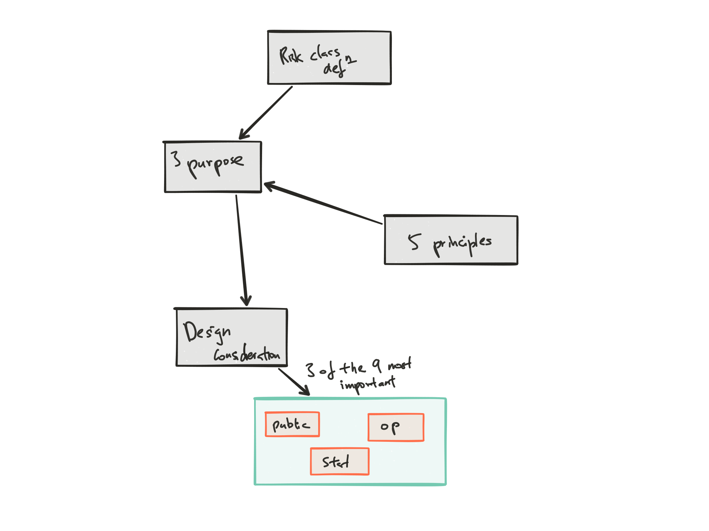

## Cliff's Summary

Short but lots of concepts to memorize and digest

What is [risk classification](#risk-class-concept) $\Rightarrow$ 3 [Purpose](#risk-class-purpose) $\Rightarrow$ 5 [Principles](#risk-class-prin) $\Rightarrow$ 9 Considerations in design

3 of the key design criteria: [Ops](#ops-consideration), [Social](#social-consideration), [Statistic](#stat-consideration)

## Types of Exam Questions

List out criteria and principles

* Just memorize

If a given plan satisfy some of the criteria

* 1998 Q43 $\star$
* 2004 Q40
* 2004 Q23 
* 2004 Q24 (Compare 2 plans)
* 2006 Q38 (Miles driven; stat and op criteria)
* 2008 Q28 (Color of car; op and social)
* 2008 Q2 $\star$ (stat and op with data)
* 2009 Q34 (free for all pick 2)
* 2012 Q4 b (In conjunction with part a from GLM)
* 2013 Q1 $\star$ (Does it follow the 3 principles)
* 2014 Q6 $\star$ (4 of any criteria)

Impacts on inadequate risk classification

* 2006 Q20

Other good questions

* 2004 Q29
* 2009 Q1 (When is risk class important)

Relate this to Section A5 with the HG mappings

* 2012 Q1 $\star$

    * Credibility: assigning a credibility of $Z = min(\frac{n}{n+k}\times 1.5, 1)$ gives larger classes more weight to permit the calculation of more accurate predictors of XS ratios

    * Homogeneity: clustering analysis using k-means algorithm is used to assign each class into a HG. K-means has the property to minimize within variance and maximize between variance so new HG are homogeneous

    * Predictive Stability: since current HG were used as the complement of credibility, this provided stability in the class XS, while still recognizing any changes that were credible

## Concepts of Risk classification

  * Grouping of risk with similar risk characteristics ($\mathrm{E}[Cost]$) for the purpose of setting prices
  * Challenge is to identify the appropriate risk characteristics to classify the risk
  * Especially useful when there are no retro/exp rating
  
## 3 Primary Purpose  
Key Concepts

1. **Protect insurance system's financial soundness**
    * Guard against adverse selection
        * *Adverse selection*: Exist when buyers are free to select from who they buy from; When insurer not using risk characteristics used by competitors $\Rightarrow$ Good risk attracted by competitors $\Rightarrow$ Left with higher share of higher risks
        * Compulsory insurance also guard against adverse selection
2. **Enhance fairness**
    * Price reflect differences in $\mathrm{E[costs]}$
    * No unfairly discriminatory
    * Insured within same class should have $\approx \mathrm{E[costs]}$
3. Permit **economic incentives to operate** and encourage widespread **availability of coverage**
    * Profit incentives:
        * Insurer makes a profit on all insured $\Rightarrow$ Will write all risk $\Rightarrow$ Availability of coverage
    * Note that the cost of classification should be < reduction in $\mathrm{E[costs]}$ for the lower cost class
    
## 5 Principles to achieve the 3 Primary Purposes  
Key Concepts

Risk classification system should:

1. Reflect **$\mathrm{E[costs]}$ differences**
2. **Distinguish** among risks on the basis of *relevant* **cost-related factors**
3. Applied **objectively**
4. **Practical** and **cost-effective**
5. **Acceptable** to the *public*

## 9 Considerations in design

### 1. Underwriting
Review risk for eligibility or schedule rating  
Should be $\perp$ of *classification* system criteria

### 2. Marketing
Need to be able to sell to that type of customer

### 3. Program Design
The program design differs based on some of the considerations below:

**Degree of choice** available

  * Voluntary vs compulsory
      * Compulsory: program's main goal is to get everyone on the plan; don't have to worry about adverse selection
      * Voluntary: buyer has more choice so risk classification helps address the 3 principles
      
**Experience** based pricing

  * If rating plans price based on loss experience after insured is in the plan, initial classifications doesn't need to be as sophisticated

**Premium payer**

  * If someone else is paying the premium rather than the insured, they're less likely to minimize their premium; less sophisticated risk class is more appropriate
      
### 4. Statistical Criteria  
Memorize

* **Homogeneity**: $\mathrm{E[Costs]} \in$ a class should be $\approx$ with no clear sub classes with different loss potential

* **Credibility**: Class large enough to be statistically credible

* **Predictive Stability**: Prices should be responsive to $\Delta$ in $\mathrm{E[Loss]}$ by class without being too volatile

***

Homogeneity and credibility are in conflict since making a class more homogeneous by eliminating risks comes at the expense of credibility (less volume)

### 5. Operational Criteria
Memorize

* **Expense**: Cost of obtaining/maintaining the data

* **Consistency**: Shouldn't have to reclass frequently

* **Availability**: Might have to add deductibles, limits or exclusions to make price more affordable for certain class

* Avoid *extreme* price **discontinuities** between classes

* **Absence of ambiguity**: Classes should be *exhaustive* and *mututally exclusive*

* **Minimize ability for Manipulation**

* **Measurability**

### 6. Harzard Reduction Incentives

E.g. Giving a sprinkler system discount encourages insureds to install sprinklers $\Rightarrow$ Reduce hazard of fire

### 7. Public Acceptability (Social Criteria)  
Good Question: 98 Q43  
Memorize

* ***Not*** **differentiate unfairly** among risks
* Based on clearly **relevant data**
* Respect personal $(1)$ **privacy**
* Risks tend identify naturally with their classification
* $(2)$ **Affordability**, especially when there is a negative correlation between incomes and insurance rates

### 8. $(3)$ Casuality (Social Criteria)

Pros: Clear cause & effect will increase public acceptability

Nice to have but not a criteria

### 9. $(4)$ Controllability (Social Criteria)

Pros: Encourages risk mitigation

Cons: Subject to manipulation

Nice to have but not a criteria

## Evaluating a rating variable

Likely exam question will be to evaluate a new rating variable against the considerations above