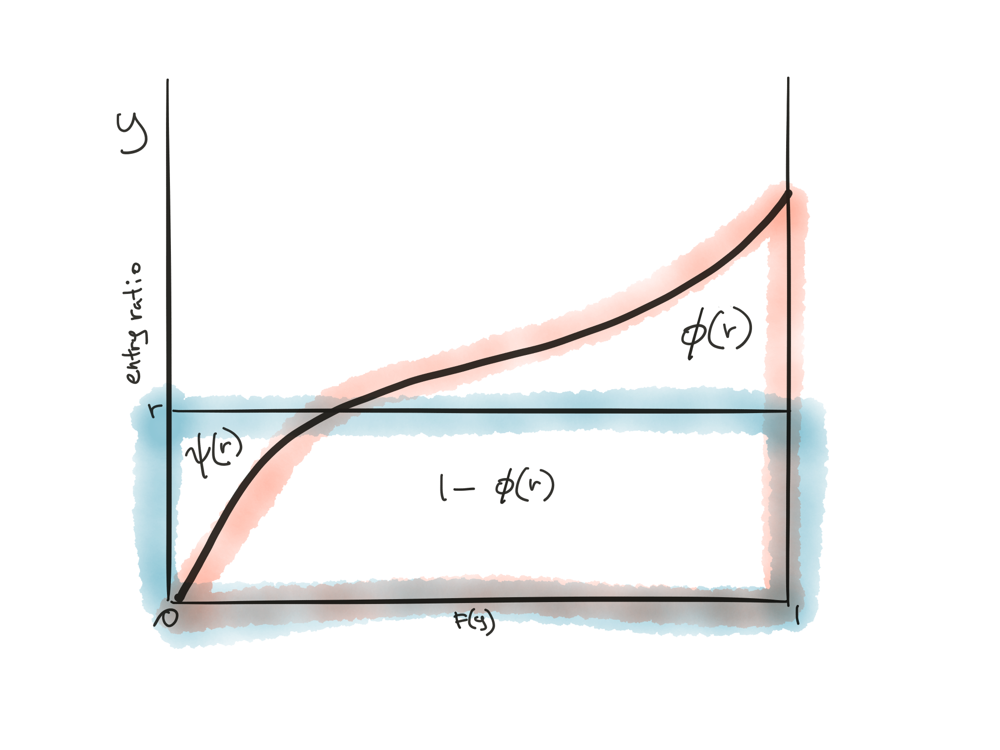
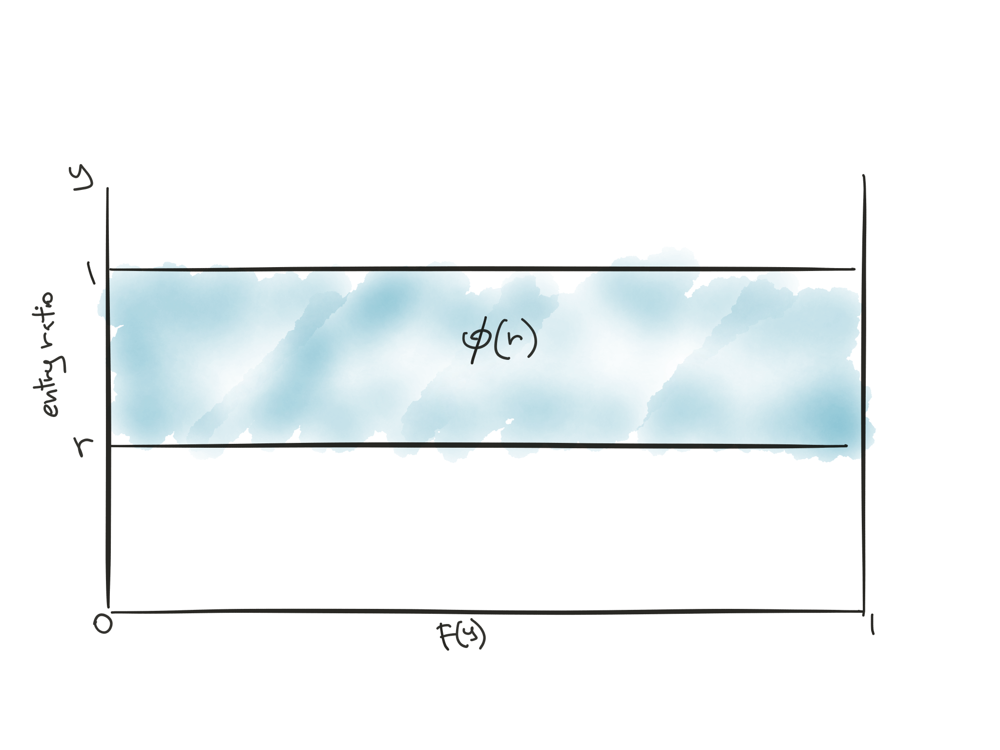
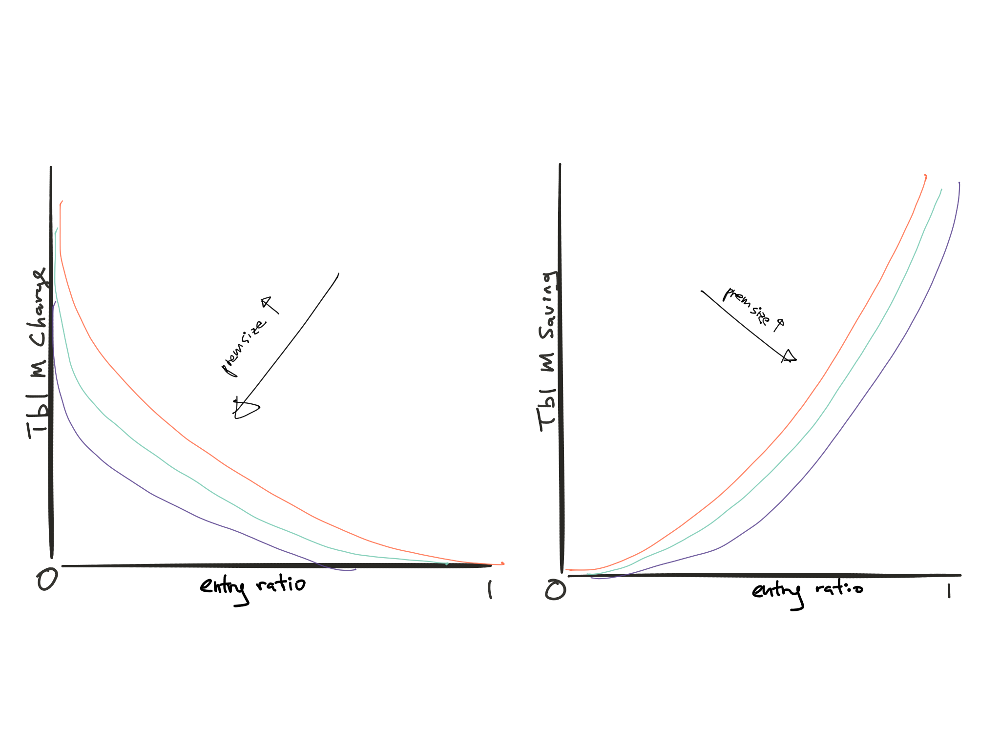
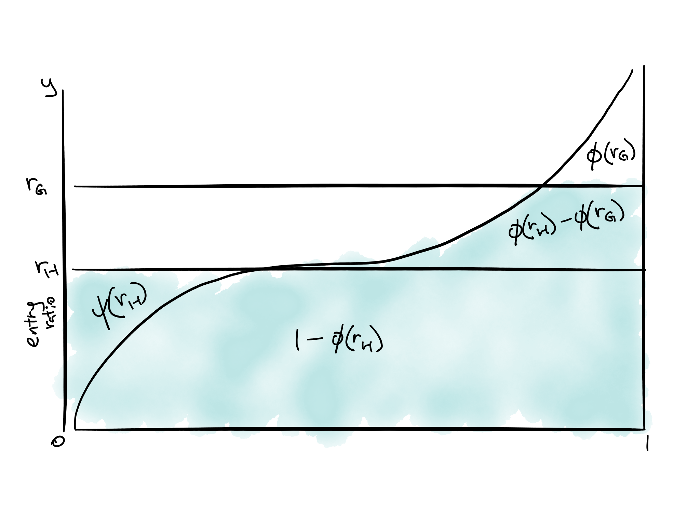
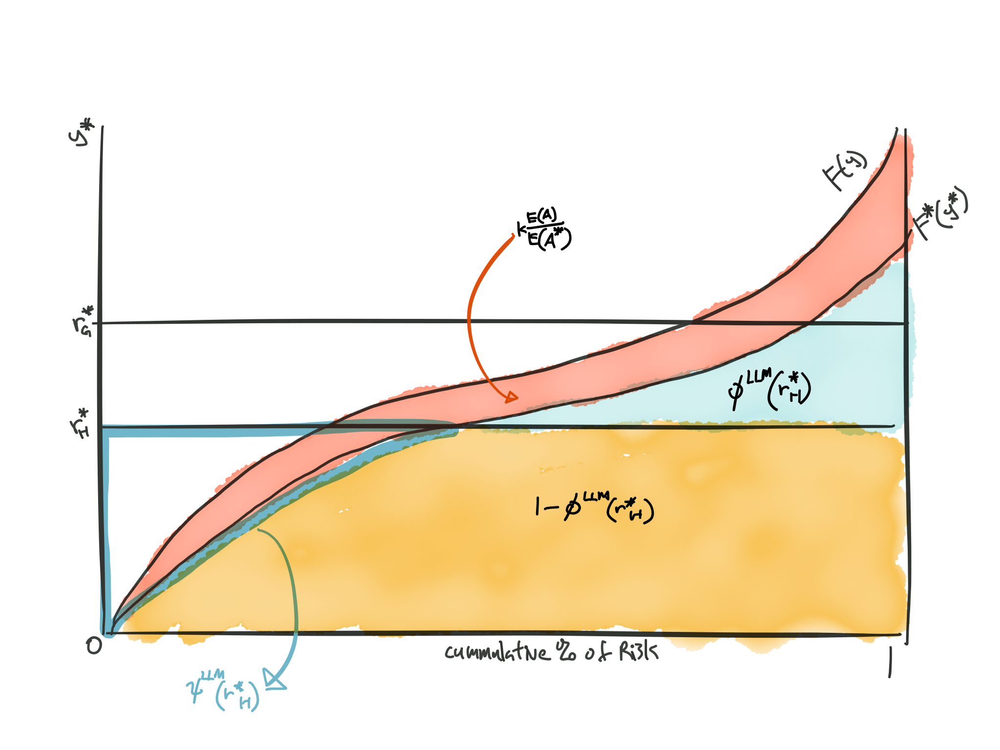
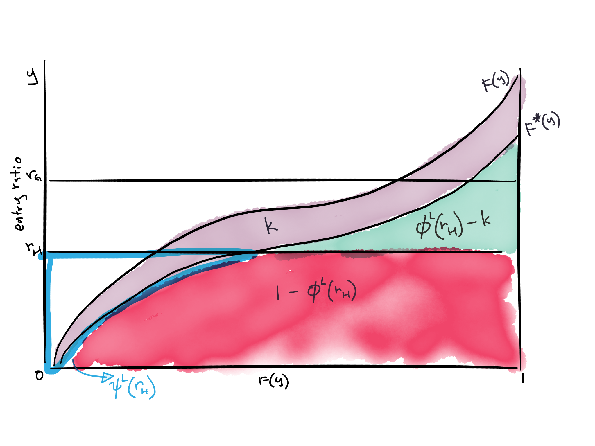

## Cliff's Summary

### Lee 2

Know how the entry ratio, charges and other relationships are represented as areas in the graph

* [Tbl M Charges](#tblmfigure1)
* [Tbl M Charges and savings](#tblmfigure4)
* [Table LLM](#tblllmfigure1)
* [Table L](#tbllfigure1)

Different forms of the charge and properties

### Gillam & Snader 2

Using NCCI Table M

* Need Adj Expected Loss to get ELG to get know the column of Tbl M

Remember the basic premium formula only works if plan is balanced

* $b = e - (C - 1)\mathrm{E}[A] + CI$

Know how to build Table M

Know how to plug and play with all the equations

### Brosius

Vertical and horizontal calculations of the tables

* Remember how to normalize

Table construction

### Skurnick

Table L rationale pros cons

ICRLL rationale pros cons

Unbalanced retro calculation

Insurance charge and savings for Table L

### NCCI 2

How to use the NCCI pages

* ELG, balance equations
* Use the table for the right year
* Look for entry difference first then charge
* Know what can be looked up
    * $e$
    * ELR
    * Tax
* For AK what can be looked up
    * ELPPF or ELAEPPF
    * Retro dev (need to multiply by the E to use)
* Know the tables

## Types of Exam Questions

### Lee 2

Interpret entry ratio plots

* 2000 Q19 (Interpret)
* 2001 Q30 (Explain its constructions)
    * Understand that Table M is constructed horizontally
    
How charges are represented on graphs

* 2002 Q17
* 2003 Q8
* 2003 Q29 (interpret charge difference)
    * <span style="color:red;background-color:yellow">?Question?</span>
* 2007 Q31 (both L and M)

Draw graphs and calculate charges

* 2005 Q33 (uniform)
* 2006 Q29 $\star$
* 2008 Q29 (uniform)
* 2009 Q9 $\star$ (Calc expected retro premium)
* 2010 Q25
* 2012 Q21
    * Convert $r$ to LR to do this?
    
Basic premium from formula

* 2012 Q23 $\star$

Impact of change on losses or size

* 2012 Q21 b [TIA](http://www.theinfiniteactuary.com/mb/viewtopic.php?f=17266&t=13017)
* 2013 Q15 b,c $\star$

Other

* 2002 Q14 (XS PP formula) 
    * Why is the denominator 1?<span style="color:red;background-color:yellow">?Question?</span>
    
GRAPHICAL REPRESENTATIONS: $\phi$, $\psi$. $I$ TABLE M & TABLE L

* As stated in title

GRAPHICAL REPRESENTATIONS: H, K , $\mathrm{E}[R^*]$, $\psi(r_G)$

* Part c on the representation of $\dfrac{\mathrm{E}[L^*]}{E}$ is interesting

GRAPHICAL REPRESENTATIONS: BALANCE EQUATIONS

* Meanings of different cut

### Gillam & Snader 2

Using Table M

* 2000 Q5 (ELG)

Plug and play for $b$, $R$, $GCP$, etc

* 2000 Q6 (Know how to do premium discount)
* 2000 Q9 ($GCP$ and $A$)
* 2001 Q8 ($GCP$)
* 2001 Q31 ($b$ formula and ELG)
    * Not sure about part b
    * [TIA](http://www.theinfiniteactuary.com/mb/viewtopic.php?f=17679&t=12649)
* 2001 Q33 (Retro @18mo) $\star$
* 2002 Q15 (Charge difference)
* 2002 Q16 (net converted charge)
* 2002 Q40a (Retro @18mo)
* 2003 Q7 (Tax multiplier)
* 2003 Q10 ($b$)
* 2004 Q18 (Retro @18mo)
* 2004 Q20 (Back out $e$ with GCP and retro)
* 2005 Q30a (Tax multiplier)
* 2005 Q30b (Tax multiplier w/ interstate risk)
* 2005 Q32a (GCP and Retro Prem)
* 2006 Q30 $\star$ (Retro, hit cap)
* 2006 Q32 $\star$ (max prem factor, clever)
* 2010 Q27 $\star$ (diff between limited and unlimited)
* 2010 Q29 $\star$ (Multiple items)
* 2011 Q20 $\star$ (GCP, expected loss is tricky)
* 2011 Q25 $\star$ (max prem, need to 2 balance equation)
* 2012 Q19 $\star$ (Retro @ 2nd adjustment)
* 2013 Q14 $\star$ (expected retro, need that E[L]/E[A] formula)
* 2014 Q18 $\star$$\star$

Formula Manipulation

* 2001 Q32a $\star$

Build Table M

* 2000 Q48

Concepts

* 2001 Q10 (relationship between max/min/b)
    * Do we need the assumed balance condition here?
* 2001 Q32b (iterative tbl M lookup)
* 2002 Q40b $\star$ (Improve insured cashflow)
* 2003 Q33 $\star$ ($\Delta$ in exposure impacts)
    * Not sure about b
* 2004 Q47 $\star$ (How to lower b)
* 2005 Q32a (GCP and Retro Prem difference)

Tricky

* 2007 Q32 (defective)
* 2007 Q35 (Balanced or not)
* 2009 Q20 (defective)

RETRO PREM: INSURANCE CHARGE, BASIC PREMIUM, EXPENSE FACTOR

* Standard calc of R with max and min no occ charge

GUARANTEED COST PREMIUM: DISCOUNT TABLE, RETRO RATING

a. Straight calcu with discount tiers
b. Use GCP formula and the $b$ formula

BALANCE EQUATIONS

* Know the formula
* For each charge difference that's too low by 0.01, increase entry ratios by 0.01

INS. CHARGE REFLECTING LOSS LIMITATIONS

* Remember the entry ratio is based on limited expected loss
* lookup ELG
* know the tax formula and the ALG

### Brosius

Insurance charge/savings

* 2002 Q36 (vertical)
* 2004 Q43 (vertical, tricky arithmetics)
* 2005 Q8 (vertical, charge/savings relationship)
* 2006 Q9 (table construction)
* 2007 Q30 (vertical)
* 2007 Q34 (table construction)
* 2008 Q28b (table construction)
* 2013 Q12 (table construction)
* 2014 Q13 $\star$ (Backout numbers)
* Practice $\star$ (table construction with normalize)

Concepts

* 2008 Q28a (vertical vs horizontal)

TABLE M CONSTRUCTION, $X_G$, $S_G$ GRAPHICAL METHOD

* Building table and graph
* horizontal

TABLE M CONSTRUCTION, $X_G$, $S_G$ DOUBLE SUM METHOD

* Basically just skip the recursive bit a little

TABLE M CONSTRUCTION, $X_G$, $S_G$ DIRECT CALCULATION METHOD

* Vertical

### Skurnick

Understandig Table L and ICRLL

* 2000 Q45 $\star$ (Tbl L and ICRLL, Pros Cons)
* 2002 Q38
* 2006 Q34 $\star$ (per occ charge)
* 2008 Q35 (same as 2000 Q45)
* 2010 Q31 $\star$ (ICRLL proc)
* 2011 Q22 bc
* 2013 Q13 $\star$ (Relationship with prem size and properties)
* 2014 Q12 a $\star$ (build table from graph)
* 2014 Q12 b $\star$ (Explain savings)

Unbalanced retro calc

* 2001 Q34 $\star$ (Unbalance and then rebalance)
    * Good questions to understand

Table Construction

* 2003 Q30 (L and M)
* 2009 Q32 (L and M)
* 2011 Q22a (L)
* 2012 Q18 $\star$

Calculate insurance charge/savings

* 2004 Q44 (Vertical, L and M)
* 2006 Q7 (Vertical, L)
    * Why is the per-occ charge not always just the LER?<span style="color:red;background-color:yellow">?Question?</span>
* 2008 Q32 $\star\star$ (Table L with different SP risk)
    * Use dollar amount or Tbl L with premium (instead of risk)
    * Should understand this

TABLE L CONSTRUCTION

* Limited loss over unlimted
* Don't forget to add the k

TABLE L : B, R, ENTRY RATIO DIFF, INS CHG DIFF

a. Remember the base is unlimited for Table L
b. Get the actual premium

CHANGE IN RETRO PREMIUM FROM TABLE M UPDATE

* Skipped, seems like you just lookup twice

LEMMA 1: RETRO PLANS THAT DON’T BALANCE TO GCP

* Good one
* Use given formula and get the $\mathrm{E}[L]$

### NCCI 2

Plug and play

* 2001 Q9 (LLM charge difference)
* 2002 Q35 $\star$
    a. expense and contingency in $b$ = w/o the $CI$
    b. $CI$ (Get ELG with LER + balance equation $\rightarrow$ tbl M search)
    c. Total
* 2003 Q31 (ELG and balance equations and D)
* 2004 Q45 (similar to 2002 Q35)
* 2005 Q32 (Just charge)
* 2006 Q35 $\star$ (backout ELF)
* 2008 Q36 (similar to 2002 Q35)
* 2009 Q30 (similar to 2002 Q35)
* 2011 Q21 $\star$ (Alaska ELG)
    * Lookup HG differential and ELAEPPF
* 2014 Q15 $\star$ (inflation impact)
* 2014 Q17 $\star$
    a. GCP (Tax is applied to final P)
    b. $b^{LLM}$
    c. Impact of higher per occ limit

Concepts

* 2003 Q32 (Why varies by ELG)

USING NCCI TABLES: BASIC PREM, ELG, BALANCE EQUATIONS

* Full blown beginning to end question on AK
* Get the ELPPF from table
* Look up size group with ICRLL
* Balance formula for charges

RETRO PREMIUM CALC WITH ELECTIVE ELEMENTS

* Retro at 2nd adjustments

## Must Know Formulas

### Table M

Net Charge (For LLM use $\mathrm{E}[A^*]$ and LLM charges):

* $I = \mathrm{E}[A][\phi(r_G) - \psi(r_H)]$

Savings:

* $\psi(r) = \phi(r) + r -1$

Other Relationships:

* $\begin{array}{ll}
    \mathrm{E}[L] &= \mathrm{E}[A] \left\{1 + \psi(r_H) - \phi(r_G)\right\} \\
    &= \mathrm{E}[A] - I \\
  \end{array}$

Table construction:

* $\phi(r_i) = \phi(r_{i+1}) + (r_{i+1} - r_i)(\text{ % risks above }r_i)$

### Reading Table M

Balance Equations (Use $\mathrm{E}[A^*]$ for the denominator if there's occ limit):

* $\phi(r_H) - \phi(r_G) = \dfrac{(e + \mathrm{E}[A])T - H}{C\mathrm{E}[A]T}$

* $r_G - r_H = \dfrac{G - H}{C\mathrm{E}[A]T}$

Adjusted Expected Losses:

* $= \mathrm{E}[A] \times \text{State HG Differential} \times \dfrac{1 + 0.8k}{1-k}$

### Retro premium related

GCP:

* $\text{Guaranteed Cost Premium} = (e + \mathrm{E}[A])T = (1-D)P$

Basic premium if balanced plan:

* $b = e - (C - 1)\mathrm{E}[A] + CI$

Tax multiplier:

* $=\dfrac{0.2 + PLR(1+\mu)}{0.2 + PLR} \left({\dfrac{1}{1-\tau}}\right)$

    * $PLR = \text{Permissible Loss Ratio} = \dfrac{\mathrm{E}[A]}{P}$ 
    
    * $\mu = \text{Assessments}$
    
    * $\tau = \text{Premium Based Tax}$

## Questions

What is the x-axis for the Table LLM

What is the state differential in finding the Adjusted Expected Loss

What is that E[L]/E[A] formula

## Recall: Prospective WC Rating

<span style="color:green">2000 Q6</span>

$\begin{align}
  \text{Premium} = &\sum\limits_{i \in class} \dfrac{Payroll_i}{100} \text{Manual Rate}_i &\cdots (1)\\
  &\times \: \text{Exp Mod} &\cdots (2)\\ 
  &\times \: \text{Sch Mod} &\cdots (3)\\
  &\times \: (1 - \text{Premium Discount %}) &\cdots (4)
\end{align}$

$(1)$ **Manual Premium**

$(1) \times (2)$ **Modified Premium**

$(1) \times (2) \times (3)$ **Standard Premium**

* Authorized rates + E-mod + Loss constant + Min Premium

$(1) \times (2) \times (3) \times (4)$ **Guaranteed Cost Premium**

* Assume no expense fee
* Reflects lower proportion of fixed expense for larger risk
    * Usually calculated by Standard Premium tiers

## Retrospective Rating: Intro

Uses insured's loss experience during the current policy term to determine their current policy premium

Initial premium collected at the start (deposit premium) $\Rightarrow$ Adjust based on reported loss starting 6 months after policy expires, then every 12 months after

$\text{Premium} = \left[\text{U/W Expense & Profit xTax} + \left(1 + \dfrac{\mathrm{E}[LAE]}{\mathrm{E}[Loss]}\right) \times Loss_{actual}\right] \times \text{Tax Multiplier}$

There's always going to be a max and min premium or else this would defeat the purpose of risk transfer

Caps are applied to the premium amount $\equiv$ Capping actual losses at max/min aggregate loss limits $\Rightarrow$ Add a charge to the premium calculation to account for this

In addition to aggregate caps, can also limit losses per occurrence (Use limited losses in the retro premium calculation) $\Rightarrow$ A separate charge to the premium calculation to account for the per occurrence limit

With both occurrence and agg limits, need to consider the overlap between the 2 charges

The starting point for retro premium is the standard premium

* GCP only uses expected losses to calculate the premium
* Retro premiums use a combination of expected loss (i.e., the insurance charge and savings) and actual loss to calculate the premiums

## Retrospective Rating: w/o Occurence Limit  
<span style="color:red;background-color:yellow">Important Formulas</span>

NCCI retro premium formula for each individual policy

$R = (b + C A + PCV) T$ <span style="color:red; background-color:yellow">Memorize</span>

* $R$: Retro premium @ t $\in [G, H]$

* $b$: Basic premium = Profit + Charge for max/min premium + non-LAE expense xTax

    * Charge for max/min premium $\equiv$ Net insurance charge
    
* $A$: Reported loss @ t (may include ALAE)

* $C$: Loss conversion factor $= 1 + \dfrac{\mathrm{E}[LAE]}{\mathrm{E}[Loss]}$

    * If $A$ includes ALAE $\Rightarrow$ $= 1 + \dfrac{\mathrm{E}[ULAE]}{\mathrm{E}[Loss \& LAE]}$

* $T$: Tax multiplier $=\dfrac{0.2 + PLR(1+\mu)}{0.2 + PLR} \left({\dfrac{1}{1-\tau}}\right)$ <span style="color:red; background-color:yellow">Memorize</span>

    * $PLR = \text{Permissible Loss Ratio} = \dfrac{\mathrm{E}[A]}{P}$ 
    
    * $\mu = \text{Assessments}$
    
    * $\tau = \text{Premium Based Tax}$
    
    * For an interstate risk, use a weighted average of the individual state tax multipliers with the standard premium for each state as the weights

* $V$: Retro development factor (Optional)

    * $= (1-\frac{1}{CDF}) \Rightarrow \text{Unreported Losses}$
    
    * $C \times A + P \times C \times V \equiv \text{B-F Ultimate}$
    
    * To stabilize premium adjustments
    
    * Only used for the first 3 adjustments
    
    * $V$ are fixed at inception but they change over time according to the plan from the outset
    
    * Since losses develop over time, without a retrospective development factor, usually losses will be lower at early adjustments, which will cause refunds to the insured. Once losses develop higher, the insured will have to pay the money back. Using a retrospective development factor will reduce the back-and-forth payments, reduce the credit risk of collecting future premiums, and allow the insurer to have more premium at early adjustments to use in earning additional investment income.
    
* $P$: Standard Premium

***

**For a balanced plan:** 

Expected retrospective premium = premium for a prospectively rated policy

$b = e - (C - 1)\mathrm{E}[A] + CI$

* $b$: Insurer expense + loss control + premium audit G&A + Adj for limiting ratio + profit contingencies
* $e$: Total expense xTax and profit
* $I$: Net insurance charge for the max/min premium
* Since $e$ includes all expenses including LAE (except taxes), we subtract off the expected LAE, since we will instead use the LAE related to actual losses from the $CA$ in the retro premium equation
* [Proof](#basicpremiumproof)

<span style="color:green">2001 Q32</span>

## Understanding the Net Insurance Charge: w/o Net Insurance Charge

Ignore the retro development for now

$R = (b + C \times A) \times T \: \: \: \text{for} \: H \leq R \leq G$

Max and min premiums $\equiv$ Aggregate limits on losses

<span style="color:red; background-color:yellow">Formula</span>  
<span style="color:green">2001 Q31</span>

$\begin{align}
  H &= (b + C \times A_H) \times T &= \text{min}\\
  G &= (b + C \times A_G) \times T &= \text{max}\\
\end{align}$

$R = (b + C \times {\color{blue}L}) \times T \: \: \: \: {\color{blue}L} = \left\{
  \begin{array}
    AA_H & A \leq A_H\\
    A & A_H < A <A_G\\
    A_G & A \geq A_G\\
  \end{array}
  \right.$

<span style="color:red; background-color:yellow">Understand Formula</span>

$\begin{array}{ccc}
  \text{Net Insurance Charge} = &I = (&\text{Ins Chg} &- &\text{Ins Saving}&) \times \mathrm{E}[A]\\
  &I = (&\dfrac{\mathrm{E}[Loss > A_G]}{\mathrm{E}[A]} &- &\dfrac{\mathrm{E}[Loss < A_H]}{\mathrm{E}[A]}&) \times \mathrm{E}[A]\\
  &I = (&\text{Tbl M Max Prem Chg} &- &\text{Tbl M Min Prem Savings}&) \times \mathrm{E}[A]\\
  &I = (&\phi(r_G) &- &\psi(r_H)&) \times \mathrm{E}[A]\\
  &I = (&\phi(\dfrac{A_G}{\mathrm{E}[A]}) &- &\psi(\dfrac{A_H}{\mathrm{E}[A]})&) \times \mathrm{E}[A]\\
\end{array}$

### Table M Terminology

Rows are **entry ratios** = $r = \dfrac{Loss_{Actual}}{Loss_{Expected}}$ <span style="color:red">Understand</span>

* $\because$ Standardized $\therefore$ Table M can be applied to various states and LOB

Columns are for **different risk size** groups

* Since dist^n^ of charges vary by risk size $\Rightarrow$ Curve differ by risk size

Entry ratio at maximum premium $= r_G = \dfrac{A_G}{\mathrm{E}[A]}$

Entry ratio at minimum premium $= r_H = \dfrac{A_H}{\mathrm{E}[A]}$

## Retrospective Rating: with Occurence Limit

Per occurrence limit impact the likelihood of hitting the max/min premiums $\Rightarrow$ Table M not appropriate $\Rightarrow$ Need to recognize the potential overlap between the occurrence and aggregate limits

3 options to handle this:

### Option 1: Limited Loss Table M  
<span style="color:red;background-color:yellow">Important Formulas</span>

$R^* = (b^{LLM} + CA^* + PCF + PCV) T$<span style="color:red;background-color:yellow">Memorize</span>

* $b^{LLM}$: From the limited loss Table M

* $A^*$: Reported limited loss @ t (might include ALAE)

* $F = ELF = \dfrac{\mathrm{E}[Loss \geq \text{Per Occ Limit}]}{\text{Standard Premium}}$
    * Varies by State + HG + Occ Limit
    * Recall Robertson paper

* $A \neq A^* + PF$

* $\mathrm{E}[A] = \mathrm{E}[A^*] = PF$

* $PCF$ and $PCV$ are electives

* $V$: Development different with occ limit than w/o

***

Theoretically correct approach

Caveat:

* Requires a large number of tables

* Charge need to vary by occ limit, entry ratio, risk size group, HG, etc

### Option 2: Table M with ICRLL Adjustment (NCCI)

ICRLL = Insurance Charge Reflecting Loss Limitation

Change the Table M column used to be the column appropriate for a larger size risk

* Per occurrence limit reduces the skewness of the entry ratio dist^n^ $\Rightarrow$ Similarly for larger risk size
    
Caveat:

* Table M doesn't vary by loss limit $\Rightarrow$ Compromises a bit on accuracy

### Option 3: Table L (WCIRB)

$R^* = (b^L + CA^* + PCV) T$

Accurately correct for overlap between the occurrence and aggregate charges similar to the LLM

Combines occurrence charge with the aggregate charge
  
* Whereas LLM's occ charge has to be added separately

WCIRB uses different HG than NCCI

$V$ varies by occ limit

* $\uparrow$ limits $\uparrow$ $V$ $\because$ $\uparrow$ potential for development

## NCCI Filings for Optional Components

NCCI do full rates or loss costs depending on the state

**Full Rates**:

* Files $ELF$ from option 1

* Files $V$, Retro Development Factors, from option 1

**Loss Costs**:

* Files $ELPPF$ (XS Loss Pure Premium Factors)
    
    * $\begin{array}{cccc}
        ELF &= &ELPPF &\times &ELR\\
        \dfrac{\mathrm{E}[XSLoss]}{\text{Standard Premium}} &= &\dfrac{\mathrm{E}[XSLoss]}{\mathrm{E}[Loss]} &\times &\dfrac{\mathrm{E}[Loss]}{\text{Standard Premium}}\\
      \end{array}$
    
    * $ELR$ from company's own estimate
    
* Use $ELAEPPF$ if per occ limit includes Loss & ALAE

* Files Development Retrospective Pure Premium Factors

    * $\begin{array}{cccc}
        \text{Retro Dev Factor} &= &\text{Retro Dev PP Factor} &\times &ELR\\
        \dfrac{\mathrm{E}[\text{Unreported Limited Loss}]}{\text{Standard Premium}} &= &\dfrac{\mathrm{E}[\text{Unreported Limited Loss}]}{\mathrm{E}[Loss]} &\times &\dfrac{\mathrm{E}[Loss]}{\text{Standard Premium}}\\
      \end{array}$
    
    * XS Loss and Allocated Expense Pure Premium Factors

## Table M

### Constructing Table M

**Aggregate dist^n^** across a large number of risks

* For losses, LR, entry ratios, etc
* Each data point is a single policy for a single term

**Table M Charge**

* $\begin{align}
    \text{Table M Charge} &= \dfrac{\sum_{r_i > r} (Loss_i - Loss_r)}{\sum_i Loss_i}\\
    &= \dfrac{\text{XS Losses }\forall \text{ Policies w/ Losses > Entry Ratio r}}{\text{Total Losses }\forall \text{ Policies}}
  \end{align}$

* $\begin{align}
    \text{Table M Savings} &= \dfrac{\sum_{r_i < r} (Loss_r - Loss_i)}{\sum_i Loss_i}\\
    &= \dfrac{\text{Losses Shortfall Compare to Loss @ r }\forall \text{ Policies w/ Losses < Entry Ratio r}}{\text{Total Losses }\forall \text{ Policies}}
  \end{align}$
  
**2 Components to build Table M**

* Sample of experience from a group of similarly sized risks
    * Risk measure can be actual losses, LR, etc
* $\mathrm{E}[\textit{Experience Measure}]$ from the sample

**Normalize** table if the sample average $\neq$ assumed expected value:

* Ignore actual expected $\Rightarrow$ Use sample avg $\Rightarrow$ $\phi(0) = 1$
* Divide *charge* and *entry ratio* columns by $\phi(0)$ to normalize

### Constructing Table M Example

```{r echo=F, message=F}
library(dplyr)
library(ggplot2)
library(knitr)
library(scales)

d1 <- data_frame(
  "Annual Claim Total ($)" = c(1000,1500,4000,10000,15000,40000),
  "# of Policies" = c(8,3,2,5,2,1)
)
```

`r kable(d1, align = 'l')`

```{r echo=F}
maxlr <- 0.8
minlr <- 0.2
sp <- 10000
```

Each risk has `r dollar(sp)` of standard premium

$\text{Max Premium} \Leftrightarrow$ `r percent(maxlr)` LR w.r.t. Standard Premium

$\text{Min Premium} \Leftrightarrow$ `r percent(minlr)` LR w.r.t. Standard Premium

Loss @ Max Premium = `r percent(maxlr)` $\times$ `r dollar(sp)` = `r dollar(sp * maxlr)` = $A_G$

Loss @ Min Premium = `r percent(minlr)` $\times$ `r dollar(sp)` = `r dollar(sp * minlr)` = $A_H$

Total \# of Policies = `r sum(d1[2])`

Total Losses = `r dollar(sum(d1[1]*d1[2]))`

$\mathrm{E}[A] = \text{Expected Loss per Policy} = \dfrac{\text{Total Losses}}{\text{Total # of Policies}} =$ `r dollar(sum(d1[1]*d1[2])/sum(d1[2]))` = Total area under curve


```{r}
# Transformation of the data to plot
d1_ecdf <-
  d1 %>%
  rbind(c(0,0),.) %>%
  mutate(`% Policies` = `# of Policies` / sum(`# of Policies`),
         `Claim EWCDF` = cumsum(`% Policies`)) 
# Note the addition of 0 row
```

`r kable(d1_ecdf, align = 'l')`

```{r echo = F, fig.height=7}
g <-
  ggplot(d1_ecdf, aes(`Claim EWCDF`, `Annual Claim Total ($)`)) +
  geom_step(direction = "vh") + 
  xlab("Cumulative % of Policies") + ylab("Losses") + theme_minimal() +
  geom_hline(aes(yintercept = minlr * sp), linetype = "longdash") +
  geom_hline(aes(yintercept = maxlr * sp), linetype = "longdash") +
  scale_x_continuous(labels = percent) + 
  scale_y_continuous(breaks = sort(c(d1[[1]],  minlr*sp,maxlr*sp)), labels = dollar) +
  theme(axis.text.y = element_text(size=6))
g
```

Note that the steps are drawn in a "vh" manner starting from origin

Table M Charge in **dollars** = Area under curve and above `r dollar(sp * maxlr)` line $A_G$

* If divided by total area = Table M Charge

Table M Savings in **dollars** = Area under `r dollar(sp * maxlr)` line $A_G$ and above curve

* If divided by total area = Table M Savings

Net Insurance Charge = Difference of the Table M Charge in dollars and Table M Savings in dollars

### 3 Ways to Calculate the Areas

1. Horizontal Slices (Table M Method)
    * Calculating the entry ratio first
2. Vertical Slices
3. Calculate area within limit and then subtract it from the expected loss
    * = Limiting losses at the max/min
    
#### Horizontal Slices (Table M Method)

Calculating the entry ratio first

* Used to get the "height" of the segment

Starting from the top of the graph

Cumulate the horizontal length of each section from top to bottom

* The % risks above $r_i$ piece

**Advantages:**

* Efficient when calculating multiple $\phi{r_i}$
* Faster when there are many risks

#### Table M Construction from Sampled Loss

***1. Start with table of sampled loss amount and respective frequency***

`r kable(d1, align = 'l')`

***2. Add rows for 0 loss and entry ratio***

```{r}
tbl_m <- 
  d1 %>%
  rbind(c(0,0), c(minlr * sp,0), c(maxlr *sp,0)) %>%
  arrange(`Annual Claim Total ($)`) %>%
  rename(`# risks` = `# of Policies`)

kable(tbl_m, align = 'l')
```

***3. Calculate Entry Ratio $r$***

* $\dfrac{Loss_{Actual}}{Loss_{Expected}}$

```{r}
tbl_m <-
  tbl_m %>%
  mutate(`Entry Ratio (r)` = `Annual Claim Total ($)` / weighted.mean(`Annual Claim Total ($)`, `# risks`))

kable(tbl_m, align = 'l')
```

***4. Calculate \# of risk above each row (Loss)***

```{r}
tbl_m <-
  tbl_m %>%
  mutate(`# risks above` = sum(`# risks`) - cumsum(`# risks`))

kable(tbl_m, align = 'l')
```

***5. Calculate % of risk above each row***

```{r}
tbl_m <-
  tbl_m %>%
  mutate(`% risks above` = `# risks above` / sum(`# risks`))

kable(tbl_m, align = 'l')
```

***6. Calculate the Table M Charge $\phi(r)$***

$\phi(r) = 0$ for the largest value of r $\Rightarrow$ No $\mathrm{E}[L]$ above the
largest loss

$\phi(r_i) = \phi(r_{i+1}) + (r_{i+1} - r_i)(\text{ % risks above }r_i)$ <span style="color:red; background-color:yellow"> Memorize Formula </span>

Savings $= \psi(r) = \phi(r) + r - 1$ <span style="color:red; background-color:yellow"> Memorize Formula </span>

#### Vertical Slices

Looking at groups of losses based on the size of loss

Probably start from the right but don't seem to matter

* For Tbl M Charge: $\text{ % of Policies hitting cap} \times \text{XS Loss Amount}$
* For Tbl M Savings: $\text{ % of Policies hitting cap} \times \text{Difference of the Minimum Bound and Loss Amount}

**Advantages:**

* Natural, since that's how the data is presented
* Easier to understand
* Faster if just looking at 1 $r$

### Understanding Table M  
<span style="color:red;background-color:yellow">Important Concepts</span>

<a name="tblmfigure1"></a>  
 

Note that the y axis is now the entry ratios and not losses like it was in the earlier example

* This is like looking at a normal CDF but rotated along the x=y line

**Def^n^:**

$Y = \dfrac{A}{\mathrm{E}[A]}$

$F(y) = \text{CDF of } y$

Area under curve:

$\mathrm{E}[Y] = \dfrac{\mathrm{E}[A]}{\mathrm{E}[A]} = 1$

* Recall when the y axis was loss amount, the area was $\mathrm{E}[Y]$

**Table M Charge and Savings** <span style="color:red;background-color:yellow">Formulas</span>

$\phi(r) = \int\limits_r^{\infty} (y - r) dF(y) = \int\limits_r^{\infty} (y - r) f(y)dy$

* [TIA](http://www.theinfiniteactuary.com/mb/viewtopic.php?f=21737&t=12672)

$\psi(r) = \int\limits_r^{\infty} (r - y) dF(y)$

**Key Properties - Tbl M Charge** <span style="color:red;background-color:yellow">Important</span>

$\phi(0) = 1, \: \phi(\infty) = 0$

$\phi'(r) = -G(r) \leq 0$

* $G(r) = 1 - F(r)$

$\phi''(r) = f(r)$

**Key Properties - Tbl M Savings** <span style="color:red;background-color:yellow">Important</span>

$\psi(0) = 0, \: \psi(\infty) = \infty$

$\psi(r)'(f) = F(r) \geq 0$

$\psi''(r) = f(r) = \phi''(r)$

Note from figure above, the area under $r = \psi(r) + (1 - \phi(r)) \Rightarrow \psi(r) = \phi(r) + r -1$  style="color:red;background-color:yellow">Memorize</span>

$\phi$ is monotonically decreasing function of premium size

### Table M Charges and Premium Size

*Large* sample and *large* risks $\Rightarrow$ $\downarrow$ variance in Loss Ratio and Entry Ratio than *large* sample but **small** risks

$\lim\limits_{\text{Premium Size}\rightarrow \infty} Var(y) = 0$

* Curve will flatten out and look like all risks have the same amount of losses

$\phi(r) =
  \begin{cases}
    1 - r &r \leq 1\\
    0 &r > 1
  \end{cases}$

CDF of Entry Ratio vs Entry Ratio



From [TIA](http://www.theinfiniteactuary.com/mb/viewtopic.php?f=21737&t=24083): Think about how Table Ms are built: you get the loss ratios for a bunch of similar sized risks, calculate the average loss ratio from these risks, and then calculate entry ratios for each risk as actual loss ratio / average loss ratio. The variance in the entry ratios is really just the variance in the actual loss ratios of the risks used to built the Table M. If the variance of these loss ratios goes to 0, then that is equivalent to saying all risks have the same loss ratio (aka, same entry ratio, aka same dollar amount of aggregate losses given equal premium sizes). So that is why the curve will flatten.

On the other hand, as $\lim\limits_{\text{Premium Size} \rightarrow 0} \phi(r) = 1$

Graphs of Entry Ratios vs Table M Charge/Savings as premium size increase

* Higher ELG (a different column) in Table M, which would have lower charges for a given entry ratio



### Net Insurance Charge - w/o Occurence Limit  
<span style="color:red;background-color:yellow">Important Concepts</span>

$R = (b + C \times {\color{blue}L}) \times T \: \: \: \: {\color{blue}L} = \left\{
  \begin{array}
    AA_H & A \leq A_H\\
    A & A_H < A <A_G\\
    A_G & A \geq A_G\\
  \end{array}
  \right.$
  
$A_H = r_H \mathrm{E}[A]$ and similarly for $A_G$

<a name="tblmfigure4"></a>  


Blue area = $\dfrac{\mathrm{E}[{\color{blue}L}]}{\mathrm{E}[A]}$

* Recall that $\mathrm{E}[{\color{blue}L}]$ is the expected limited loss
* = Expected Retro Premium? 2003 Q29

<span style="color:red;background-color:yellow">Memorize Formula</span>

$\begin{array}{ll}
  \dfrac{\mathrm{E}[L]}{\mathrm{E}[A]} &= 1 + \psi(r_H) - \phi(r_G) \\
  \mathrm{E}[L] &= \mathrm{E}[A] + [\psi(r_H) - \phi(r_G)]\mathrm{E}[A] \\
  \mathrm{E}[L] &= \mathrm{E}[A] - I
\end{array}$

* Recall: $I = \mathrm{E}[A][\phi(r_G) - \psi(r_H)]$
* Expected loss given max/min = Expected Loss - Net Insurance Charge

<span style="color:red;background-color:yellow">Memorize Understand</span>

$\begin{array}{lll}
  R &= (b + CL)T\\
  \mathrm{E}[R] &= (b + C\mathrm{E}[L])T\\
  \mathrm{E}[R] &= \big\{b + C(\mathrm{E}[A] - I)\big\}T & (1)\\
\end{array}$

Recall if the plan is balance $\Rightarrow$ $\mathrm{E}[R] = \text{Guaranteed Cost Premium}$ <a name="basicpremiumproof"></a>

$\begin{array}{lll}
  \text{Guaranteed Cost Premium} &= (e + \mathrm{E}[A])T & (2)\\
  &=(1-D)P & (3)\\
\end{array}$

* $e$ = Total expense x tax & profit
* $D$ = Premium discount $= \sum (\text{Premium in Range}_i)(\text{Discount}_i)$
* $P$ = Standard Premiums

Combine $(1)$ and $(2)$

$\big\{b + C(\mathrm{E}[A] - I)\big\}T = (e + \mathrm{E}[A])T$ 

$b = e - (C - 1)\mathrm{E}[A] + CI$ <span style="color:red;background-color:yellow">Memorize Formula</span>

* $e - (C - 1)\mathrm{E}[A]$ is never capped
* $CI$ is where the cap comes in
* Recall:  
$e = \dfrac{1-D}{T} - PLR$  
$T = \dfrac{0.2 + PLR(1+\mu)}{0.2 + PLR}\left(\dfrac{1}{1-\tau}\right)$

<span style="color:green">2009 Q31, 2011 Q8</span>

Question that ask for G or H usually use balance equation

Alt formula: 
$b = (1 - D)\dfrac{P}{T} - C\mathrm{E}[A] + CI$

Use this if we don't' have max/min premium

### Table M Balance Equations

Basic premium and max/min premium depends on each other $\Rightarrow$ Need trial and error to get the right Table M row

#### First balance equation  
Value (change) difference

Retro premium formula with max loss:  
$H = (b + CA_H)T = (b + Cr_H\mathrm{E}[A])T$

Start with the GCP formula and subtract $H$

$\begin{array}{ll}
  \text{GCP} - {\color{blue}H} &\\
  (e + \mathrm{E}[A])T - {\color{blue}H} &= \big\{b + C(\mathrm{E}[A] - I)\big\}T - {\color{blue}{(b + Cr_H\mathrm{E}[A])T}}\\
  &= CT\big\{\mathrm{E}[A] - I - r_H\mathrm{E}[A]\big\}\\
  &= CT\Big\{\mathrm{E}[A] - \mathrm{E}[A]\big\{\phi(r_G) - \psi(r_H)\big\} - r_H \mathrm{E}[A]\Big\}\\
  &= C \: T \: \mathrm{E}[A] \big[ \psi(r_H) - r_H + 1 - \phi(r_G)\big] \\
\end{array}$

Move everything to one side and we get: <span style="color:red;background-color:yellow">Important Memorize</span>

$\phi(r_H) - \phi(r_G) = \dfrac{(e + \mathrm{E}[A])T - H}{C\mathrm{E}[A]T} = \dfrac{(1-D)P-H}{C\mathrm{E}[A]T}$

* Interpretation: Charge difference = to the difference between the
expected retro premium E[R] and the minimum premium H, except for the factor CE[A]T
* 2003 Q29

#### Second balance equation  
Entry difference, based $G - H$

<span style="color:red;background-color:yellow">Important Memorize</span>

$r_G - r_H = \dfrac{G - H}{C\mathrm{E}[A]T}$

Can do all the above looking at them as a % of Standard Premium

### Table M Search

1. Use balance equations to get the difference and then look up the table
2. Look for the Entry difference first then charge difference

Note:

* Charge difference $\downarrow$ as you $\uparrow$ entry ratios
* Entry ratio pair $\Delta$ the charge difference by about 0.01

## Limited Loss Table M

### Constructing a Limited Loss Table M

Same as Table M but with limited losses $A^*$ for each policy

Entry Ratio: $r^* = \dfrac{A^*}{\mathrm{E}[A^*]}$

Note that the denominator of the Entry Ratio is the $\mathrm{E}[A^*]$, where as in Table L it's not limited $\mathrm{E}[A^*]$

### Understanding a Limited Loss Table M

Note that the y axis is now limited entry ratios $y^*$

<a name="tblllmfigure1"></a>  


Entry Ratio: $Y^* = \dfrac{A^*}{\mathrm{E}[A^*]}$

$F^*(Y^*) = \text{CDF of }Y^*$

Loss Elimination Ratio: $k = LER = 1 - \dfrac{\mathrm{E}[A^*]}{\mathrm{E}[A]}$ <span style="color:red;background-color:yellow">Know</span>

* $\dfrac{\mathrm{E}[A^*]}{P} = \text{Unlimited ELR} - LER$

Note that $\mathrm{E}[Y^*] = \dfrac{\mathrm{E}[A^*]}{\mathrm{E}[A^*]}$ no surprise

But $\mathrm{E}[Y] = \dfrac{\mathrm{E}[A]}{\mathrm{E}[A^*]} = 1 + k\dfrac{\mathrm{E}[A^*]}{\mathrm{E}[A]}$

Integration and key properties all the same as Table M but with limited loss

Same thing for what happens when $\lim\limits_{\text{Premium Size} \rightarrow \infty}$ and $\lim\limits_{\text{Premium Size} \rightarrow 0}$

### Net Insurance Charge - LLM

$R^* = (b^{LLM} + C{\color{blue}{L^*}}+PCF) T \: \: \: \: {\color{blue}{L^*}} = \left\{
  \begin{array}
    AA_H & A^* \leq A_H\\
    A^* & A_H < A^* <A_G\\
    A_G & A^* \geq A_G\\
  \end{array}
  \right.$
  
$+ PCV$ if to stabilize

*Everything similar* to Table M but now that the **entry ratios $r^*$ are limited** and has some **limied loss** $\mathrm{E}[A^*]$

$\mathrm{E}[L^*] = \mathrm{E}[A^*] - I^{LLM}$

* $I^{LLM} = \mathrm{E}[A^*][\phi^{LLM}(r^*_G) - \psi^{LLM}(r^*_H)]$

$b^{LLM} = e - (C - 1)\mathrm{E}[A] + CI^{LLM}$

* $e - (C - 1)\mathrm{E}[A]$ is never capped

$\phi^{LLM}(r_H^*) - \phi^{LLM}(r_G^*) = \dfrac{(e + \mathrm{E}[A])T - H}{C\mathrm{E}[A^*]T} = \dfrac{(1-D)P-H}{C\mathrm{E}[A^*]T}$

$r_G^* - r_H^* = \dfrac{G - H}{C\mathrm{E}[A^*]T}$

## Table L

### Constructing Table L

Table L charge includes the charge for per occurrence limit

* LLM adds the per occ charge via ELF separately (by State + HG + occ limit)

Implicit charge for the occ limit $\in \{0, k\}$

* $k$ is the Loss Elimination Ratio
* Incremental charge above the normal Table M charge.
* Varies by: occurrence limit, ELR, premium size, entry ratios
    * Not vary by premium size would result in overcharging small risks and undercharging large risk
    
Table L uses different premium size groups and occurrence limits

The LER was derived from the combination of all premium groups

* That's why entry ratio are based on expected unlimited losses $\mathrm{E}[A]$

CA version of Table M shows a higher charge than the CW average due to higher variation in the CA rates

$\phi^L(r) - \phi(r)$ shows in the data was smaller than the LER implies due to overlap between occ limit and agg limit

**Main Difference from the M and LLM**

Entry ratios = $\dfrac{A^*}{\mathrm{E}[A]} = \dfrac{\text{Actual Limited Loss}}{\text{Expected }\textbf{Unlimited}\text{ Loss}}$

<span style="color:green">2013 Q15b</span>

If Standard Premium $\neq$ $\forall$ risk $\Rightarrow$ Create Tbl L with P instead of # of risk

* Denominator of Entry Ratios $= \dfrac{\mathrm{E}[A]}{P}$
* Numerator of Entry Ratios $= \dfrac{A^*}{P}$
* $\phi^L(r_i) = \phi^L(r_{i+1}) + (r_{i+1} - r_i)(\text{ % Premium above }r_i)$

<span style="color:green">2008 Q32</span>

### Understanding Table L

<a name="tbllfigure1"></a>  


Note that the y axis is $Y = \dfrac{A^*}{\mathrm{E}[A]}$ and the CDF of interest is $F^*(Y)$. However, the x axis of the graph is of $F(Y)$

* Axis = Original Table M since denominator of the Entry Ratio $= \mathrm{E}[A]$

Loss Elimination Ratio: $k = LER = 1 - \dfrac{\mathrm{E}[A^*]}{\mathrm{E}[A]}$

* Same as LLM

Area under $F(Y) = 1$ same as Table M $\Rightarrow$ Area under $F^*(Y) = \mathrm{E}[Y] = \dfrac{\mathrm{E}[A^*]}{\mathrm{E}[A]} = 1 - k$

* Based on graph

$\phi^L(r) = \int\limits_r^{\infty} (y-r)dF^*(y) + k$ <span style="background-color:yellow">Remember the k</span>

* Note the addition of k, charge for per occ limit, is in the table L charge

$\psi^L(r) = \int\limits_0^{r} (r-y)dF^*(y)$

Key properties all the same except:

$\phi^L(\infty) = k$

### Net Insurance Charge - Table L

$R^* = (b^L + C{\color{blue}{L^*}}) T \: \: \: \: {\color{blue}{L^*}} = \left\{
  \begin{array}
    AA_H & A^* \leq A_H\\
    A^* & A_H < A^* <A_G\\
    A_G & A^* \geq A_G\\
  \end{array}
  \right.$

Everything same as Table M but now that we use $I^L$

$\mathrm{E}[L^*] = \mathrm{E}[A^*] - I^{L}$

* $I^{L} = \mathrm{E}[A][\phi^{L}(r_G) - \psi^{L}(r_H)]$

$b^{L} = e - (C - 1)\mathrm{E}[A] + CI^{L}$

* $e - (C - 1)\mathrm{E}[A]$ is never capped

$\phi^{L}(r_H) - \phi^{L}(r_G) = \dfrac{(e + \mathrm{E}[A])T - H}{C\mathrm{E}[A]T} =  \dfrac{(1-D)P-H}{C\mathrm{E}[A]T}$

$r_G - r_H = \dfrac{G - H}{C\mathrm{E}[A]T}$

<span style="color:green">2001 Q34</span>

## Table L vs NCCI

NCCI uses the ICRLL to $\approx$ LLM

Table L Advantages:

* Mathematically accurate in how it accounts for the overlap
* No need for separate per occ charge ($PCF$ in LLM)
* CA focus

Table L Disadvantages:

* Can't be used for alternate loss limits
    * Charge for a fixed limit is built into the table
* Requires large numbers of tables for CW
    * Varies by Entry Ratio + State + Limit + Premium Size Group
    * Likely by HG too since ELFs varies by HG
* Need regular update for inflation
    * Aggregate dist^n^ $\Delta$ shape
    * With Table M you just update the $\mathrm{E}[L]$
* CW data might be more credible

## Example of Table L, LLM, and M

See Manual for example

## Using NCCI Manual

Some of the important sections below. Cancellation provision is not on the syllabus

### Expected Loss Group Tables (Pt 4-B)

Expected Loss Group = Risk Size Groups

To determine the ELG:

1. Adjusted Expected Losses $= \mathrm{E}[A] \times \text{State HG Differential} \times \dfrac{1 + 0.8k}{1-k}$
    * $k = LER$
    * $\dfrac{1 + 0.8k}{1-k}$ is the ICRLL procedure
        * LLM $\approx$ Table M by adjusting the Adjusted Expected Losses to be for a ELG
        * Use LLM balance equation instead if using this
2. Look up ELG with the Adjusted Expected Losses
    * Match the policy effective date with table effective date

$\mathrm{E}[L]$ increase over time due to inflation. The ELG tables are updated so the curves so NCCI doesn't have to update the curve. They'll just push risk to different ELG.

Estimate portion of risk moving from ELG X to Y: $\dfrac{\text{Portion of ELG X in new ELG Y}}{\text{Size of old ELG X}}$

Since there is more variance in the loss ratio dist^n^ for smaller insureds than for larger insureds, there will be more variance in the entry ratio dist^n^ as well. As such, the tables in the NCCI manual reflect different columns for different insured sizes. Using a single dist^n^ for all insureds would result in overcharging the large insureds and undercharging the small insureds

### Table M (Pt 4-C)

Each column is for different ELG

For low entry ratios, Table M savings are shown as well

### Expense Ratio Tables (Pt 4-D)

<span style="color:red">Not tested since 2000</span>

This is for the $e$ in $b = e - (C - 1)\mathrm{E}[A] + CI$

Type A = Stock; Type B = non-Stock

Shows ELR, premium discount ranges and tax multipliers

### AK Special Rating Values

2nd last page

* Items to get Adjusted Expected Losses
    * HG Differentials; varies by HG
    * ELPPF by occ limit + HG
        * ELPPFs = LER $k$

Last page

* ELAEPPFs
* Retrospective PP Dev Factor
    * By occ limit and adjustments
    * Can convert into retrospective development factor $V$