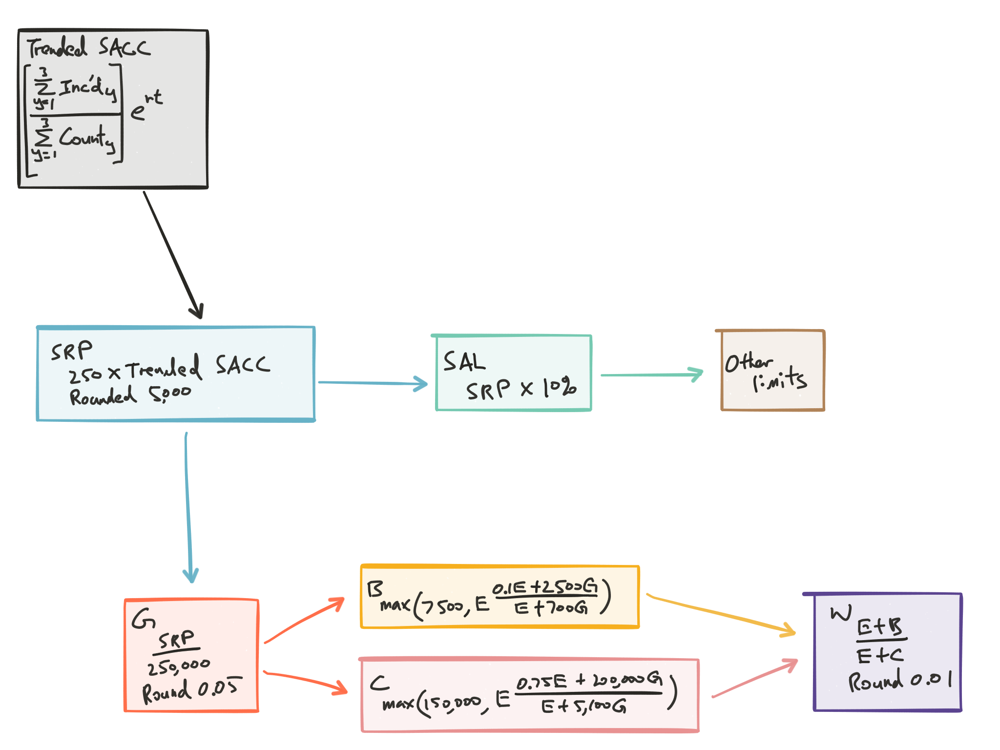

## Purpose of Experience Rating

Relates an insured's premium for $policy_t$ to their own loss experience from $policy_{t-1}$

$\begin{array}{lcccc}
  \text{Standard Premium} &= &\textbf{Modified Premium} &\times &\text{Schedule Mod Factor} \\
  &= &\left( \textbf{Manual Premium} \times \textbf{Experience Mod Factor} \right) &\times &\text{Schedule Mod Factor} \\
\end{array}$

Mostly just assumes Sch Mod = 1 $\therefore$ Standard Premium = Modified Premium

Experience rating is suitable for WC $\because$ lots of variations within a classification plan due to level of control over safety practices

Experience rating helps further distinguish between risks within a classification for things that typically doesn't have a separate rating for, e.g. Compensation, variation in premise, operating processes, materials, managements, employee morale, claim consciousness, relation to the community, etc

Credibility of actual loss experience depends on:

* Size of the insured (e.g. payroll)
* $\sigma$ between the loss experience of risks within a classification
    * Experience rating is more useful when the class plan doesn't sufficiently explain $\sigma$ in loss experience between risks
    
***

Experience modification is a prospective measure only

<span style="color:green">2003 Q6</span> Experience rating will attempt to equalize standard loss ratios across all risks, which will implicitly attempt to equalize standard loss ratios across classes. However, since it isn’t looking segmenting by classes directly, it will only be a partial correction

## Goals of Experience Ratings
<span style="color:red;background-color:yellow">Important Concepts</span>
<a name="expratinggoal"></a>

1. **Predictive accuracy** $\Rightarrow$ Individual risk equity  
Degree of charge based on past experience should be the degree to which it is predictive of future losses $\Rightarrow$ Insureds charged more closely relates to their loss potential $\Rightarrow$ Ensures equity, rates not unfairly discriminatory
    * Individual rate equity means charging risks a rate that is commensurate with their loss exposure

2. **Safety incentive**  
Give insured financial incentive for loss control

3. **Enhance market competition**
Increase availability of insurance since experience rating helps guarantee an equal profit potential on all risks after the application of the experience mod

**Balance between 1. and 2.** since 2. will charge for all losses while 1. will only charge for non-random prior losses that are predictive of future loss potential

***

<span style="color:green">2012 Q11</span> The main goal of experience rating is individual risk equity. Experience rating recognizes that each risk has a different loss potential, so by modifying rates appropriately, the expected profit potential for each risk can be made equal. This ensures that equity is achieved and rates are not unfairly discriminatory. Otherwise, risks with lower loss potential within the class would subsidize other higher loss potential risks

## Types of Experience Rating Plans

Maximize predictive accuracy $\Rightarrow$ Minimize error between predicted and actual losses

Use $\mathrm{E}[error^2]$ since it's solvable and penalizes large errors

Linearity constraint: E-mod has to be a linear function of losses

* Simplify math and make them more understandable

### No-split Plans

No subdivision of losses

$\begin{array}{llll}
  Mod &= \dfrac{\text{Modified Expected Losses}}{\text{Expected Losses}} &= \dfrac{ZA + (1-Z)E}{E} & \cdots (1) \\
  & &= 1 + Z \left( \dfrac{A - E}{E} \right) & \cdots (2)\\
  & &= \dfrac{A + K_E}{E + K_E} \\
\end{array}$

* **Credibility**: $Z = \dfrac{E}{E + K_E}$

* For formula $(2)$
    
    * 1 represents the manual rate
    
    * $(A-E)$ is the charge/credit for experience
    
    * $\frac{Z}{E}$ moderates the effect of any single large claims

***

Alternatively, from $(1) \times \frac{P}{P}$ you get the Surety Association Plans formula:

$Mod = (1 - Z) + Z \dfrac{P}{E} \times \dfrac{A}{P}$

* $P$: Standard Premium

* $(1-Z)$: Premium Modifier

* $Z \dfrac{P}{E}$: Adjusted Loss Modifier

* $\dfrac{A}{P}$: Adjusted Loss Ratio

***

#### $K_E$: Credibility Constant

$K_E$ could be:

* A constant; or
* $f(E)$; or
* Manually picked for desired responsiveness (NCCI)

Condition for $K_E$ (By relation for $Z$)

<a name="credibilityprop"></a>

1. $0 \leq Z \leq 1$
    
    * The credibility should be between zero and one

2. $\frac{d}{dE}(Z) \geq 0$

    * Size of risk $\uparrow$ $\Rightarrow$ $Z$ can't go down
    
    * The credibility should be increasing as a function of size

3. $\frac{d}{dE}\left(\frac{Z}{E}\right) < 0$

    * Size of risk $\downarrow$ $\Rightarrow$ % charge for any loss $\downarrow$
    
    * $Z$ can't $\uparrow$ faster than the size $\uparrow$
    
    * $\neq$ $Z$ increase at a decreasing rate
    
    * As the size of risk increases, the percentage charge for a loss of a given size decreases

$E$ represents the size of risk


#### Problems of no split plans

Problematic for highly skewed, heavy-tailed distributions such as that of Work Comp claims

**Solution based on Venter's Argument:**

Split losses into primary and XS, the dist^n^ of each component becomes less heavy-tailed and more predictable than using unsplit losses

**Correct Argument:**

Splitting losses into primary and XS does NOT make each more predictable. E.g. it is much easier to price a ground-up policy than an excess policy, since there is much greater uncertainty around XS losses

Split plan works better because:

* Substantial parameter risk due to the claim count uncertainty that impacts mostly the primary layer

* Process risk is due to the volatility of severity that impacts mostly the XS layer

* Split plans are more effective when most of the parameter risk goes to one portion of the split while most of the process risk goes to a separate portion

* [Source](http://www.variancejournal.org/issues/?fa=article&abstrID=7015)

### Split Plans

Subdivision losses into *primary* and *XS* components and $\mathrm{E}[error^2]$ is minimized separately

**Primary:**

* Reflects claim frequency
* Receives most weight

**XS:**

* Reflects claim severity
* Losses are typcially capped to prevent large losses that are not predictive of future losses from having too big of an impact on the insured’s premium
    * e.g. the SAL in the NCCI plan

***

<span style="color:red;background-color:yellow">Memorize</span>

$\begin{array}{llccc}
  Mod &= &\frac{1}{E}[Z_p A_p + (1-Z_p)E_p] &+ &\frac{1}{E}[Z_e A_e + (1-Z_e)E_e] \\
  &= 1 + &Z_p \left( \dfrac{A_p - E_p}{E} \right) &+ &Z_e \left( \dfrac{A_e - E_e}{E} \right) \\
  &= 1 + &\dfrac{A_p - E_p}{E + K_p} &+ &\dfrac{A_e - E_e}{E + K_e} \\
\end{array}$

* $Z_p = \dfrac{E}{E + K_p}; Z_e = \dfrac{E}{E + K_e}$

***

**Perryman's First Formula:**

$Mod = \dfrac{A_p + W A_e + (1 - W)E_e + B}{E_{total} + B}$ <span style="color:red;background-color:yellow">Memorize</span>

* $B = (1 - W)K > 0$

* $Z_p = \dfrac{E}{E + B}$

* $Z_e = W Z_p$

* Weight: $W = \dfrac{E + K_p}{E + K_e}$
    * $0 < W < 1$
    * $W$ never $\uparrow$ given $\downarrow$ $E$

* $B = K_p$

* $E_{total} = E_p + W E_e + (1-W)E_e$

* Used by NCCI since 1940 change

***

#### Single Split Plans

$A_p = 
  \begin{cases}
    A & A \leq C \\
    C & A > C \\
  \end{cases}$

$A_e = \hat{A} - A_p$

* $\hat{A}$: Capped loss that are too large that have no predictability
    * Cap by SAL

#### Multi-split Plans

Multiple incremental amounts of losses; Decreasing portion (by factor of $(1-d)^i$) of each successive increment is considered to be primary

$A_p = I + \sum\limits_{i=1}^{N-1}(1-d)^i I + (1-d)^N (A-NI)$

* $N$: number of complete increments
* $I$: incremental loss \$
* $d$: rate of discount
* Max $A_p = \frac{I}{d}$

$A_e = \hat{A} - A_p$

## History of NCCI Experience Rating

| Time Period | Highlights |
| ----------- | ---------- |
| Pre-1940    | No-split   |
| 1940        | Multi-split: $I = \$500, d = \frac{1}{3}$; $B$, $K$ $\downarrow$ linearly to risk size |
| 1961        | Single-split: @ \$2,000 w/ max $A_p = \$10,000$ |
| 1991        | Single-split: @ \$5,000 w/ max $A_p = \$5,000$;  $B$, $K$, $\uparrow$ non-linearly to risk size |
| 1998        | $\downarrow$ Med-only weight; $\uparrow$ XS weight; inflation sensitive split |

### Pre-1940

No-split

$Mod = \dfrac{A + K_E}{E + K_E}$

### 1940 Changes

Multi-split

$Mod = \dfrac{A_p + W A_e + (1 - W)E_e + B}{E_{total} + B}$

* $I$ = \$500
* $d$ = $\frac{1}{3}$

Tables of $B$ and $W$ based on risk size:

* Prevent large swings in E-mod for small insured
* $Z$ can be 1 for large insured

As risk size $\uparrow$:

* $B$, $K$, $\downarrow$
* $W$ $\uparrow$

### 1961 Changes

$A_p =
  \begin{cases}
    A & A \leq 2,000 \\
    \dfrac{10,000A}{A + 8,000} & A > 2,000 \\
  \end{cases}$
  
Max $A_p = 10,000$

$A_e = \hat{A} - A_p$

* $\hat{A}$ capped by max ratable value

### 1991 Changes

1. Simplified single split
2. $B$, $K$, $\uparrow$ non-linearly with premium
    * $W$ still $\uparrow$ with premium

$A_p =
  \begin{cases}
    A & A \leq 5,000 \\
    5,000 & A > 5,000 \\
  \end{cases}$
  
$A_e = \hat{A} - A_p$

**Reason for change:**  
Too much credibility given to large risk and not enough for small risk $\Rightarrow$ <10K and >100K became preferred business

**Theoretically:**  
$B$, $K$ being constant assume that larger insureds are more stable than smaller insureds, and thus the variance of standard loss ratios should be inversely $\propto$ to risk size

**Reality:**  
Variance did not decrease that quickly

**Impact:**<span style="color:red;background-color:yellow">Important Memorize</span>

| Small risks $Z_p$  | Small risks $Z_e$      |
| ------------------ | ---------------------- |
| $\uparrow$         | $\uparrow; \: Z_e > 0$ |

| Large risks $Z_p$                | Large risks $Z_e$                |
| -------------------------------- | -------------------------------- |
| $\downarrow;\: max \: Z_p = 91\%$ | $\Downarrow;\: max \: Z_e = 57\%$ |

For large risk, $\because$ $Z_e \: \downarrow \: > Z_p \: \downarrow \: \Rightarrow$ Effectively gave primary losses more weight for large risks

New plan performed better for small and large risks, and performed equally well for medium sized risks based on quintiles test

***

<span style="color:green">2005 Q25</span> B and K being constant would assume that larger insureds are more stable than smaller insureds, and thus the variance of the standard loss ratio should be inversely proportional to risk size. Empirical studies have shown that variance does not decrease this quickly. As such, if B and K were constant, too much credibility would be given to large risks and not enough credibility would be given to small risks.

<span style="color:green">2010 Q19d</span> Giving full credibility to loss experience conflicts with the goal of individual risk equity, which is to charge insureds for their true loss potential. Giving full credibility to an insured’s loss experience would penalize the insured for having random losses that do not reflect their true expected loss

### 1998 Change
<span style="color:red">Not in 2015 syllabus Concepts</span>

1. $\downarrow$ $Z$ on Med-only by about 70%
    * Disincentivize not reporting med-only claims
    * Lowered ELRs and D-ratios to maintain balance
2. $\uparrow$ $Z_e$ as premium $\uparrow$
    * Promote safety incentive
3. Inflation sensitive split point

## Testing the Experience Rating Plan  
<span style="color:red;background-color:yellow">Important know all test</span>

Main challenge: Determining the proper $Z$ to give to prior losses

Correct $Z$ $\Rightarrow$ maximizing predictive accuracy of plan

### Dorweiler's 2 conditions for correct credibility
<a name="Dorcriteria"></a>
<span style="color:red;background-color:yellow">Know</span>

1. Necessary: $PLR_i = PLR_j \forall \: i,j$ credit and debit risks in prospective period (each random subgroup as well)
2. Sufficient: $\nexists \: \subset$ risks with $PLR_i \neq PLR_j$ in prospective period

3 test for predictive accuracy of the plan; All tests are performed for each size group separately

### Test 1: Dorweiler's Test

**Setup:**

1. **Sort** risks by **mods** in **increasing** order
2. **Group** into subdivisions
3. For each subdivisions: calculate **manual** and **standard** LR using weighted averages by respective premium (w/ actual loss) <span style="color:red;background-color:yellow">Not super sure what to weight</span> 
    * If no premium: Manual LR $\Rightarrow$ Use $\dfrac{Loss_{Actual}}{Loss_{Expected}}$; Standard LR $\Rightarrow$ Use $\dfrac{Loss_{Actual}}{Loss_{Modified Expected}}$

**For plan performing ideally:**<span style="color:red;background-color:yellow">Know Concepts</span> 

* **Max dispersion** in manual LRs (**Identifies**)
    * Plan is good at identifying risk difference
* **Equal** standard LRs (**Corrects**)
    * Shows plan corrects for risk difference
* Same as Venter's convergence test
* If there's $\uparrow$ trend in Standard LR (as mod $\uparrow$) $\Rightarrow$ Too little credibility (not responsive enough) is applied; Vice versa

### Test 2: Gillam's Quintiles Test

<a name="Quintiles"></a>
Only for comparing 2 or more plans

**Setup:**

1. **Sort** risks by **mod** in **increasin** order
2. **Group** into **5 quintiles**
3. For each quintiles: calculate *manual* and *standard* LR using weighted averages by manual premium
4. *Quintiles test statistics:* $\dfrac{\sigma^2(Standard \:  LR)}{\sigma^2(Manual \: LR)}$
    * Uses $n$ in the denominator for the variance?

**For plan performing ideally:**

Low test statistics

### Test 3: Efficiency Test

<a name="Efficiency"></a>
Only for comparing 2 or more plans

**Setup:**

1. *No* sorting necessary
2. *No Grouping* within the size group
    * Recall all 3 test are done for each size group
3. For each group, calculate *manual* and *standard* LR
4. *Efficiency test statistics:* $\dfrac{\sigma^2(Standard \:  LR)}{\sigma^2(Manual \: LR)}$

**For plan performing ideally:**

Low test statistics

* Better risk reduction in risk LR variance

***

For each test, if no premium data available:

* Replace manual LR $\Rightarrow$ Use $\dfrac{Loss_{Actual}}{Loss_{Expected}}$

* Replace standard LR $\Rightarrow$ Use $\dfrac{Loss_{Actual}}{Loss_{Modified Expected}}$

### Example for Quintiles and Efficiency Tests

```{r echo = FALSE, message=FALSE}
library(dplyr)
library(scales)
library(knitr)

d1 <- data_frame(
  "Pol No" = seq(1,10,1),
  "Manual LR" = c(0.62, 0.65, 0.69, 0.68, 0.77, 0.81, 0.85, 0.81, 0.85, 0.93),
  "Plan A E Mod" = c(0.75, 0.80, 0.85, 0.90, 0.95, 1.00, 1.1, 1.15, 1.2, 1.25),
  "Plan B E Mod" = c(0.68, 0.84, 0.95, 0.78, 1.0, 1.08, 1.00, 1.11, 1.17, 1.22)
)

d1 <-
  d1 %>% 
  mutate(`Plan A Standard LR` = `Manual LR`/`Plan A E Mod`,
         `Plan B Standard LR` = `Manual LR`/`Plan B E Mod`,
         `Manual LR` = `Manual LR`)
```

`r kable(d1, align = 'l')`

#### Quintiles Test:

***1. Sort by mod and group into 5 quintiles***

```{r}
d1_1 <- 
  d1 %>%
  mutate(QuintileA = ntile(`Plan A E Mod`, 5),
         QuintileB = ntile(`Plan B E Mod`, 5))
```

`r kable(d1_1, align = 'l')`

***2. Calculate Weighted average manual and standard LR***

```{r}
d1_2_a <-
  d1_1 %>%
  group_by(QuintileA) %>%
  summarize(`Plan A Manual Avg LR` = mean(`Manual LR`),
            # Straight average
            `Plan A Standard Wtd Avg LR` = weighted.mean(`Plan A Standard LR`, `Manual LR`)
            # Wtd by Manual LR
  )
```

`r kable(d1_2_a, align = 'l')`

```{r}
d1_2_b <-
  d1_1 %>%
  group_by(QuintileB) %>%
  summarize(`Plan B Manual Avg LR` = mean(`Manual LR`),
            # Straight average = Wtd by Manual LR
            `Plan B Standard Wtd Avg LR` = weighted.mean(`Plan B Standard LR`, `Manual LR`)
            # Wtd by Manual LR
  )
```

`r kable(d1_2_b, align = 'l')`

***3. Quintile Statistics***

```{r}
d1_3_a <-
  d1_2_a %>%
  summarize(`Manual LR Var` = var(`Plan A Manual Avg LR`)*(nrow(.)-1)/(nrow(.)),
            `Standard LR Var` = var(`Plan A Standard Wtd Avg LR`)*(nrow(.)-1)/(nrow(.)))

kable(d1_3_a, align = 'l')

```

Quintiles Test Statistics for Plan A = $\dfrac{\sigma^2(\text{Standard LR})}{\sigma^2(\text{Manual LR})}$ = `r d1_3_a[[2]]/d1_3_a[[1]]`

```{r}
d1_3_b <-
  d1_2_b %>%
  summarize(`Manual LR Var` = var(`Plan B Manual Avg LR`)*(nrow(.)-1)/(nrow(.)),
            `Standard LR Var` = var(`Plan B Standard Wtd Avg LR`)*(nrow(.)-1)/(nrow(.)))

kable(d1_3_b, align = 'l')

```

Quintiles Test Statistics for Plan B = $\dfrac{\sigma^2(\text{Standard LR})}{\sigma^2(\text{Manual LR})}$ = `r d1_3_b[[2]]/d1_3_b[[1]]`

$\because$ Plan A has a lower test statistics $\therefore$ Plan A is more effective

#### Efficiency Test:

Calculate the variance of the manual LR and standard LR under the 2 plan with out any sorting and grouping

```{r}
d2 <-
  d1_1 %>%
  summarize(`Manual LR Var` = var(`Manual LR`)*(nrow(.)-1)/(nrow(.)),
            `Plan A Standard LR Var` = var(`Plan A Standard LR`)*(nrow(.)-1)/(nrow(.)),
            `Plan B Standard LR Var` = var(`Plan B Standard LR`)*(nrow(.)-1)/(nrow(.)))

kable(d2, align = 'l')
```

Quintiles Test Statistics for Plan A = $\dfrac{\sigma^2(\text{Standard LR})}{\sigma^2(\text{Manual LR})}$ = `r d2[[2]]/d2[[1]]`

Quintiles Test Statistics for Plan A = $\dfrac{\sigma^2(\text{Standard LR})}{\sigma^2(\text{Manual LR})}$ = `r d2[[3]]/d2[[1]]`

$\because$ Plan A has a lower test statistics $\therefore$ Plan A is more effective

## Experience Rating: Data

NCCI data source for *classs ratemaking* and *experience rating*: 
 
* Workers Compensation Statistical Plan, a.k.a. Unit Plan
* Report losses by injury type, payroll, and class codes for every risk from insurers up to the 5th report

**Time Period** for E-mod calculation:

* 3 prior years of actual loss
* e.g. 7/2013 policy uses 7/2009-2011 (x2012 since it's still in effect as the price is quoted)

2 **adjustments** to loss data

1. Add contract med losses (med portion of indemnity) to Med-only
2. Separate PP into Major PP and Minor PP

**Group** losses into 3 categories

1. *Serious*: Fatal, PT, Major PP
2. *Non-serious*: TT, Minor PP
3. *Med*: Medical from all claims

NCCI make adjustments (detrend/dev) to the $\mathrm{E}[L]$ to make them comparable to historical actual

Does **Not** *develop* nor *trend* nor adjust for *benefit levels* on the ***actual*** losses

## Experience Rating: Plan Parameters & Rating Value

Plan parameters by **State** + **Insured Size**

* **State Reference Point (SRP)**:  
Calculate $Z$ and loss limits  
Depends on trended *State Average Cost per Claims (SACC)*

* **Weighting Value (W)**:  
Limit weight of XS $loss_{actual}$

* **Ballast (B)**:  
Provide stability on E-mod by limiting impact from any single loss

Rating value by **State** + **Class**

* **ELR**:  
$\dfrac{\mathrm{E}[L]}{ \$100 \text{ payroll}}$

* **Discount Ratio (D ratios)**:  
Expected primary % of expected loss $\dfrac{\mathrm{E}[L_{Primary}]}{\mathrm{E}[L]}$

Note: Might not need to know how to calculate ELR and D-ratios. But know all the adjustments made to get the ELRs from the class rate (PLR Adj, time frames, limiting loss)

### Plan Parameters
<a name="plan-para"></a>



#### Trended State Average Cost per Claim SACC

$\text{Trended SACC} = \left( \dfrac{\sum\limits_{y=1}^3 \text{Inc'd Loss}_y}{\sum_{y=1}^3 \text{Claim Count}_y} \right) \times e^{rt}$

* Forward trended wtd avg 3 years undeveloped severity
* $r$ = continuously compounded annual trend
* $t$ = trend period = midpoint of mod experience period
* Employer's liability claim is capped at 100K

Rationale:

* Undeveloped losses so data has = maturity as the data that is used for actual losses entering the E-mod calculation
* Trend to bring older data to current cost level

***

#### State Reference Point (SRP)

$SRP = 250 \times \text{Trended SACC}$

Additional adjustments/constraints:

* **Round** to nearest \$5,000
* $SRP_t \nless SRP_{t-1}$ unless significant reduction in WC benefits
* $\Delta SRP > 20\%$ will be investigated

***

#### State Accident Limit (SAL)

Limit for individual actual losses entering the experience mod calculation

$SAL = 10\% \times SRP$

Other dependents:

* Limit on the total losses from a multiple claim occurrence = $2 \times SAL$
* See rule 2.C.13

***

#### Scale factor (G)

$G = \dfrac{SRP}{250{,}000}$

Additional adjustments/constraints:

* **Round** to nearest 0.05

***

#### Ballast (B),  Weighting Value (W) (and C = $K_e$)

$\begin{array}{llll}
  B &= \max \left( 7500, \: E \times \dfrac{0.1E + 2{,}500G}{E + 700G} \right) &= K_p & B>0 \\
  C &= \max \left( 150{,}000, \: E \times \dfrac{0.75E + 200{,}000G}{E + 5{,}100G} \right) &= K_e \\
\end{array}$

$W = \dfrac{E + B}{E + C}$

Additional adjustments/constraints:

* **Round** to nearest 0.01
* $0 < W <1$
* $W$ can **not** $\uparrow$ for $\downarrow$ $E$

Constraint on $B$ and $W$ so that no risk has 100% credibility

***

### Plan Rating Values

Need *ELRs* and *D-ratios* for each class $i$ to get $E$ and $E_e$

$E_i = ELR_i \times \left( \dfrac{\sum\limits_{y=1}^3 Payroll_{i,y}}{100} \right)$

$E = \sum\limits_{i \in class} E_i$

$E_p = \sum\limits_{i \in class} D_i \times E_i$

$E_e = E - E_p$

ELRs and D-Ratios are calculated at the same time and using the same data as the filed rates

#### $ELR_i$ Expected Loss Ratio by Class: 

***Step 0. Starting Point***

Class rates (or class loss costs) published by NCCI (by States)

***Step 1. Calculate ELR Level Factor***

Purpose:  
Reduces manual rates (or loss costs) to pure premiums at 2nd report, @ the same benefit level as in the experience period

Calculations/Adjustments:

1. Class rate (or loss costs) $\times PLR$  
Remove remove profit, taxes, and expenses

2. Time frame difference adjustments between prospective class rates and historical losses  
Benefit levels, loss development, trend

***Step 2. ELR factors by HG and ELR factors by class***

Purpose:  
To reflect that losses going into the experience rating calculation are limited by the $SAL$, but the losses underlying the rates are not limited

Calculations/Adjustments:

1. $\forall$ HG: $\dfrac{\sum\limits_i Cost_{i,j}}{\sum\limits_i Claim_{i,j}}$ $j \in \{\text{Serious Injury Types}\}$

2. $\forall$ types, HG: $\dfrac{SAL}{\text{injury type average cost per case}} = \text{Entry Ratio} \: r$

3. Use $r$ from 2. and tables of $R(L)$ $\Rightarrow$ $R(L)$ $\forall$ injury type and HG

4. $\forall$ HG: weight the 3 $R(L)$ by injury type weights to get a single $R(L)$ for each HG

5. $[\text{HG adjustment factor}] = 1 - R(L)$ from 4.

6. $\forall$ HG $[ELR \text{ level factor}]_{HG} \times [\text{HG adjustment factor}] = [\text{HG }ELR\text{ Factor}]$

7. $[\text{HG }ELR\text{ Factor}] \times \text{Class rate in HG} = ELR\text{ by class}$

$ELR_i = (\text{Manual Rate}_i) \times (\text{ELR level factor}_i) \times (\text{HG Adj Factor}_i)$

***Step 3. Check the ELRs for reasonability***

Not in syllabus

<span style="color=red;background-color=yellow">?Question?</span> Use the value of E in the NCCI tables to find the values for W and B. (from 2011 Q15)

#### $D_i$ D-ratios by Class  
<span style="color:red">Calculation not in syllabus</span>

Portion of loss that will be primary

1. Use 3 most recently available years of data
2. Calculate expected primary percentage of losses for serious, non-serious, and medical claim types
3. Weight the 3 together to produce a single D-ratios for each class

## Application of NCCI Experience Rating Plan

$\text{Standard Premium} = \text{Experience Mod} \times \sum\limits_{i \in class} \sum\limits_{j \in locations} \text{Manual Premium}_{i,j}$

Mod only differentiates loss potential for risks within a class, not between classes since it's applied to the manual premium which varies by class

Debit and credit could just means a poor class fit and not necessary poor safety habits

## The Off-balance

Rate level vs premium level:

* Rate level: just manual premium
    * No Exp/Sch rating, prem discount, retro rating, dividends
* Premium level: includes all the above
    * Premium level can $\Delta$ due to $\Delta$ in any one of the above factors without rate level $\Delta$

<a name="off-balance"></a>
$\begin{array}
  \text{Off-Balance} &= \dfrac{\text{Standard Premium}}{\text{Manual Premium}} \\
  &= \text{weighted average experience mod across all risks} \\
  &= f(\text{Adequacy of the rating values of the ELRs and D-ratios})
\end{array}$

If ELRs and D-ratios adequate:  

* Off-Balance $\approx$ 1; or
* Slight credit (< 1.00) since risks large enough for experience rating tend to have better loss experience

Off-balance is not used to change the overall premium adequacy

* Varies by state, usually within $\pm$ 1-2 points of 1.00

If the off-balance isn't changing, it has no impact on the needed premium level change

**Off-balance mismatch:**  
<span style="color:green">2013</span>

* Due to the fact that rate indications are based on standard loss ratios, but the rate changes are applied to the manual rates
* Usually happens when rate adequacy deteriorates for several years due to lack of regulatory approval
* Example:
    1. DOI refuses to approve NCCI class rate level $\Delta$ (Individual E-mod $\uparrow$) $\Rightarrow$ rates are considered 10% inadequate (This is starting point for $E$)
    2. Off-balance $\uparrow$ > 1, since the $E$ values are too low relative to the A values; reduce the premium inadequacy, but not the rate inadequacy
    3. Rate indications are based on standard loss ratios, the indications will be too low compare to real inadequacy since the off-balance is reducing the premium inadequacy
    4. If adequate rates are then approved by the DOI, the off-balance will move back down towards 1, and the premiums will become inadequate once again
* Example 2:    
    1. Projected LR to determine indication = $\dfrac{\text{Projected Losses}}{\text{Projected Final Premium (w/ e-mod)}}$
    2. Indication = $+x\%$
    3. DOI approve $+x\%$
    4. ELR used to get the $\mathrm{E}[L]$ in the Exp rating formula is based on manual rates $\Rightarrow$ $\mathrm{E}[L]$ in the mod formula $\uparrow$
    5. Mod formulas now compare actual losses vs higher $\mathrm{E}[L] $\Rightarrow$ Mod for individual risk start coming down $\Rightarrow$ Average mod $\downarrow$ (off-balance)
    6. Mods $\downarrow$ %\Rightarrow$ Premium collected $\downarrow$ $\Rightarrow$ Premium inadequate

From [TIA](http://www.theinfiniteactuary.com/mb/viewtopic.php?f=17592&t=23387&sid=1cf6ce84b3b9097eb43584801adb56de)

* Indicated rate change factor = Actual Loss Ratio / Target Loss Ratio
* Where Actual Loss Ratio = Actual Losses / Final Premium and the Final Premium includes experience mods (i.e., the off-balance), among other things
* So as long as final premium doesn't change, the rate indication doesn't change (all else being equal). However, when the off-balance changes, the final premium will change, and thus the indication will change
* Looking at this from the opposite direction, after a rate change, the off-balance changes (since the expected losses in the experience mod formula are based on current rates). The changing off-balance causes the final premium to change yet again, which alters the rate indication.

## Using the NCCI Experience Rating Plan Manual  
<span style="color:green">2002 Q33, 2009 Q25</span>

Some highlights

### Rule 2.A.2.  
<span style="color:red;background-color:yellow">Important</span>

Table showing the premium **eligibility for experience rating** by **state**

Mod is *mandatory* once an insured is eligible

Need one of the following:

* $\sum\limits_{t=1}^2 \text{Manual Premium}_t \geq \text{Column A}$; OR
* $\dfrac{\sum\limits_{t=1}^3 \text{Manual Premium}}{3} \geq \text{Column B}$

### Rule 2.C

Descriptions of all the items in Experience mod formula

**2.C.9** and **2.C.10.** shows calculation for *interstate* $W$ and $B$

### Rule 2.C.13.  
<span style="color:red;background-color:yellow">Important</span>

Rules for different loss limits to apply to actual losses

Per claim accident limitation = $SAL$

### Rule 2.D.1.  
<span style="color:red;background-color:yellow">Important</span>

Experience Mod Formula

### Rule 2.D.2.  
<span style="color:red;background-color:yellow">Important</span>

Maximum debit mod, varies by risk

### Rule 5.B.

Ex-Med coverage, formula to convert expected losses to an ex-medical basis

### Appendix Table  
<span style="color:red;background-color:yellow">Important</span>

Table for **ELRs** and **D-ratios** by class for AL

Table for $W$ values based on $E$ for AL
    * Also has $G$ and various loss limits and **state multi limit**
    
Table for $B$ values based on $E$ for AL

### Miscellaneous Rules

**Rule 1.C.8.**

Reasons why risk might have mod = 1.00

**Rule 2.A.5.**

Qualification for interstate experience rating

**Rule 2.B.2.**

Rating effective dates for multiple policy risks with different effective dates

**Rule 3.**  
<span style="color:green">2001 Q25</span>

Ownership changes and combination of entities

**Rule 4.B.1-3**

Corrections for payroll, losses of classifications can result in revised mods

**Rule 4.C.**

Definitions for preliminary, final, and contingent mod