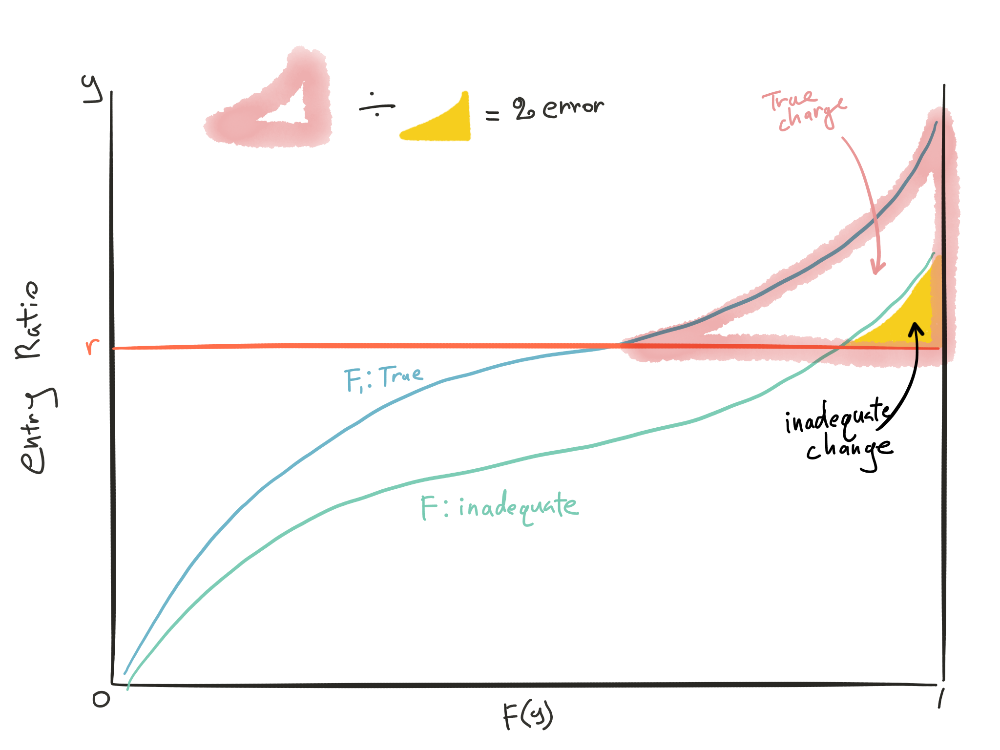

2002 Q39, 2003 Q35

## Intro to LDD and XS Policies

Usually requires employers to be very large, especially for XS policies since they have to service those policies

Both are less regulated than

### Adventages of LDD and XS policies

Insured's POV:

* Save costs related to insurer profit and expenses
* Tax savings since liability for an insurance deductible on an unpaid insurance claim can be deducted, but not loss reserve on a retained claim

Insurer's POV:

* Positive cash flow since XS claims don't paid out for years
* Lower residual market assessments if those assessments are based on written premium

###Large Dollar Deductible Overview

Employer:

* Self-retain a per occ deductible and/or aggregate deductible

Insurer:

* Indemnifies all losses > deductible
* Provides services = full coverage
* Adjusts all claims
* Issue as endoresement to full coverage

Additional Pros:

* Medium size employers can qualify
* No administration effor
* Savings on taxes and assessments
    * Losses below the deductible do not generate premium, which is subject to these taxes and assessments
* Already familiar with insurer's level of service
* Insurer might be best qualified to provide policy and claim services

### XS Policy Overview

Employer:

* Self-retain a per occ dedeuctible and/or aggregate deductible
* Service the plan internally (or use TPA)

Insurer:

* Indemnifies all losses > deductible
* Only involve with claims that may exceed deductible
* Issue as a stand-alone policies

Additional Pros:

* Expenses paid to TPA are not considered insurance premium so not subject to premium based taxes and assessment

### LDD and XS Policies Rating Method Overview

Mostly retrospectively rated since the retro premium can vary with actual costs instead of based on uncertain expected costs $\Rightarrow$ More stable stream of income for insurers; Increase equity in costs across insureds

2 way to price:

* Summing up the cost components
    * More justifiable and more appealing to customers
* Discount from full coverage
    * Assumes full coverage premium is adequate (or apply factor for rate adequacy)
    
## LDD and XS Policies Cost Components  

Loss + ALAE + ULAE + Overhead + Acquisition + Risk Load + Taxes & Assessments + Profit & Contingencies

### Loss  
2013 Q18

Mostly similar between LDD and XS with 1 exception:  
Insurer’s exposure is dependent on the prudence of the TPA’s claim handling $\Rightarrow$ Additional uncertainty will be priced in

$\begin{array}{lc}
  \text{XS Loss Cost} = &\text{Losses }>\text{ per occ deductible} \\
  &+ \\
  &\text{Agg primary losses }> \text{ agg deductible}\\
\end{array}$

3 methods to price similar to retro rated policies

1. Tbl LLM for agg charge + ELPPF for per occ charge
2. Tbl M with ICRLL for agg charge + ELPPF for per occ charge
3. Tbl L for both

Losses may or maynot be rated with ALAE, deal with it appropriately. E.g. Use ELAEPPF for Tbl LLM and M

#### Considerations when Using ELPPFs

ELPPFs only vary by limit and HG and state $\Rightarrow$ Might not be appropriate for all insured

Nature of insured's business might be different than the HG (Also affects the charge)

Insured’s prior loss history, particularly of serious injuries as they are more likely to pierce the limit

Insured's safety and managed care

Overlap between ELPPF and charge (Already accounted for in the method)

ELPPF vs ELAEPPF

#### Fisher Comments

Estimate of expected losses below the deductible is too low:

1. The % error in insurance charges is greatest for large policies w/ high entry ratios
    * As $r$ $\uparrow$, ratio for the 2 area $\uparrow$
    * As policies size $\uparrow$, curve flatter $\Rightarrow$ smaller areas above same $r$
2. The \$ error in insurance charges is greatest for large policies w/ low entry ratios
    * Area between the curves and above $r$ largest for low values of $r$
    * \$ value greater when this difference in area is multiplied by a larger expected loss

## LAE

