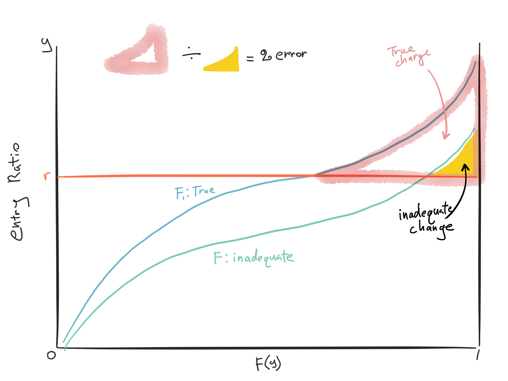

## Cliff's Summary

### Gillam & Snader 3

Know the [4 assumptions](#discountass) for discount method

Know [assumptions](#xmedass) behind the x-med formula

Know how to setup formula based on what's given

* Take out ALAE from loss if needed

Know the deductible formulas

### Teng

Know the by component calculations of premium

* Apply $\phi^{LLM}(r)$ to the right basis (limited or unlimited loss)
    * Charge from a Table LLM would naturally be expressed as a percent of expected limited losses
* $EEL$ is usually $EL$ times XS factor (know if it includes ALAE)
* Expensee as % of standard premium vs final premium
* Check if deductible limits loss & alae or alae is ground-up

Know the difference between XS and LDD and full plan

* For [Loss](#XSvLDD-Loss), [LAE](#XSvLDD-LAE), [G&A](#XSvLDD-GA), [Acq](#XSvLDD-acq), [risk load](#XSvLDD-risk), [tax](#XSvLDD-tax), [profit & contingencies](#XSvLDD-profit)

### Fisher

Mostly related to the loss components of LDD with the insurance charges and XS loss

Make sure when you looking up table M ICRLL, use entry ratios with the limited loss

Note the difference between Excess Loss Pure Premium Factor and an Excess Loss Factor. Remember that the ELPPF is excess losses over total losses, and the ELF is excess losses over standard premium.

Know fisher's comment

## Types of Exam Questions

### Gillam & Snader 3

Calculation using discount method

* 2001 Q36 $\star$ (LDD discount)
    * Note to take out ALAE in formula
    * And only medical is part of the deal
* 2004 Q19 $\star$ (Disappearing deductible)
* 2005 Q35 $\star$ (Back solve disappearing deductible)
* 2009 Q26 (both deductible)
* 2010 Q26 $\star$ (back out disapperating deductible with trial and error)
* 2011 Q17 $\star$ (arithmetic with deductibles)
* 2012 Q22 ab$\star$ (deductible and trend)

Concepts

* 2000 Q20 (Discount methdod assumptions)
* 2001 Q13 (Discount methdod assumptions)
* 2002 Q2 (x-med discount assumptions)
* 2012 Q22 c$\star$ (XS layer trend higher, B7)

STRAIGHT DEDUCTIBLE: LER & DISCOUNT

* Remember that ALAE is not variable, so not part of the discount
* ULAE is also not reduced
* No inspection expense for LDD

DISAPPEARING DEDUCTIBLE: LER & DISCOUNT

* Know the formula
* Else similar to just straight deductible

EX-MEDICAL COVERAGE: DISCOUNT, ADJUSTED LCF

* Bunch of formulas maybe memorize

EXCESS COVERAGE: PREMIUM/LOSS SENSITIVE DISCOUNT

* Know if expenses are sensitive to losses or premium

### Teng

LDD Prem

* 2000 Q38 ab $\star$ (full blown LDD calc)
    * LBA is an expense
* 2002 Q1 (plug and play)
* 2004 Q39 (get LER then plug and play)
* 2004 Q48 (plug and play)
    * ALAE treatment: ground-up
* 2005 Q48 (plug and play)
* 2006 Q33 (plug and play)
* 2007 Q45
* 2007 Q36 a (plug and play)
* 2008 Q31 a (plug and play)
* 2009 Q35 (fullblown)
    * Watch out for what the % are givens as of
* 2011 Q18 (plug and play)
* 2013 Q13 (plug and play)
* 2013 Q18 $\star\star$ (fullblown + B9 truncate shift!!!)
* 2014 Q19 a $\star$ (Use entry ratio with limited denominator when looking up table)

XS

* 2008 Q31 b
* 2014 Q19 c

Concepts

* 2000 Q38 c $\star$ (LDD vs XS)
* 2001 Q12 (LDD considerations)
* 2002 Q44 $\star$ (LDD vs XS)
    * d: higher uncertainty of loss for XS so higher ELF
* 2003 Q34 $\star$ (LDD vs XS, payment pattern)
* 2005 Q34 $\star$ (LDD vs full)
* 2006 Q31 $\star$ (LDD vs XS)
* 2007 Q36 bc (LDD vs full)
* 2008 Q31 c (LDD vs XS)
* 2009 Q29 (LDD vs XS)
* 2011 Q18 (LDD vs XS)
* 2013 Q16 $\star$ (More related to Retro section with LLM charges)
* 2014 Q19 b $\star$ (LDD advantages)
* 2014 Q19 a $\star$ (LDD vs XS in profit and tax)
* Practice 1 (Describe 2 ways to price)

WC LARGE DEDUCTIBLE: NET PREMIUM & EXPENSE RATIO

* Standard LDD calc, always watch out for what's the charge applies to
* Know what is a % of what

WC EXCESS COVERAGE: NET PREMIUM & EXPENSE RATIO

* Need to know what are the relevant information

### Fisher

Calculate charges and expected loss

* 2002 Q39 $\star\star$ (charges calculations)
    * Tricky wording with the retention vs limits for retro
* 2003 Q35 $\star$ (lookup tables with ICRLL)
* 2004 Q46 (expected loss with charge)
* 2005 Q36 (expected loss with charge)
* 2006 Q36 (expected loss with charge)
* 2007 Q33 $\star$ (expected loss with charge, LLM and ICRLL)
* 2008 Q30 (expected loss with charge)
* 2009 Q27 $\star$ (% error)
* 2010 Q24 (% error)
    * Make assumption on ELF and assuming looking at % error
* 2010 Q28 $\star$ (Tbl M constuction then get LDD prem)
    * Make assumption about table being unlimited
* 2011 Q19 (expected loss with charge, with charget interpolation)
* 2011 Q23 ($ Error)
* 2012 Q20 $\star$ (expected loss with charge on AK policies table lookup)
* 2013 Q19 a (expected loss with charge)
* 2014 Q16 a $\star$ (backsolve occ limit)
* 2014 Q16 b $\star$ (Lee diagram)
* 2014 Q16 c $\star$ (Compare to retro)

Concepts

* 2003 Q12 (charges)
* 2008 Q33 $\star$ (error impact, fisher comments)
    * [TIA](http://www.theinfiniteactuary.com/mb/viewtopic.php?f=17866&t=15045)
* 2013 Q19 b $\star$ (ICRLL)
    * The presence of a per occurrence limit (in addition to an aggregate limit) reduces the variance in entry ratios for a group of risks of a given size that are used to construct a (Limited Loss) Table M. As such, the (Limited Loss) Table M curve will be flatter than without the per occurrence limit, and the insurance charges for a given entry ratio will be smaller. Using a regular Table M without adjustment would result in an overlap with the charge for the per occurrence limit.
This reduction in the variance of entry ratios is also what happens for groups of larger risk sizes, since the law of large numbers gives their loss ratios more stability. As such, the ICRLL procedure uses the Table M curve for a group of larger risks to approximate the use of a Limited Loss Table M curve

AGG DED LIMIT COST: TABLE M

* Getting the cost from Table M

AGG DED LIMIT COST: TABLE $M_D$

* Have a very good graph for showing how each piece is represented
    
## Must Know Formulas

LDD by components

* $\text{LDD Prem} = \dfrac{ (EEL + \phi^{LLM}(r_G) \times EPL) + EL \: (ULAE + LBA) + SP \: (GO + CR)}{1 - A - T - p}$

XS by components

* $\text{XS Prem} = \dfrac{(EEL + \phi^{LLM}(r_G) \times EPL) \times (1 + ULAE) + SP \: (GO)}{1 - A - T - p}$

***

Straight Deductible

* $PLER = \dfrac{L_r + (N-n)r}{L}$

Disappearing Deductible

* $PLER = \dfrac{L_r + L_R - (L_R - rN_R)\frac{R}{R-r}}{L}$

$\begin{array}{ll}
  L_r &=  \text{Total losses from claims with loss size }\leq r \\
  N &= \text{Total # of claims} \\
  n &= \text{Total # of claims with loss size }\leq r \\
  r &= \text{Deductible amount} \\
  L &= \text{Total losses} \\
  & \\
  &\text{For Disappearing only} \\
  & \\
  L_R &=  \text{Total losses from claims with loss size } r < \lambda < R \\
  N_R &=  \text{Total # of claims with loss size } r < \lambda < R \\
\end{array}$

***

LDD by discount

* $D = \dfrac{(ELR)(PLER)(f)}{1-A-T-p}$

XS by discount varies with Net Premium

* $D = \dfrac{(ELR)(PLER)(f)}{1 - A - T - p - u - i - gh}$

XS by discount varies with XS L&ALAE

* $D = \dfrac{(ELR)(PLER)(f)(1+u_E+i_E+g_E h_E)}{1 - A - T - p}$

ULAE$(u)$, Inspection Expense$(i)$, and Portion$(g)$ of Home Office Expense$(h)$

***

X-med policies by discount

* $P = \dfrac{E - kE_M+ eP}{1-A-T}$

Adj under retro rating x-med

* $C' = 1 + (C - 1)\dfrac{1-A-T-e}{(1-D)(1-A-T)-e}$

## Intro to LDD and XS Policies

Usually requires employers to be very large, especially for XS policies since they have to service those policies

Both are less regulated than

### Adventages of LDD and XS policies

Insured's POV:

* Save costs related to insurer profit and expenses
* Tax savings since liability for an insurance deductible on an unpaid insurance claim can be deducted, but not loss reserve on a retained claim

Insurer's POV:

* Positive cash flow since XS claims don't paid out for years
* Lower residual market assessments if those assessments are based on written premium

### Large Dollar Deductible Overview

Employer:

* Self-retain a per occ deductible and/or aggregate deductible

Insurer:

* Indemnifies all losses > deductible
* Provides services = full coverage
* Adjusts all claims
* Issue as endorsement to full coverage

Additional Pros:

* Medium size employers can qualify
* No administration effort
* Savings on taxes and assessments
    * Losses below the deductible do not generate premium, which is subject to these taxes and assessments
* Already familiar with insurer's level of service
* Insurer might be best qualified to provide policy and claim services

### XS Policy Overview

Employer:

* Self-retain a per occ deductible and/or aggregate deductible
* Service the plan internally (or use TPA)

Insurer:

* Indemnifies all losses > deductible
* Only involve with claims that may exceed deductible
* Issue as a stand-alone policies

Additional Pros:

* Expenses paid to TPA are not considered insurance premium so not subject to premium based taxes and assessment

### LDD and XS Policies Rating Method Overview

Mostly retrospectively rated since the retro premium can vary with actual costs instead of based on uncertain expected costs $\Rightarrow$ More stable stream of income for insurers; Increase equity in costs across insureds

2 way to price:

* Summing up the cost components
    * More justifiable and more appealing to customers due to additional transparency
* Discount from full coverage
    * Assumes full coverage premium is adequate (or apply factor for rate adequacy)

## LDD and XS Policies Cost Components  

Loss + ALAE + ULAE + Overhead + Acquisition + Risk Load + Taxes & Assessments + Profit & Contingencies

### Loss

Mostly *similar* between LDD and XS with **1 exception**:  
For XS, insurer’s exposure is dependent on the prudence of the TPA’s claim handling $\Rightarrow$ Additional uncertainty will be priced in $\Rightarrow$ Use higher ELFs or like risk adjusted ILFs (B7)

***

$\begin{array}{lc}
  \text{XS Loss Cost} = &\text{Losses }>\text{ per occ deductible} \\
  &+ \\
  &\text{Agg primary losses }> \text{ agg deductible}\\
\end{array}$

3 methods to price similar to retro rated policies

1. Tbl LLM for agg charge + ELPPF for per occ charge
2. Tbl M with ICRLL for agg charge + ELPPF for per occ charge
3. Tbl L for both

Losses **may or may not be rated with ALAE**, deal with it appropriately. E.g. Use ELAEPPF for Tbl LLM and M

#### Considerations when Using ELPPFs

ELPPFs only vary by limit and HG and state $\Rightarrow$ Might not be appropriate for all insured

Nature of insured's business might be different than the HG (Also affects the charge)

Insured’s prior loss history, particularly of serious injuries as they are more likely to pierce the limit

Insured's safety and managed care

Overlap between ELPPF and charge (Already accounted for in the method)

ELPPF vs ELAEPPF

#### Fisher Comments

Estimate of expected losses below the deductible is too low:

1. The % error in insurance charges is greatest for large policies w/ high entry ratios
    * As $r$ $\uparrow$, ratio for the 2 area $\uparrow$
    * As policies size $\uparrow$, curve flatter $\Rightarrow$ smaller areas above same $r$
2. The \$ error in insurance charges is greatest for large policies w/ low entry ratios
    * Area between the curves and above $r$ largest for low values of $r$
    * \$ value greater when this difference in area is multiplied by a larger expected loss

### LAE

LDD LAE $\gg$ XS LAE since insurer handles all claims

LDD

* ALAE rated with loss
* ULAE rated with unlimited loss

XS

* Split pro rata on losses above and below deductible
* ULAE rated with XS loss

### General Overhead Expenses

E.g. home office admin, policy production, underwriting, actuarial, IT costs, and statistical reporting

LDD G&A > XS G&A since services are only provided for claims above the deductible

LDD G&A can be > full coverage:

* Insurer has to seek reimbursement for losses < deductible
* Complicated data reporting
* Separately LDD endorsement
* Computer system needs to handle these policies

G&A as % of **Standard Premium**

* Expense loads in pricing should vary by risk size to account for fixed costs
* In full coverage this is handled by the premium discount

### Acquisition Expense

E.g. Sales commissions and sales office expenses

Structure varies by company so should be priced accordingly

Acq Expense as % of **Net Premium**

### Risk Load

LDD and XS are riskier than full coverage:

1. XS loss harder to estimate
2. Higher interest rate risk $\because$ Longer payout period
    * 4-5 years duration for LDD; 10+ years for XS
    * 2003 Q34 LDD policies have additional expenses compared to Excess policies because LDD policies require handling of all claims below the deductible, while Excess policies only handle claims that exceed the retention. Since the expenses on claims below the deductible are paid out much more quickly than excess losses and the expenses for excess claims, the combined expense and loss payout period for LDD policies is significantly shorter than for Excess policies
3. Credit risk (for LDD only)
    * Vary based on insured and collateral

Might need cat reinsurance, so the include the cost of that

*Credit risk* as % of **Standard Premium**; The rest are typically part of profit & contingencies

### Taxes and Assessments

Based on net premium or net loss (Sometimes group-up loss and full coverage premium)

XS plan are treated more like XS GL than WC

* No residual market assessments or loss based assessments
* Lower premium tax rate

### Profit & Contingencies

LDD

* Compete on services and price

XS

* Compete on price only
* Profit margin usually negative
* Made up in investment income

Profit & Cont as % of **Net Premium**

## Insurance Charge and Loss Elimination Ratio  
2007 Q33

Insurance Charge

**For policy with both per occ and agg deductible**

Fisher:

* Use LLM or Tbl M w/ ICRLL to price agg charge
* Charge is applied to the $\mathrm{E}[Loss_{primary}; \text{Per occ limit}]$ to get \$ charge

Teng:

* Converts table charge to be % of expected $\mathrm{E}[Loss_{group-up}]$ and applies $\mathrm{E}[Loss_{group-up}]$

Just make sure you're applying charges to the right kind of loss

**Loss Elimination Ratio**

* In retro rating: $\dfrac{\mathrm{E}[Loss > occ]}{\mathrm{E}[Loss]}
* Gillam & Snader 3 (LDD and XS): $\dfrac{\mathrm{E}[Loss < occ]}{\mathrm{E}[Loss]}
* Difference due to looking at different POV, both are losses that are eliminated

## Pricing LDD: By Components  
Important Formulas

$\text{LDD Prem} = \dfrac{ {\color{blue}{(EEL + \phi^{LLM}(r_G) \times EPL) } } + EL \: (ULAE + LBA) + SP \: (GO + CR)}{1 - A - T - p}$

**Loss**  
${\color{blue}{(EEL + \phi^{LLM}(R_G) \times EPL) } }$:

$\begin{array}{ll}
  EL &= \text{Expected ground-up L&ALAE} \\
  EPL &= \text{Expected primary L&ALAE} \\
  &= EL \times LER \\
  EEL &= \text{Expected XS L&ALAE} \\
  &= EL - EPL \\
  r_G &= \dfrac{Deductible_{Agg}}{EPL} \\
  \phi^{LLM}(r_G) &= \text{Insurance charge for aggregate deductible} \\
\end{array}$

**As a % of Group-up Losses**

$\begin{array}{ll}
  ULAE &= \text{Provision for ULAE} \\
  LBA &= \text{Loss based assessment} \\
\end{array}$

**As a % of Standard Premium**

$\begin{array}{ll}
  GO &= \text{General & Admin Expense} \\
  CR &= \text{Credit Risk} \\
\end{array}$

**As a % of Net Premium**

$\begin{array}{ll}
  A &= \text{Acquisition Expense} \\
  T &= \text{Taxes and Premium Based Assessments} \\
  p &= \text{Profit and Contingencies} \\
\end{array}$

***

$\phi^{LLM}(r)$

* Is the charge that should cover losses in XS of $r$ times expected primary losses
* Make sure you know if this is expressed as % of either ground-up or primary and apply to the appropriate loss amount

Full coverage the loss portion is just $EL$ and without $CR$

LDD LR $\ll$ Full Coverage LR, usually <50%
LDD Expense $\gg$ Full Coverage LR, usually >50%

## Pricing XS Policies: By Components

$\text{XS Prem} = \dfrac{ {\color{blue}{(EEL + \phi^{LLM}(r_G) \times EPL) } } \times (1 + ULAE) + SP \: (GO)}{1 - A - T - p}$

**Differences from LDD:**  
Important Concepts

* $ULAE$ is related to XS Loss
* No $CR$ and $LBA$
* $GO$ smaller since only service XS portion
* $T$ smaller since not treated as WC
* $p$ smaller due to purely price competition

***

XS LR $\gg$ LDD LR, usually >70%

XS Expense $\ll$ LDD Expense, usually <20%

## Pricing LDD and XS Policies as a Discount off Full-Coverage

Need to calculate the discount in 2 steps:

1. Determine the loss elimination ratio for the per-occurrence retention.
2. Make expense assumptions, and determine the discount corresponding to the LER.

### Implicit Assumptions  
Important Concepts

**1. Safety factor**

* Applies to LER
* Reflects that LER might not be fully realized e.g. credit risk

**2. Same LAE and G&A**

* For full vs LDD, everything is same
* For full vs XS, some items were allowed to vary with XS loss or net premium

**3. Acquisition costs, taxes, and profit are the same % to final premium**

* For full vs LDD vs XS
* Not realistic for XS since they are taxed at lower rates and lower profit margin

**4. Only per occ deductible and no agg**

Can relax assumption 1. and 4.

### Calculating Loss Elimination Ratio

Interested in Primary LER, losses below the deductible over total losses

#### Straight Deductible

Fixed dollar amount, losses < $r$ are fully eliminated and losses > $r$ are reduced by $r$

Important Formulas

$\begin{array}{ll}
  PLER &= \dfrac{L_r + (N-n)r}{L} \\
  L_r &=  \text{Total losses from claims with loss size }\leq r \\
  N &= \text{Total # of claims} \\
  n &= \text{Total # of claims with loss size }\leq r \\
  r &= \text{Deductible amount} \\
  L &= \text{Total losses} \\
\end{array}$

#### Disappearing Deductible

* Claims < $r$ are fully eliminated
* Deductible $\downarrow$ linearly between $r$ and $R$
* Claims > $R$ have no deductible

Important Formulas

$\begin{array}{ll}
  PLER &= \dfrac{L_r + L_R - (L_R - rN_R)\frac{R}{R-r}}{L} \\
  L_R &=  \text{Total losses from claims with loss size } r < \lambda < R \\
  N_R &=  \text{Total # of claims with loss size } r < \lambda < R \\
\end{array}$

***

Tempered Loss Elimination Ratio = $f \times PLER$

* $f$ = safety factor

### Pricing LDD: Discount

$\text{Discount} = D = \dfrac{(ELR)(PLER)(f)}{1-A-T-p}$Memorize Formula

*Proof:*

$\begin{array}{lll}
  D &= 1 - \dfrac{P'}{P} &\text{by definition} \\
  &= 1 - \dfrac{ (EEL + \phi^{LLM}(r_G) \times EPL) + EL \: (ULAE + LBA) + SP \: (GO + CR)}{(EL) + EL \: (ULAE + LBA) + SP \: (GO)} &\text{From Pricing LDD: By Components}\\
  &= \dfrac{EL - \left[EEL + \phi^{LLM}(r_G) \times EPL\right] - SP(CR)}{(EL) + EL \: (ULAE + LBA) + SP \: (GO)} \\
  &= \dfrac{ {\color{blue}{EL}} - \left[{\color{blue}{EEL}} + \phi^{LLM}(r_G) \times {\color{blue}{EPL}}\right] - SP(CR)}{P(1-A-T-p)} & \text{From definition of }P \\
  &= \dfrac{ {\color{blue}{P(ELR)}} - \left[{\color{blue}{P(ELR)(1-PLER)}} + \phi^{LLM}(r_G) \times {\color{blue}{(P)(ELR)(PLER)}}\right] - SP(CR)}{P(1-A-T-p)} & \text{Restate losses with LR and }P \\
  &= \dfrac{P(ELR) - P(ELR)(1-PLER) - SP(CR)}{P(1-A-T-p)} & \text{Assumption 4. No agg deductible }\Rightarrow \phi^{LLM}(r_G) = 0 \\
  &= \dfrac{P(ELR)(PLER) - SP(CR)}{P(1-A-T-p)}\\
  &= \dfrac{P(ELR)(PLER)(f)}{P(1-A-T-p)} &\text{Assumption 1. Use safety factor for credit risk}\\
  &= \dfrac{(ELR)(PLER)(f)}{1-A-T-p} &\text{Final formula }{\color{red}{Memorize}}\\
\end{array}$

Make sure we're consistent with all the factors on whether we include ALAE or not

## Pricing XS Policies: Discount

Formula depends on what does **ULAE**$(u)$, **Inspection Expense**$(i)$, and **Portion**$(g)$ of **Home Office Expense**$(h)$ varies with

**Additional Assumptions:**

1. No LBA
2. ALAE rated with losses
3. Rest of G&A are the same between full and XS

Varies with **Net Premium**:

$D = \dfrac{(ELR)(PLER)(f)}{1 - A - T - p - u - i - gh}$

Varies with **XS L&ALAE**

$D = \dfrac{(ELR)(PLER)(f)(1+u_E+i_E+g_E h_E)}{1 - A - T - p}$

## Pricing X-Med Policies: Discount

**Assumptions:**  
Important

1. X-Med Pure Premium = Full Coverage PP - **Portion** of Medical PP
    * Selection of X-Med will likely be adverse to the insurer
    * Some medical cost may still be required based on court interpretation
    * Insurer retains obligation if employer is unable to pay
2. Taxes and acquisition costs vary with net premium; Else stays the same

***

**Discount:**

$\begin{array}{ll}
  D &= 1 - \dfrac{P'}{P} \\
  &= \dfrac{1-A-T-e}{1-A-T} \times \dfrac{kE_M}{E} \\
\end{array}$

**Full coverage:**

$P = \dfrac{E + eP}{1-A-T}$

**X-Med:**

$P = \dfrac{E - kE_M+ eP}{1-A-T}$

***

$\begin{array}{ll}
  E &= \text{Expected total PP xLAE} \\
  e &= \text{Expense & profit including LAE but x}A \& T \\
  A &= \text{Acquisition cost} \\
  T &= \text{Taxes} \\
  E_M &= \text{Expected Med PP} \\
  k &= \text{Portion of Med pp to eliminate} \\
\end{array}$

***

### Adjustments Under Retro Rating for X-Med

$C' = 1 + (C - 1)\dfrac{1-A-T-e}{(1-D)(1-A-T)-e}$  
Never tested... Memorize

***

Need to adjust $LCF$ if still assume same LAE for X-Med and Full

**Assumption:**

* ALAE not rated with losses
* LAE portion of retro premium for Full coverage is $(LCF-1)Loss$
* LAE portion of retro premium for X-Med is $(LCF'-1)Loss_{XM}$

Keep the same LAE dollars:

$\begin{array}{lll}
  (C' - 1)L_{XM} &= (C-1)L \\
  C' &= 1 + (C - 1)\frac{L}{L_{XM}} \\
  &= 1 + (C - 1)\frac{E}{E_{XM}} &\text{Convert losses to PP by dividing by exposures} \\
  &= 1 + (C - 1)\frac{E}{E - kE_{M}} \\
  &= \vdots \\
  C' &= 1 + (C - 1)\dfrac{1-A-T-e}{(1-D)(1-A-T)-e}\\
\end{array}$