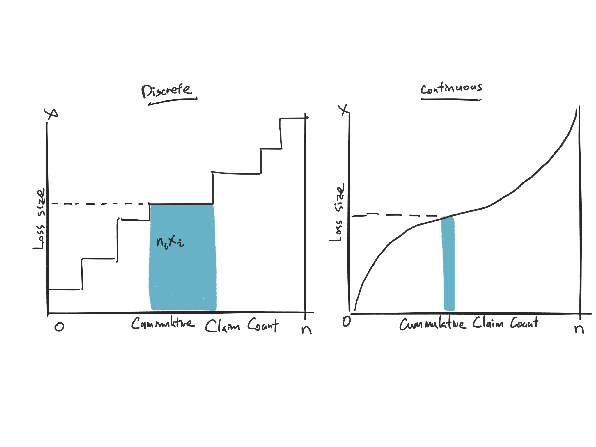
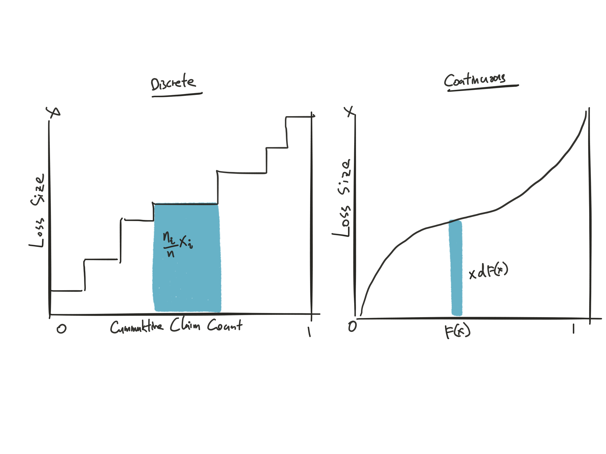
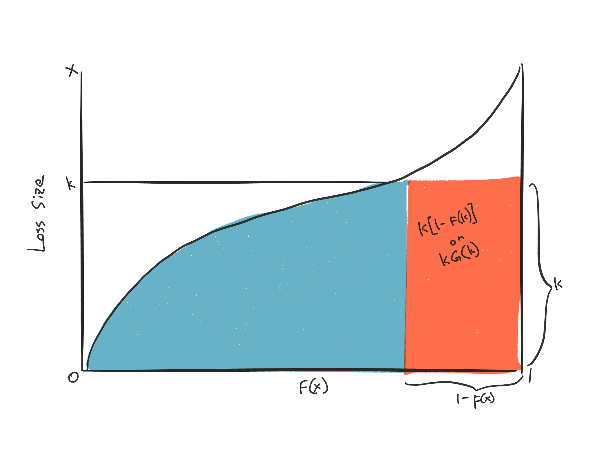
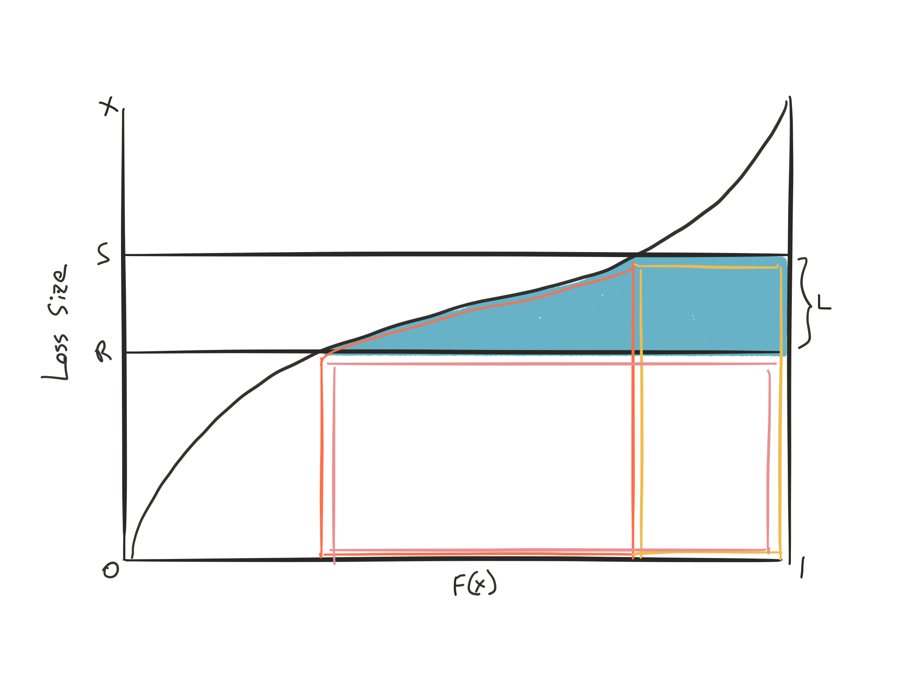
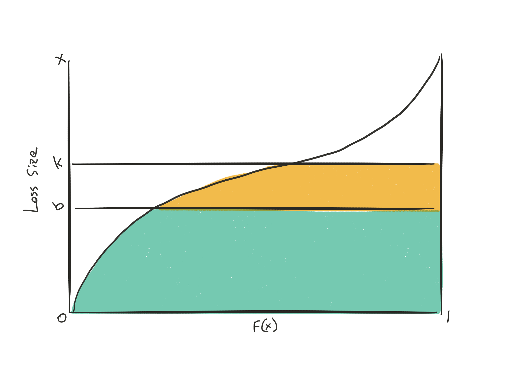
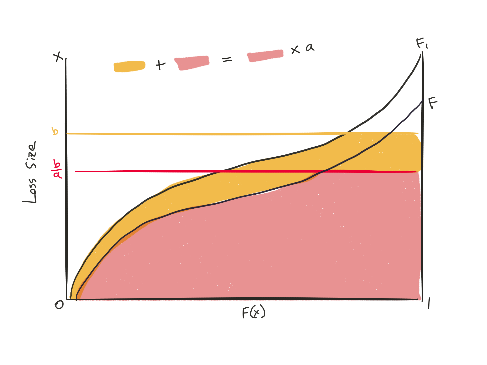
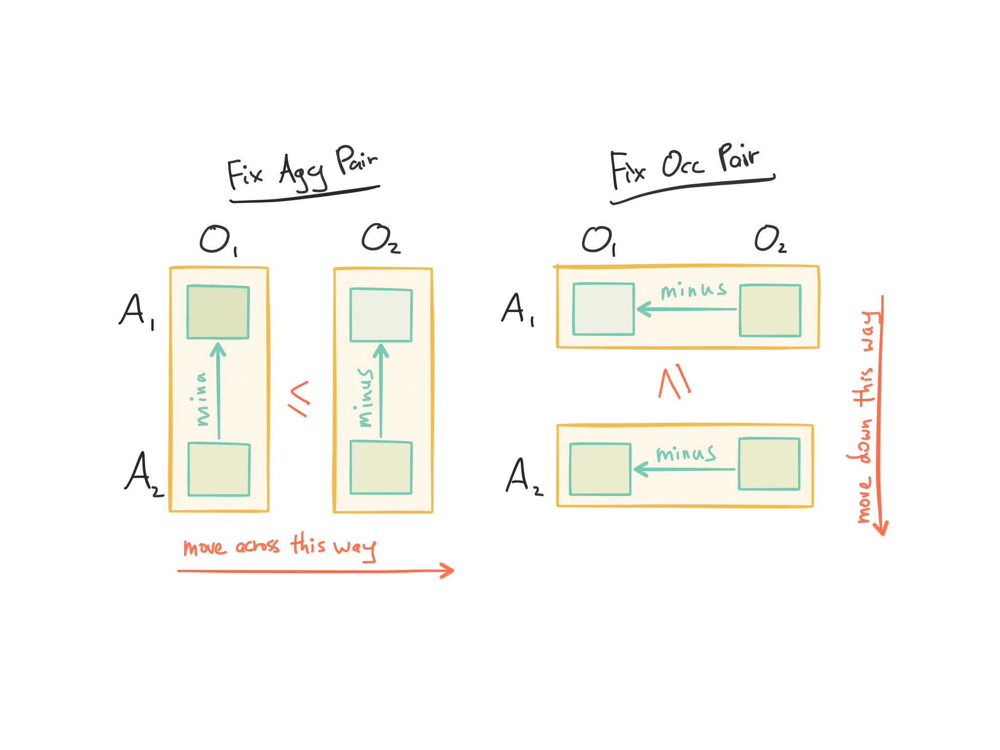

## Cliff's Summary

Severity Curves integration formula

* Limit k:  
$\mathrm{E}[h(X;k)] = \int_0^k G(x) \: dx = \int_0^k x \: dF(x) + k \: G(k)$
* Limit L and deductible R:  
$\mathrm{E}[h(X;R,L)] = \int_R^S x \: dF(x) + SG(S) - RG(R)$

***

Know all the ILF formulas

* [Vanilla](#vanilla-ilf)

* In layer

* [Constant inflation](#inflate-ilf) ($x_1 = \alpha(x) = ax$):

    * $\mathrm{E}[h(X_1;b)] = a\mathrm{E}[h(X;\frac{b}{a})]$

    * $I_1(k) = \dfrac{I(\frac{k}{a})}{I(\frac{b}{a})}$
    
    
* [Risk Adjusted](#risk-adj-ilf) for limit $k$

    * $I_r(k) = \dfrac{\mathrm{E}[h(X;k)] + \lambda \mathrm{E}[h(X;k)^2]}{\mathrm{E}[h(X;b)] + \lambda \mathrm{E}[h(X;b)^2]}$
    
    * Loosen the assumption of same profit load for all limits

Know the 3 [assumptions](#ILF-assumptions) for ILF

Know the [properties](#ilf-prop) of ILF

***

Consistency Tests:

* [1-D ILF](#1-DTest)
* [2-D ILF](#2-DTest)
* [1-D Coinsurance](#1-DCoin)
* [2-D Rosenberg](#rosenberg)

***

[Reason](#layertrend) why trend in high layer is higher

% Change in layer loss with trend $a$

* $\dfrac{\mathrm{E}[h(X_1;R,L)]}{\mathrm{E}[h(X;R,L)]} = 
\begin{cases}
  \dfrac{a ILF(\frac{L}{a})}{ILF(L)} & \text{if } R = 0\\
  & \\
  \dfrac{a \left( \mathrm{E}[X] - \mathrm{E}\left[ h(X;\frac{R}{a}) \right] \right)}{\mathrm{E}[X] - \mathrm{E}[h(X;R)]} & \text{if } L = \infty\\
  & \\
  \dfrac{a \left[ ILF(\frac{S}{a}) - ILF(\frac{R}{a}) \right]}{ILF(S) - ILF(R)} & \text{else}\\
\end{cases}$

***

Problems with [empirical severity](#problem-emp) dist^n^

## Types of Exam Questions

Consistency Test:

* 2001 Q11 (1-D ILF)
* 2002 Q41 (1-D Deductible)
* 2003 Q13 (1-D ILF)
* 2004 Q26 c (1-D ILF)
* 2006 Q6 (1-D ILF)
* 2007 Q10a (1-D ILF)
* 2008 Q27ab (1-D ILF)
* 2010 Q17 (1-D ILF + range of okay)
* 2011 Q10a (1-D range of okay)
* 2013 Q5 (2-D and Rosenberg)
* 2014 Q7 $\star$ (1-D, more open ended, + explain if the premiums are sound)

Policy @ different limits with ILFs

* 2002 Q42 (vanilla ILF from XS Ratio)
* 2003 Q37 (some arithmetic)
* 2004 Q26 ab

Risk Adjusted Calculations

* 2001 Q37 $\star$ (Proof on those compound equations)
* 2003 Q43 $\star$ (Need premium @ different limits)
* 2005 Q23 
* 2009 Q18
* 2013 Q6 $\star$ (Same as 2003 Q43, ILF with premium, not compound poison)

Concepts:

* 2000 Q37 $\star$ (higher trend in XS layer)
* 2002 Q43 $\star$ (Inflation impact graphically)
* 2003 Q36 (Adverse selection)
* 2007 Q10bc $\star$ (Consistency test implications)
* 2008 Q27c (Why test fails)
* 2009 Q24 (ILF with plot)
* 2010 Q16 $\star$ (anti selection)
* 2011 Q10b (Meaning of consistency test)
* 2012 Q15b (Loss distribution tail impact on XS layer inflation)

Inflation/trends:

* 2004 Q5 (Inflation at XS layer give loss by claim and base inflation)
* 2005 Q6 $\star$ (don't forget to inflate the base PP severity!)
* 2005 Q10 $\star$ (impact of trend calc)
* 2006 Q8 $\star$ (creative with trend and exposure growth)
* 2007 Q7 $\star$ (ILFs with trends)
* 2008 Q26 $\star$ (Inflation PP in layer)
* 2009 Q17 a (Trended ILF, % increase in loss after trend)
* 2011 Q11 $\star$ (Non constant trend)
* 2012 Q15a (% increase after trend)
* 2014 Q6 $\star$ (Plot and calculate inflation trend in layer with area)

GRAPHS - I(L), I’(L), CONSISTENCY TEST

a. [Graphical representation of $ILF_k$](#graph-ilf)
b. Graphical representation of $ILF'_k$
c. Graphical rep of the consistency test
    * Show that expected payment in any layer is less than in a preceding (lower) layer $\Rightarrow$ ILF must increase at a decreasing rate as the limit increases
    
ILFS VIA INTEGRATION

* Use layer method
* $\mathrm{E}[h(X;R,L)] = \int_R^S G(x) \: dx$
* Size method requires differentiate across x which is harder here

MARGINAL RATE, 1-WAY CONSISTENCY TEST

1. ILF $\uparrow$ when k $\uparrow$
2. Decreasing marginal ILF
3. $\ILF''(k) < 0$

4-WAY CONSISTENCY TEST

* 2 Way + Rosenberg

CO-INSURANCE CONSISTENCY TEST

* Straight forward

EXCESS LAYER LOSSES, ILF - WITH TREND

a. Increase in XS layer after trend. Use change in layer loss formula
b. Trended ILF
c. Trended PP for Layer
    * Don't forget to trend the expected loss

RISK LOAD & RISK ADJUSTED ILF TABLE

* Also just formula

RISK LOAD & RISK ADJUSTED ILF

* Same but non poisson

## Graphing the Severity Curve

**Discrete**

Loss size $x_i$ occurs $n_i$ times

* Total claims $= \sum\limits_{i=1}^k n_i$
* Total loss $= \sum\limits_{i=1}^k n_i x_i$

**Continuous**

Loss size $x$ with $n$ total claims

### Restating the x-axis

**Discrete**

Loss size $x_i$ occurs $n_i$ times

* Total claims $= \sum\limits_{i=1}^k n_i$
* $\mathrm{E}[L] = \sum\limits_{i=1}^k \frac{n_i}{n}x_i$
    * Re scale with $\frac{1}{n}$
    
**Continuous**

Size view of losses

$F(x) = Pr(X \leq x)$

* $\mathrm{E}[L] = \int_0^{\infty} x dF(x)$
* [Stieltjes integral](http://math.stackexchange.com/questions/22887/definition-of-mean-as-an-integral-over-the-cdf)
* [Riemann-Stieltjes integral](https://en.wikipedia.org/wiki/Riemann–Stieltjes_integral)

### Horizontal Slices

**Continuous**

Layer view of losses

$G(x) = 1 - F(x) = Pr(X > x)$

$\mathrm{E}[L] = \int_0^{\infty} x dF(x) = \int_0^{\infty} G(x) dx$

* [Proof](http://math.stackexchange.com/questions/172841/integral-of-cdf-equals-expected-value)

$\int_a^b G(x) dx = \int_a^b x dF(x) + bG(b) - aG(a)$

## Coverage Functions

**def^n^**

$X =$ Random loss

$h(X)$ is the cost function for what the insurer has to pay for loss amount $X$ given deductible, limits, and co-insurance

### Limit $k$

$h(X;k) =
  \begin{cases}
    X & 0 < X < k\\
    k & X > k\\
  \end{cases}$
  
$\begin{array}{clcl}
  \mathrm{E}[h(X;k)] &= &\int_0^k x \: f(x) \: dx + k[1-F(k)] &= \int_0^k x \: f(x) \: dx + k \: G(k)\\
  \text{OR} &= &\int_0^k G(x) \: dx &= \int_0^k x \: dF(x) + k \: G(k)\\
\end{array}$

### Limit $L$ and Deductible $R$

$L$ is defined as the max the insurer has to pay

$h(X;R,L) =
  \begin{cases}
    0 & 0 < X < R\\
    X - R & R < X < S\\
    L & X > S\\
  \end{cases}$
  
Where $S = R + L$ is the max ground up loss

$\begin{array}{cl}
  \mathrm{E}[h(X;R,L)] &= \int_R^S x \: dF(x) + SG(S) - RG(R)\\
  \text{OR} &= \int_R^S G(x) \: dx\\
  \text{OR} &= \mathrm{E}[h(X;S)] - \mathrm{E}[h(X;R)]\\
\end{array}$

## Increased Limit Factors (ILF)

**Def^n^**

$ILF(k) = \dfrac{\mathrm{E}[h(X;k)]}{\mathrm{E}[h(X;b)]}$

* Relativity for the rate @ limit k to the rate @ basic limit b

* $\mathrm{E}[h(X;b)] =$ Average Basic Limits Severity (ABLS)

$\text{Rate @ Limit k} = ILF(k) \times \text{Rate @ Basic Limit b}$

For ILF in layer $L$ XS $R$:

* $\dfrac{\mathrm{E}[h(X;S)] - \mathrm{E}[h(X;R)]}{\mathrm{E}[h(X;b)]}$

* $ILF(S) - ILF(R)$

***

  
**Key Assumptions** Important Concept

1. All u/w expenses & profit are variable and don't vary by limit
    * IRL not true, $\uparrow$ limits $\Rightarrow$ Volatility $\uparrow$ $\Rightarrow$ $\rightarrow$ profit load
    * This is loosen with the risk adjusted ILFs
2. Frequency $\perp\!\!\!\perp$ Severity
3. $Freq_i = Freq_j \forall \: \text{limits} \: i, \: j$
    * IRL not true due to adverse/favorable selection; GLM or LR method will reflect the differences

***

**Derivation:**
    
$\begin{array}{lll}
  ILF(k) &= \dfrac{\text{Rate}_k}{\text{Rate}_b}\\
  &= \dfrac{\frac{\text{Pure Premium w/ LAE for } k}{1 - V_k - Q_k}}{\frac{\text{Pure Premium w/ LAE for } b}{1 - V_b - Q_b}}\\
  &= \dfrac{\text{Pure Premium w/ LAE for } k}{\text{Pure Premium w/ LAE for } b} & \text{from assumption 1.}\\
  &= \dfrac{Freq_k \times Sev_k}{Freq_b \times Sev_b} & \text{from assumption 2.}\\
  &= \dfrac{Sev_k}{Sev_b} & \text{from assumption 3.}\\
  &= \dfrac{\mathrm{E}[h(X;k)]}{\mathrm{E}[h(X;b)]}\\
  &= \dfrac{\int_0^k G(x) dx}{\mathrm{E}[h(X;b)]}\\
\end{array}$

***

$ILF = \dfrac{Yellow + Green}{Green}$

**Properties of ILF** Know

$ILF$ increase at a decreasing rate

* $ILF'(k) = \dfrac{G(k)}{\mathrm{E}[h(X;b)]} \geq 0$
* $ILF''(k) = \dfrac{-f(k)}{\mathrm{E}[h(X;b)]} \leq 0$

$\Rightarrow$ $ILF(k)$ will approach a constant value $\Rightarrow$ $\exists$ a limit $c$ which there will be no additional charge for limit $k$ where $k > c$ since $Pr(Loss > c) = 0$

## 1-D Consistency Test for ILFs

Marginal premium per 1K coverage $\downarrow$ as coverage limit $\uparrow$

* $Pr(Loss > k_1) < Pr(Loss > k_2) \: \text{given } k_1 > k_2$ $\Rightarrow$ Insurance should cost less for each additional $1K of coverage
* $\dfrac{\Delta ILF}{\Delta k} = ILF'(k)$ should $\downarrow$ for $\uparrow$ $k$
* Works with deductible as well, the marginal rate should still $\downarrow$ for $\uparrow$ deductible (the deductible factor $\downarrow$ as deductible $\uparrow$ though)
* The practical interpretation is that as the limit increases, there are less losses expected at higher
layers, so rates should not increase more for higher limits than for lower limits.
* So long as partial losses are possible, expected losses will not increase as much as the increase in limits
* If the test fails, then it means an insured would pay more for an incremental amount of coverage above a lower coverage amount, implying negative probabilities
    * This would be impossible if we are assuming that frequency and severity are independent and frequency is the same for all limits, since the increase would have to entirely be due to severity, which would be capped by the coverage amount

| Per Occ Limit $k$ | $ILF(k)$ | $\dfrac{\Delta ILF}{\Delta k}$ |
| ----------------- | -------- | ------------------------------ |
| $k_0$               | $ILF(k_0)$ |                                |
| $k_1$             | $ILF(k_1)$ | $\dfrac{ILF(k_1) - ILF(k_0)}{k_1-k_0}$ |
| $\uparrow$ | $\uparrow$ | $\downarrow$ |

### Reasons for Inconsistency: Anti-Selection

Good Questions 2011 Q10b

**Adverse Selection:**

* Higher limits $\Rightarrow$ Adverse experience
    * $\because$ Insureds that expect higher loss potential buys higher limits
    * $\because$ Lawsuits and settlements influenced by size of limit

**Favorable Selection:**

* Higher limits $\Rightarrow$ Better experience
    * $\because$ Financially secured risk has more assets to protect $\therefore$ Buys higher limits
    * High limits are only underwritten for better risks
    
**Solution to anti-selection:**

* Fit separate severity curve for each policy limit
    * Only use polices with $limits_k$ to determine $ILF(k)$
    * If there are no anti-selection you can use the combined data for all $limits_i$ to determine the $ILF$

## Impact of Trend

Trend on $Sev_k$ > $\left(Sev_{total} \textbf{ or } Sev_b\right)$ for $k > b$ when trend > 0

* $\because$ for losses > $b$, trend in entirely in the XS layer
* Losses just < $b$ are pushed into the XS layer by the trend $\Rightarrow$ New losses for the XS layer

Similarly for trend < 0 it'll be more negative for XS layer

See 2000 Q37 for graphical explanation

***

**Def^n^:**

$x_1 = \alpha(x)$ where $\alpha$ is the inflation function

If $\alpha$ is monotonic then $F_1(x_1) = F(x)$

* $\cdots = Pr(X_1 \leq x_1) = Pr(\alpha(X) \leq x_1) = Pr(X \leq \alpha^{-1}(x_1)) = Pr(X \leq x) = \cdots$

***

### For constant inflation $x_1 = \alpha(x) = ax$

$\mathrm{E}[h(X_1;b)] = a\mathrm{E}[h(X;\frac{b}{a})]$Important Memorize

* $\cdots = \int_0^b G_1(x_1)dx_1 =\int_0^b G(\frac{x_1}{a})dx_1 = a\int_0^{\frac{b}{a}}G(x)dx = \cdots$

* Expected severity after inflation limited @ $b$ = $a$ times expected severity limited @ $\frac{b}{a}$

Graphical representation below:

### ILF after constant inflation/trend

$ILF_1(k) = ILF$ for limit $k$ after inflation

$ILF_1(k) = \dfrac{I(\frac{k}{a})}{I(\frac{b}{a})}$Important Memorize

* $\cdots = \dfrac{\mathrm{E}[h(X_1;k)]}{\mathrm{E}[h(X_1;b)]} = \dfrac{a\mathrm{E}[h(X;\frac{k}{a})]}{a\mathrm{E}[h(X;\frac{b}{a})]} = \dfrac{\mathrm{E}[h(X;\frac{k}{a})]}{\mathrm{E}[h(X;\frac{b}{a})]} \times \dfrac{\mathrm{E}[h(X;b)]}{\mathrm{E}[h(X;b)]} = \cdots$

$ILF'_1(k) = \dfrac{G(\frac{k}{a})}{a\mathrm{E}[h(X;\frac{b}{a})]}$

Average increase in severity after trend in layer $R$ to $S = R + L$Important Memorize

### Change in layer loss after constant inflation/trend

$\dfrac{\mathrm{E}[h(X_1;R,L)]}{\mathrm{E}[h(X;R,L)]} = 
\begin{cases}
  \dfrac{a ILF(\frac{L}{a})}{ILF(L)} & \text{if } R = 0\\
  & \\
  \dfrac{a \left( \mathrm{E}[X] - \mathrm{E}\left[ h(X;\frac{R}{a}) \right] \right)}{\mathrm{E}[X] - \mathrm{E}[h(X;R)]} & \text{if } L = \infty\\
  & \\
  \dfrac{a \left[ ILF(\frac{S}{a}) - ILF(\frac{R}{a}) \right]}{ILF(S) - ILF(R)} & \text{else}\\
\end{cases}$

2008 Q26

## The Charge for Risk

Charge for risk is included in the profit & contingencies load

$\uparrow$ volatility $\uparrow$ risk charge

Pricing risk $\Rightarrow$ Degree of uncertainty in pure premium

* **Process Risk**: Difference between actual & expected losses
* **Parameter Risk**: Inability to estimate expected losses accurately
    * Difficult to quantify a risk charge
    * E.g. Event difficult to predict; Unknown inflation; $\Delta$ business mix; Sampling Error
    
### Risk Adjusted ILF for limit $k$

$ILF_r(k) = \dfrac{\mathrm{E}[h(X;k)] + \lambda \mathrm{E}[h(X;k)^2]}{\mathrm{E}[h(X;b)] + \lambda \mathrm{E}[h(X;b)^2]}$Important Memorize

* $n \: \sim Poi(\theta)$
* Risk charge $\propto$ Variance of loss based on factor $\lambda$
* Loosen [assumption 1](#ILF-assumptions) of the ILFs by incorporating process risk

$\mathrm{E}[h(X;k)] = \int_0^k G(x)dx$

$\mathrm{E}[h(X;k)^2] = 2\int_0^k xG(x)dx$

**For Limit $L$ and Deductible $R$**

$\mathrm{E}[h(X;R,L)] = \int_R^S G(x)dx$

$\begin{array}{ll}
  \mathrm{E}[h(X;R,L)^2] &= \mathrm{E}[h(X;S)^2] - \mathrm{E}[h(X;R)^2] - 2R \: \mathrm{E}[h(X;R,L)]\\
  \text{OR} &= 2\int_R^S (x - R) G(x)dx\\
\end{array}$

2009 Q18

***

Many questions on this

Premium $= \mathrm{E}[Y] + \lambda \: Var(Y)$

* Risk charge $\propto$ Variance of loss
* Works with limited losses as well

$\mathrm{E}[Y] = \mathrm{E}[n]\mathrm{E}[h(X)]$

$\begin{array}{lll}
  Var(Y) &= \mathrm{E}[n]\mathrm{E}[h(X)^2] + (Var(n) - \mathrm{E}[n])\mathrm{E}[h(X)]^2\\
  &= \mathrm{E}[n] \mathrm{E}[h(X)^2] & \text{if }n \: \sim \: Poi\\
\end{array}$

* Standard [Compound Poisson](https://en.wikipedia.org/wiki/Compound_Poisson_distribution) Equations

Premium $=\mathrm{E}[n]\left\{ \mathrm{E}[h(X)] + \lambda \mathrm{E}[h(x)^2] \right\}$

## Problems in Creating a Severity Distribution from Empirical Data
Memorize Concept

1. Future development on claims
2. Loss data from policies with different limits would bias the dist^n^
3. Low credibility at the high end of the dist^n^ $\Leftarrow$ Few large losses
4. Cluster points at round numbers

Solution:  
Fit a theoretical dist^n^
B9 Mahler 3??

## 1-D Consistency Test for Property Coinsurance

$\text{Premium} = \text{Coinsurance Req %} \times \dfrac{\text{Cov @ 100% Value}}{\text{Exposure Base}} \times \text{Coinsurance Factor} \times \text{Rate / Exposure}$

***

**Test:**

$\dfrac{\Delta \text{Premium}}{\Delta \text{Coinsurance Req %}}$ or $\dfrac{\Delta \left(\text{Coinsurance Req %} \times \text{Coinsurance Factor}\right)}{\Delta \text{Coinsurance Req %}}$

* Should $\uparrow$ as Coinsurance Req % $\downarrow$

## 2-D Consistency Test for ILF

Use when there are 2 types of limits

Apply separately for row and columns while holding one type constant

Marginal rate $1K coverage $\downarrow$ as limit $\uparrow$

## Rosenberg's 2-D Consistency Test

2013 Q5

**Def^n^:**

Occ limits: $O_1 < O_2$

Agg limits: $A_1 < A_2$

**Test**

Fix the aggregate limits:

$I(A_2,O_2) - I(A_1,O_2) \geq I(A_2,O_1) - I(A_1,O_1)$ 

Fix the occurrence limits:

$I(A_2,O_2) - I(A_2,O_1) \geq I(A_1,O_2) - I(A_1,O_1)$ 

