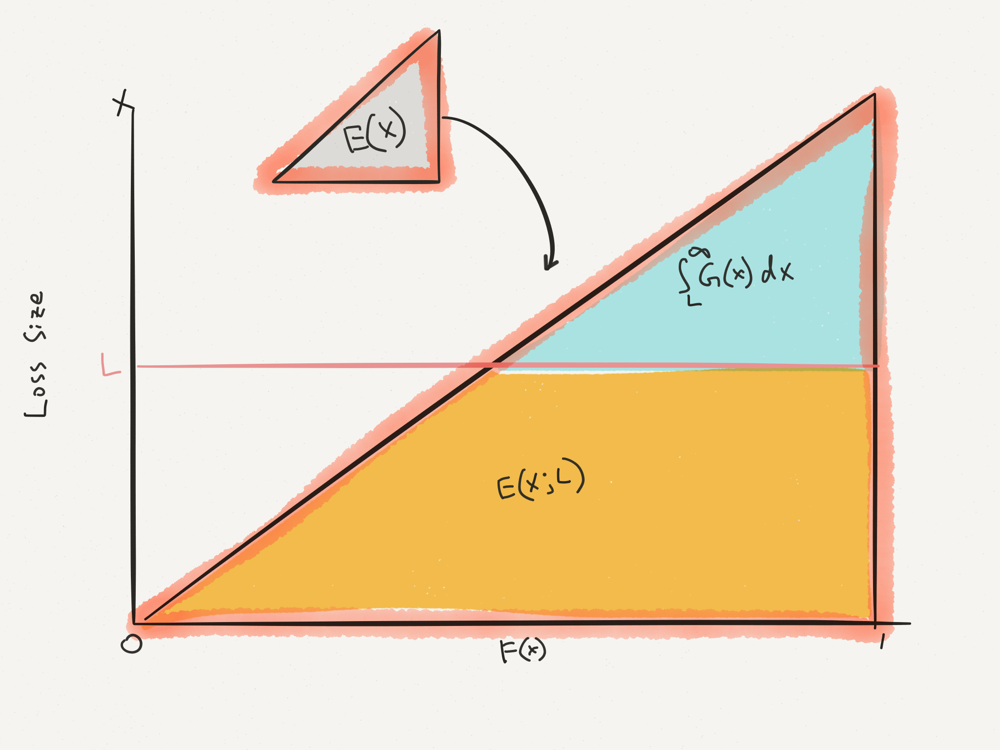
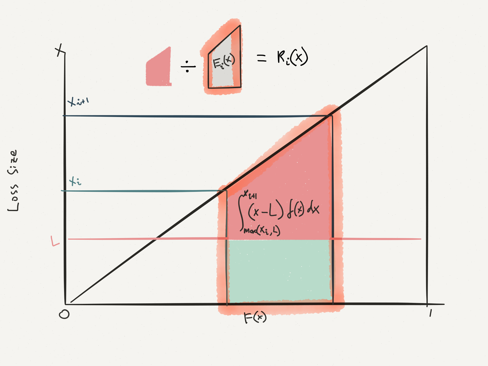
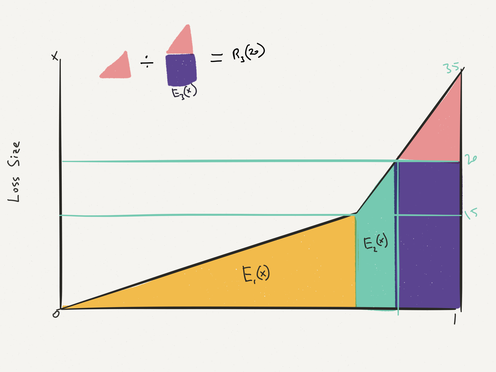

Purpose of the paper is to examine the impact of dispersion of LDFs on XS ratios

##2 Development Concerns that Impact XS Ratios

1. Different size of claims may have different development pattern
2. **Dispersion Effect**: Losses of the same size might develop differently

## XS Ratio Formula

$\text{XS Ratio at limit } L = R(L) = \dfrac{\int_L^{\infty} (x - L) \: f(x)dx}{\int_0^{\infty} x \: f(x) dx} = \dfrac{\int_L^{\infty}G(x)dx}{\mathrm{E}[X]} = \dfrac{\mathrm{E}[X] - \mathrm{E}[X;L]}{\mathrm{E}[L]}$ Know

Graphical representation of the XS ratio:

## XS Ratio in Segments

You can break the above formula into segments and $R(L)$ can be written as weighted average of XS ratio $R_i(L)$ with weights $\dfrac{\mathrm{E}_i[X]}{\mathrm{E}[X]}$:

$R(L) = \dfrac{\sum\limits_i R_i(L) \mathrm{E}_i[X]}{\sum\limits_i\mathrm{E}_i[X]} = \sum\limits_i R_i(L) \dfrac{\mathrm{E}_i[X]}{\mathrm{E}[X]}$ Know Formula

* $\mathrm{E}_i[X] = \int_{x_i}^{x_{i+1}} x \: f(x)dx$

* $R_i(L) = \dfrac{\int_{max(x_i,L)}^{x_{i+1}}(x-L) \: f(x)dx}{\mathrm{E}_i[X]}$

Graphical representation of the XS ratio in segments:

Breaking it down into segments is beneficial in terms of visualizing it as well as when the severity curve have different distributions in different part of the curve

Example:

$f(x) = 
  \begin{cases}
    0.05 & 0 < x \leq 15 \\
    0.0125 & 15 < x \leq 35 \\
    0 & x > 35 \\
  \end{cases}$

$R(20) = \dfrac{R_1(20) \times \mathrm{E}_1[20] + R_2(20) \times \mathrm{E}_2[20] +R_3(20) \times \mathrm{E}_3[20]}{\sum_{i=1}^3\mathrm{E}_i[20]}$

Where $\text{Segment 1} \in (0, 15)$, $\text{Segment 2} \in (15, 20)$, $\text{Segment 3} \in (20, 35)$

$R(20) = \dfrac{0 \times \mathrm{E}_1[20] + 0 \times \mathrm{E}_2[20] +R_3(20) \times \mathrm{E}_3[20]}{\sum_{i=1}^3\mathrm{E}_i[20]}$

Since the first 2 segments doesn't have area > 20

## Simple (Discrete) Dispresion

**Assumptions/Definitions:**

1. Finite number of possible LDFs
2. Multiplicative LDFs $r_i$ $\Rightarrow$ $X_1 = r_i \times X$
3. $Pr(LDF = r_i) = p_i$

***

XS Ratio of developed losses:  
$\widehat{R}(L) = \dfrac{\sum\limits_i p_i r_i R(\frac{L}{r_i})}{\sum\limits_i p_i r_i}$Know Formula

* $R(\frac{L}{r_i})$: XS ratio of undeveloped loss w/ limit $\frac{L}{r_i}$

* Weighted average of different dist^n^ of developed losses

* Think of the LDF like constant inflation

* $\begin{array}{lll}
    \cdots = \dfrac{\mathrm{E}[X_1] - \mathrm{E}[X_1;L]}{\mathrm{E}[X_1]} &= \dfrac{\sum p_i \mathrm{E}[X_1|r_i] - \sum p_i \mathrm{E}[X_1;L|r_i]}{\sum p_i \mathrm{E}[X_1|r_i]} \\
    &= \dfrac{\sum p_i r_i \mathrm{E}[X] - \sum p_i r_i \mathrm{E}[X;\frac{L}{r_i}]}{\sum p_i r_i \mathrm{E}[X]} & \because \text{See B7}  \\
    &= \dfrac{\sum p_i r_i (\mathrm{E}[X] - \mathrm{E}[X;\frac{L}{r_i}])}{\mathrm{E}[X] \sum p_i r_i} \times \dfrac{\mathrm{E}[X]}{\mathrm{E}[X]} = \cdots \\
  \end{array}$

## Generalized Dispersion

Hard to test actual calculation

**Assumptions/Definitions:**

1. $F(X \leq x) = D(x)$
2. $h(r) \equiv$ PDF of multiplicative LDFs $r$

***

$F(y) = \int_0^{\infty} D \left( \frac{y}{r} \right) \: h(r)dr$

If $X \sim Exp(\theta)$ and $\frac{1}{r} \sim Gamma(\alpha, \beta)$ $\Rightarrow$ $X_1 \sim Pareto(\alpha, x_m)$

Can use piece-wise linear dist^n^ ($interval_i \sim \mathcal{U}(a,b) \forall i$) to estimate a dist^b^ in pieces, then weight those pieces together to produce XS ratios

Dispersion $\uparrow$ when:

* $\frac{1}{r}$ dist^n^ has heavy tail (True for $r$ as well)
* c.v. of $\frac{1}{r}$ $\uparrow$ (True for $r$ as well)

$\uparrow$ dispersion $\Rightarrow$ $\uparrow$ XS ratios