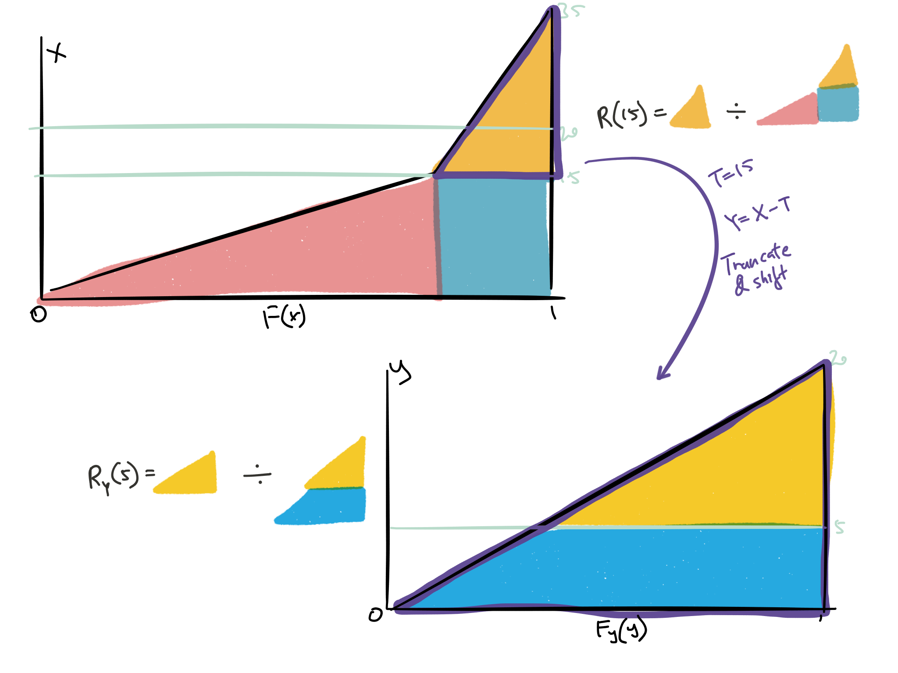

## Cliff's Summary

Overall procedure:

1. Initial data adjustments
2. Mean residual life exploratory analysis
3. Pre fit adjustments

Truncate and shift data

* $R(L) = R_Y(L-T) \times R(T)$
* $Y = X - T$
* $T$ is the truncate point that's less than $L$
* [Considerations](#truncateconsiderations) when truncate

Curve fitting between pareto and exponential

* [Reasons, features and advantages](#fitting)
* 1 curve for all HGs
* Fit to normalized data (entry ratios), pretty much always the case

XS Ratio from $j$ dist^n^:

* $R(L) = \dfrac{\sum_j p_j \mathrm{E}_j[X] R_j(L)}{\sum_j p_j \mathrm{E}_j[X]}$

Fitted distribution you always plug in the entry ratio below:

* $r_{HG}(L) = \dfrac{L - \$100,000}{\text{Average size of loss truncated and shifted to \$100,000 for HG}}$

## Types of Exam Questions  
Questions a bit thin but seems to cover all

Truncate and shift and fit to curve

* 2008 Q34 $\star$ (with curve fit, basically everything)
* 2009 Q33a (same as above)
    * Not Normalize to 1 does it work?
* 2010 Q30a $\star$ (XS ratio from discrete distribution)
* 2012 Q17a (same as 08 and 09)
* 2014 Q14 $\star\star$ (Price XS policy with the XS Ratio)

Concepts

* 2009 Q33b (considerations when truncate)
* 2010 Q30b (initial data adjustments)
* 2011 Q24 (overall approach)
* 2012 Q17bc (3 advantages, why same curve for all HGs)
* 2013 Q17 (truncate point selection; Alternative curves)
    * Just heavier tail, which would result in overstating the XS for limits just above the truncation point
    * Less heavy tail, the XS ratios would be lower for the largest limits compared to the mixed Exponential-Pareto
    
MEAN RESIDUAL LIFE - GROUND-UP LOSSES

* Need occurence level
* $e(x) = \dfrac{\text{ Dollar XS of }x}{\text{# of Accidents XS of }x}$ = XS severity function

ADJUSTMENTS TO LOSSES FOR CURVE FITTING

1. Split by HG
2. Trend, develop, benefit level
3. Group by occurence
4. Truncate
5. Shift by normalizing by HG average
6. Use above to estimate $\theta$ for the exponential
7. Use formula to get XS ratio

EXCESS LOSS RATIO FROM TABLES

* Just plug and play

EXCESS LOSS RATIO FROM MIXED DIST. FORMULAS

* Plug and play with formulas

MOMENTS OF A MIXED DIST

* Just weight the moments

## Overview

**Goal:**  
Improve calculation of XS ratios

**Insight:**  
Assume severity curve takes on different dist^n^ at different layers of loss

**Method:**  
Use actual loss data (w/ some adjustments) for lower limits;  
Curve fitting for higher limits

## Motivation for the Analysis

$ELF(L) = R(L) \times ELR$

* $\cdots = \dfrac{\mathrm{E}[X] - \mathrm{E}[X;L]}{\text{Standard Premium}} = \left( \dfrac{\mathrm{E}[X] - \mathrm{E}[X;L]}{\mathrm{E}[L]} \right) \times \left( \dfrac{\mathrm{E}[X]}{\text{Standard Premium}} \right) = \cdots$

$ELF$ is over premium while XS Loss Ratio is over $\mathrm{E}[L]$

$\because$ $ELF$ are by **HG + limit** $\therefore$ Need XS Ratio by **HG + limit**

## Step 1 - 4: Initial Adjustments to Data

Standard ratemaking adjustments for step 1 - 4:

Develop $\Rightarrow$ Trend $\Rightarrow$ Benefits Level Adjustments $\Rightarrow$ Group claims into accidents

* **Group into accidents** since limits are per occurrence
* Caveat is that we can't look at injury type

## Mean Residual Life: Exploratory analysis between Step 4 & 5

**Def^n^:**

Mean Residual Life = $e(x) = \dfrac{\text{ Dollar XS of }x}{\text{# of Accidents XS of }x}$ = XS severity function

***

1. Plot $e(x)$ vs loss limit $x$ for each HG
2. Examine tail of the XS severity dist^n^
3. $\because$ Curve looks similar $\forall$ HGs $\therefore$ Use a single curve $\forall$ HGs

## Step 5 - 7: Curve fit preperation

Curve fit for higher limit $\because$ sparse data

Step 5 - 7 adjustments:

5. Combine data for 3rd to 5th reports
6. Truncate and shift data @ $100K
7. Normalize output from 6. for each HG to have mean = 1
    * Converts the data to entry ratios

## Step 6: Truncate and shift

Selection of truncation point for using adjusted actual data vs curve fit:

* Use as much actual data as possible where it is credible while,
* Leaving enough data above the truncation point to be used in curve fitting

Truncate and shift to split XS ratios into segments $\sim$ Section B8

Split @ truncation point $T$, where $T < L$ for $R(L)$ to use different dist^n^ above and below

$R(L) = R_Y(L-T) \times R(T)$ Know Memorize

2008 Q34

*Proof:*

$\begin{array}{cccccccl}
  R(L) &= &\dfrac{\int_L^{\infty}(x-L) \: f(x)dx}{\int_0^{\infty}x \: f(x)dx} &= &\dfrac{\int_L^{\infty}(x-L) \: f(x)dx}{\int_T^{\infty}(x-T) \: f(x)dx} &\times &\dfrac{\int_T^{\infty}(x-T) \: f(x)dx}{\int_0^{\infty}x \: f(x)dx} \\
  \vdots &= &\vdots &= &\dfrac{\int_{L-T}^{\infty}((y+T)-L) \: f(y)dy}{\int_0^{\infty}y \: f(y)dy} &\times &R(T) & \text{by sub } Y = X - T \\
  \vdots &= &\vdots &= &\dfrac{\int_{L-T}^{\infty}(y - (L - T)) \: f(y)dy}{\int_0^{\infty}y \: f(y)dy} &\times &R(T) \\
  R(L) &= &\cdots &= &R_Y(L-T) &\times &R(T) \\
\end{array}$

### Example

Continue from Section B8

$f(x) = 
  \begin{cases}
    0.05 & 0 < x \leq 15 \\
    0.0125 & 15 < x \leq 35 \\
    0 & x > 35 \\
  \end{cases}$
  
$R(20) = R_Y(20 - 15) \times R(15)$

$R(15)$ is standard from Section B8

To get $R_Y(20 - 15)$ need $f_y(y)$

$f_y(y) = 
  \begin{cases}
    0.5 & 0 < y \leq 20 \\
    0 & y > 20 \\
  \end{cases}$

* Shift the ranges by -15
* Scale up the piece so the $\int_0^{20} f_y(y) = 1$
    * The eliminated first piece took out $0.05 \times 15 = 0.75$
    * Redistribute it by $\frac{0.0125}{1-0.75}$

Graphically:

## Step 8: Fitting Curve

Mixed dist^n^ $p$ for Pareto and $1-p$ for Exponential

* Fit a single curve for all HG data combined
* Moments of mixed dist^n^ = weighted average of individual's moments

Reasons for fitting mixed Pareto & Exponential:

1. Exponential fits well with limits 100K to 500K
2. Pareto fits well for the tail > 500K

**Features and advantages of using mixed dist^n^:**

* Relies on actual data for low limits
    * Avoid fitting to small accidents
    * Large amount of credible data
* Curve fitted ratios are used for higher layers, where actual experience may not be credible
* Group claims in the accidents
    * Fit combined data regardless of the injury
* Avoids arbitrary division of claims between injury type
* Pareto-Exp assigns most weight to short tailed exponential
* Long tailed Pareto models the extreme tail
* The mixed pareto-exponential curve is structured so that it smoothly joins the experience curves at the cutoff point, yielding a result that is consistent

***

XS Ratio from $j$ dist^n^:

$R(L) = \dfrac{\sum_j p_j \mathrm{E}_j[X] R_j(L)}{\sum_j p_j \mathrm{E}_j[X]}$Know Memorize

* Weighted average of $R_j(L)$ with weight $\dfrac{p_j \mathrm{E}_j[X]}{ \sum_j p_j \mathrm{E}_j[X]}$
* Very similar to the XS Ratio by segment formula in B8, except this has $p_j$

***

Recall Step 7 converts data to entry ratios by normalizing to mean = 1

* $r_{HG}(L) = \dfrac{L - \$100,000}{\text{Average size of loss truncated and shifted to \$100,000 for HG}}$