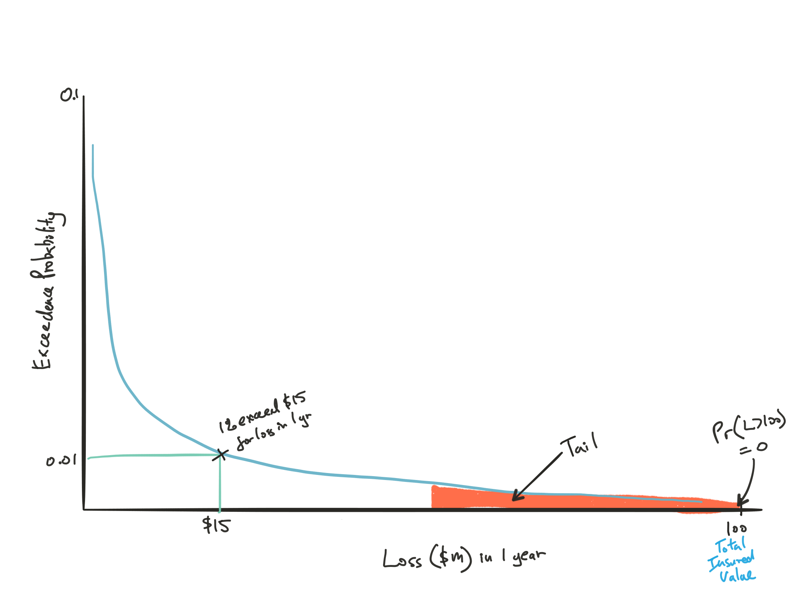
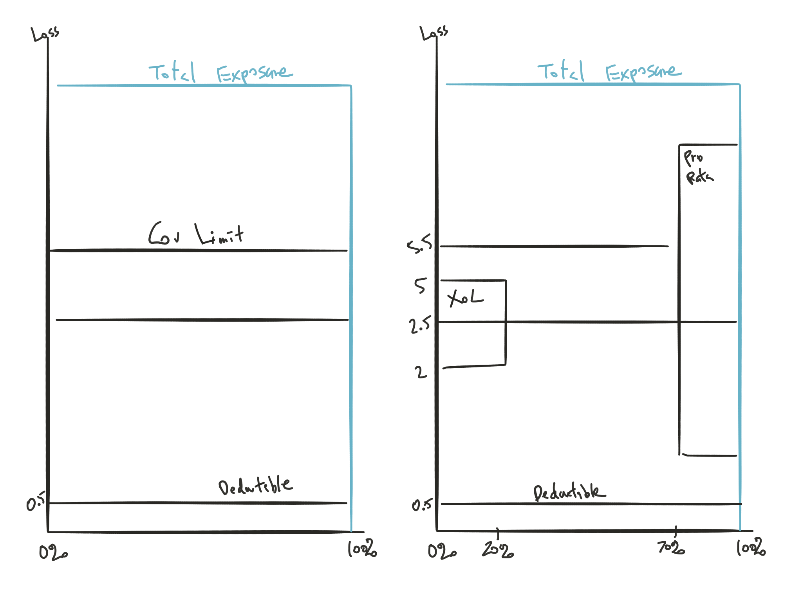

## Intro to Catastrophe Models

Multi-discipline: Physics, geology, engineering, actuarial science

| Users of catastrophe model | Purpose                                   |
| -------------------------- | ----------------------------------------- |
| Insurers & reinsurers | Assess risk exposed |
| Reinsurance brokers | Assess risk of their clients to send to reinsurers |
| Capital market | Price cat bond |
| Regulators | Assess insurer's work |
| Emergency Management Agencies | Determine impact of an actual event post occurrence |

2 main risk management strategies:

* **Risk reduction**:  
Non-renew policies, limit coverage, increase deductible or rates

* **Risk transfer**:  
Purchase reinsurance or issue cat bonds

## Components of Catastrophe Models

Regular statistic tool not appropriate for catastrophe:

* Insufficient historical claim data
* Limited data are inappropriate due to changing factors (e.g. property values, cost of repair, etc)
* Probabilistic approach more appropriate

4 Modules of cat models:

1. **Hazard Module:**
    * Simulates natural disasters
    * Based on probabilities of different event parameters  
    e.g. epicenter, Richter scale, etc
2. **Inventory Module:**
    * Exposure
    * Properties at risk and their characteristics
3. **Vulnerability Module:**
    * Estimate susceptibility to damage of each property given a specific simulate cat and property information
4. **Loss Module:**
    * Quantifies direct and indirect losses of the event on each property
    * Direct loss like property damage or indirect losses like business interruption or cost of relocation
    
### Hazard Module

Main parameters:

1. **Location:** Certain areas are more prone to certain catastrophe
2. **Frequency:** Biggest uncertainty
3. **Severity:** Includes characteristics that drives the severity and also what's physically possible

*To model hazard module*: Use historical data for ${pdf}_0$ $\Rightarrow$ Refine with scientific knowledge

*Model run*: Simulate large number of possible events based on dist^n^ of event parameters $\Rightarrow$ For each iteration, estimate intensity a different locations

### Inventory Module

Inventory can range from entire industry, to single insurer, or just individual risks

Properties and their value grouped by:

* Zip
* LoB
* Coverages
* occupancy type
* Construction type (important for damagebility)

Include more detailed data for modeling individual insurer portfolio (specific risk information) $\Rightarrow$ More reliable output

Data integrity:

* Seek to identify missing or erroneous data
* Test for reasonability
* Use site-specific analysis for important individual buildings

### Vulnerability Module

Estimates the damage to properties from simulated events

Maps hazard $\rightarrow$ damage:

***Engineering Judgement***

Expert opinion

* Pros:  
Simple

* Cons:  
Arbitrary; Not easy to update

***Building response analysis***

Use advanced engineering techniques

* Pros:  
More accurate

* Cons:  
Only for specific buildings, not appropriate for entire portfolio

***Class based building response analysis***

Modify the *building response analysis* to make it more appropriate
for portfolio risk assessment

1. Divide risk into classes based on building characteristics
2. Identification of a typical building in each class
3. Evaluation of building performance
    * Generate $Dmg(buildings_{class})$ for each class, based on relationship of intensity of force and $\mathrm{E}[Damage]$ to the typical building for each class
    * Apply $Dmg(buildings_{class})$ to all buildings in each class $\Rightarrow \: DmgRatio = \dfrac{\text{Repair cost}}{\text{Replacement cost}}$
    * Damage ratios and damage functions are created for eah coverage
    
*Model run*: Lookup $DmgRatio$ $\forall$ buildings on class + intensity for each simulated event $\Rightarrow$ $\mathrm{E}[Damages]$

### Loss Module

To determine monetary loss, 2 main approaches:

1. Link event parameters $\Rightarrow$ $\mathrm{E}[Loss]$
    * Based on expert opinion
    * Hard to update
2. Estimate the physical damage from event then use cost analysis to translate in to \$

Compute insured loss from total loss by applying policy conditions

* Coverage limits, sub limits, deductibles by coverage, coinsurance, risk specific reinsurance

## Exceedance Probability Curves  
2012 Q9

One of the model outputs beside $\mathrm{E}[Loss]$

**Occurence exceedance probability (OEP)**  
Important Concepts, formula a bit iffy

* $Pr(N \geq 1)$; N = # of event with loss > k; in a given time period
* Useful for insurer buying XoL

Let $p_i$ be the probability of event $E_i$ with loss $L_i$

Expected loss of $E_i$: $\mathrm{E}[L_i] = p_iL_i$

Average annual loss: $\sum\limits_i p_i L_i$

Let $L_{(i)}$ be $L_i$ sorted in descending order

$OEP(L_i) = 1 - Pr(NoEvent) - \prod\limits_{j \: for \: L_j < L_i} (1-p_j)$

* $\cdots = P(L > L_i) = 1 - P(L \leq L_i) = 1 - (1 - p_{(1)})(1 - p_{(2)}) \cdots (1 - p_{(i-1)}) = \cdots$

$OEP(L_{(1)}) = 0$ Since $L_{(i)}$ is the largest possible loss

$\sum\limits_i p_i \neq 1$ since there is also a chance of none of the event occur

Based on this graph, insurers can decide what level of risk is tolerable, and make risk management decisions to deal with unacceptable levels of risk

This is an OEP from ground up, you can have it for different stakeholders and it'll be chopped up at different attachment points

***

**Aggregate exceedance probability (AEP)**

* $Pr(\sum\limits_i Loss_i > k)$; in a given time period
* Useful for insurer buying Agg reinsurance treaty

**Conditional exceedance probability (CEP)**

* $Pr(Loss_i > k | i occurs)$
* Useful for setting reserves after event

## Insurability of Catastrophe Risks

**Conditions for insurability:**

1. Ability to identify and quantify the frequency and severity
2. Ability to set premiums for *each* customers

Insurable $\neq$ profitable

Rate needs to be *profitable* + *demand (affordable)*

Cat specific considerations for setting rates:

* High correlation losses
* Need liquid asset $\Rightarrow$ $\downarrow$ yield $\Rightarrow$ $\uparrow$ profit margin for opportunity cost
* Low frequency $\Rightarrow$ $\uparrow$ uncertainty

General considerations:

* Regulations
* Competition
* Adverse selection
* Moral Hazard

ASB principles of ratemaking

1. Estimate of **expected value of future cost**
2. Provides for **all cost** associated with the transfer of risk
3. Provides for the cost associated with an **individual** risk transfer
4. **Reasonable** and **not excessive, inadequate, or unfairly discriminatory** if it is an actuarially sound estimate of the expected value of all future costs associated with an individual risk transfer

## Determining whether to Provide Coverage

$Pr(Loss > n \times Premium + Surplus) < Pr(Insolvency)$

As $Premium \: \uparrow$ $\Rightarrow$ $n \: \downarrow$

## Simple Ratemaking Model

$\begin{array}{lccccccc}
 \text{Premium} &= &\text{Average Annual Loss} &+ &\text{Risk Load} &+ &\text{Expense Load} \\
 &= &\sum\limits_i p_i L_i &+ &\sqrt{\sum\limits_i ({L_i}^2 p_i) - {AAL}^2} &+ &\text{Expense Load} & \text{Risk load based on } \sigma \text{ of OEP} \\
\end{array}$

* Doable in exam if given band of discrete events

Cat model can outputs AAL and risk load

Cat model can determine an **equitable AAL for different risk** based on:

1. **Structure attributes**: Physical performance of the building during a cat
    * e.g. construction type, occupancy type, etc
2. **Location attributes**: Proximity and susceptibility to hazard of the building
    * e.g. fault lines, coast, soil type, etc
    
## Regulation & Catastrophe Modeling

Reasons for lack of regulatory supports:

* **Difficult to evaluate**:  
Require subject matter experts  
Can use benchmark models to evaluate

* **Proprietary**:  
Some states require government documents to be publicly available

Conflict for regulators:

* (Insurer solvency) Cat model is scientifically rational to quantify risk
* (Affordability) Insurer can use it to justify higher rates

## California Earthquake Authority

Publicly managed insurer formed due to insurers threatening to leave CA market from earthquake losses after 1994 Northbridge earthquake

Ratemaking constraints for CEA:

* Actuarially sound
* Scientific information consistent with geophysical data and current scientific knowledge

Issues raised by consumer groups:  
Try to tie it with different modules later

* **Frequency**  
Model produce frequency twice the historical

* Uncertainty in **time dependent**  
Assume $Poi(\lambda)$ but actual might not be memoriless

* **Damage estimate**  
Damage curve based on limited historical experience (Only Northbridge)

* **Underinsured**  
Losses are based on % of IV $\Rightarrow$ understated losses if under insured

* **Demand surge**  
Difficult to quantify the $\uparrow$ in cost

* **Policy sublimits**  
Need to reduce model output based on sublimits but challenging due to the lack of details with claims data

* **Rating plan deviation**  
Cross subsidy within territory on rates $\Rightarrow$ not actuarially sound $\Rightarrow$ Adverse selection

* **Retorfit discount**  
Retro fit discount only based on expert judgment not from data

Note that the insurance commissioner ruled that the last 2 points are appropriate

## Open Issues of Ratemaking with Catastrophe Models

Open issues regarding the use of catastrophe models in ratemaking decisions

### Regulatory acceptance

Lack of technical expertise to assess assumptions, inputs and outputs

Might need independent commissions to verify models

***

### Public acceptance

Low, since usually results in rate increase

***

### Actuarial acceptance  
Important Concepts

Actuary needs to have basic understanding, know the components of the model (ASOP 38)

Actuary needs to determine:

* Appropriate reliance of experts
* Appropriate for intended application
* If appropriate validation has occurred
* Appropriate use of the model

***

### Model to model variance

Often significant differences between the output of different models due to the varying scientific and engineering data and assumptions used

Complex multisource of uncertainty; different method for incorporating uncertainty

## Uncertainty in Catastrophe Modeling

Aleatory (process variance) vs Epistemic (VHM)

Not necessary to distinguish but make sure not to double count

### Aleatory

Just inherent randomness that reflects the probability distributions

### Epistemic  
Try to tie it with different modules later

Uncertainty due to lack of knowledge

* Limited scientific knowledge
* Limited data
* Cross-disciplinary $\Rightarrow$ Each has their own assumptions
* Lack of data for geographic information system
* Lack of accurate data on true market value on buildings
* Understanding of how some material perform due to limited lab testing of structural material

## Quantifying Uncertainty

### Logic trees (Alt Scenarios)

1. Show alternative parameter or mathematical relationships
2. Weights each alternatives $\Rightarrow$ Estimates for each parameter or relationship

Pros:  
Tractability & useful to communicate risk

Cons:  
Based on expert opinion and maybe biased

### Simulation

Model a real system by building a model that tries to replicate the system's behavior

Pros:  
Can handle complicated scenarios  
Use to derive probability distributions (discrete and continuous)

### Hybrid

Use simulation to generate dist^n^ for each branch of the logic tree $\Rightarrow$ Each branch has it's own EP curves and you can get the mean, median, and CI, etc for a combined EP curve

Similarly, can combine multiple models by weighted outputs

## Simulation Example

Assign probabilities to events then runif(0,1) to pick the outcome

## Insurnace Portfolio Management

Important to assess cat risk at the portfolio level in addition to individual level

**Data quality**

Important for key variables like construction type and age of building; Good data $\downarrow$ septicemic uncertainty

**Uncertainty Modeling**

Need to allocate losses to stakeholders based on probability dist^n^

**Correlations**

Need a diverse portfolio $\downarrow$ risk of single event resulting in damages to a large portion of the portfolio

### Portfolio Composition

Residential vs Commercial

* Residential:  
Single location + limits by coverage + single deductible $\Rightarrow$ Should have moderately detailed data

* Commercial:  
Multi location + high replacement cose + deductibles vary by locations + policy level limits & deductible $\Rightarrow$ Should have highly detailed data

Underwriter considerations when adding policies:

* Magnitude of risk
* Correlation with existing portfolio
* Highest price risk willing to pay

Cat models help make the decision more objective by quantifying the risk posed

### Portfolio Modeling: Bottom-up

$\begin{array}{ll}
  \text{Locations Level:} &Loss_{location} \\
  \text{Policies Level:} &\sum\limits_{locations} Loss_{location} \\
  \text{Portfolio Level:} &\sum\limits_{policies} Loss_{policies} \\
  \text{Multi-Portfolio Level:} &\sum\limits_{ptf} Loss_{ptf} \\
\end{array}$

Can also $\sum$ by zip to identify high risk zip and limit exposure or growth

Visualize with loss diagrams

Diagram to the right shows:

* $0.5M deductible, the insurer, and 2 reinsurance contracts
* 20% $3M X $2M (based on ground-up loss)
* 30% pro-rata treaty that covers 30% of losses above the deductible

### Portfolio Management

Important to adequately model the tail of the EP curve to find:

* AAL
* Likelihood to go insolvent

Analyze main drivers of loss at different levels: business unit, peril, geographic area, or account

Insurer needs to set a target OEP for a given dollar loss

* e.g. Target $OEP(10M) < 0.5\% \: \equiv \frac{1}{0.5\%} = \text{1 in 200 year PML of 10M}$

If the existing OEP is higher than target, need to reduce some of the loss amount

### Multiple Portfolios

Diversification across portfolios can reduce the impact of individual events to the insurer

Reduce risk by eliminating a portfolio that is most positively correlated

## Cliff's Summary

Components:

* [Harzard](#hazard-mod)
    * Location, freq, sev
    * Simulates natural disasters based on probabilities of different event parameters (e.g., for earthquakes, this would include epicenter and Richter scale magnitude)
* [Inventory](#inventory-mod)
    * Group properties; data integrity is key
    * Contains the properties at risk and their characteristics (e.g., insurer’s portfolio of insured homes, including construction type, insured amount, property location)
* [Vulnerability](#vuln-mod)
    * Maps hazard to damager
    * Engineering judgement; building response analysis; Class based building response analysis
    * Estimates the susceptibility to damage of each property given a specific simulated catastrophe and property information (e.g., brick construction is good against hurricanes, but poor against earthquakes)
* [Loss](#loss-mod)
    * Link event parameters to expected loss
    * Estimate damage and translate to cost
    * Quantifies the direct & indirect losses of the event on each property. Direct losses include physical damage, while indirect losses include things like business interruption or relocation costs
    
Exceedance Probability Curves (and 2 other types)

* $OEP(L_i) = 1 - Pr(NoEvent) - \prod\limits_{j \: for \: L_j < L_i} (1-p_j)$
* Watchout for the chance of no event when doing the calculations

[Insurability conditions](#insurability-condition)

Formula to provide coverage or not

* $Pr(Loss > n \times Premium + Surplus) < Pr(Insolvency)$

[Simple ratemaking model](#simple-ratemaking)

Know the concerns with Cat models

* Concerns with regulator
* Tie the CEA issues with different modules

Open issues with ratemaking with Cat Models

* Mostly [actuarial](#actuarial-accceptance) issues

Aleatory vs Epistemic uncertainty

* Try to tie out the epistemic issues with the different modules

Quantify uncertainy

* Logic trees and simulation or hybrid

Porfolio Management

* [3 Special issues](#cat-ptf-issues): Data quality, uncertainty modeling, correlations
* Composition
* Managing AAL and chance of insolvent with EP curve and OEP
* Multiple portfolios

## Types of Exam Questions  
Questions a bit thin

OEP

* 2011 Q5 (calculate OEP and draw curve)
* 2012 Q9 (1 in 25 years PML on EP curve)
* 2013 Q24 a (PML on OEP curve)
* 2013 Q24 b $\star$ (Losses in layers with inuring)
* Practice 9 (AAL and OEP)

Portfolio management

* 2011 Q6 a (Minimize risk)
    * Look at AAL then correlations
    
Other calculations

* Practice 4 (How to run a simulation)
* Practice 5 (maximum number of policies to write)

Concepts

* 2011 Q6 b (Problems with Cat model ratemaking)
* 2012 Q9 ac (Explain EP curve and use)
* 2013 Q24 a (PML def)
* Practice 1 (4 Components)
* Practice 2 (How Cat models work)
* Practice 3 (Vulnerability module, class based analysis)
* Practice 6 (Aleatory vs Epistemic and reasons for it)
* Practice 7 (Regulatory challenges and responses)
* Practice 8 (3 special issues insurers need to consider in managing portfolio)

## Qeustions

AAL Formula