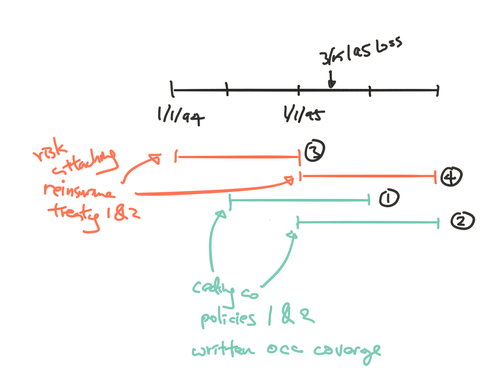

## Intro to Reinsurance

2 main methods reinsurance can be applied:

***Facultative***:  
Designed and purchased separately for each individual risk

***Treaty***:  
Single contract covers multiple risk and price based on risks in aggregate

***

2 main types of treaty:

***Proportional***: Reinsurer assumes a given % of losses and premium

* **QS**:  
Fix % of premium and losses across all risk

* **Surplus share**:  
% of premium and losses vary by risk (size?)

***Non-proportional***: Reinsurer assumes losses in excess of the ceding company’s retention limits

* 2002 Q43 Can retain a larger portion of premium on small profitable risks
* Helps stabilize underwriting results

* **Per risk XoL**:  
Protects against large individual claims

* **Per occurrence XoL**:  
Cat reinsurance, covers multiple risk for each occurrence

* **Aggregate XoL**:  
Frequency protections, for aggregate total losses for a given time period

## Basis of Reinsurance

***Risk Attaching***

Covers **all policies that begin or renew** during the reinsurance contract period

Think of losses on a **PY** basis and relates to **WP**

***Loss Occurring***

Covers **all claims that occur** during the reinsurance contract period

Think of losses on an **AY** basis and relates to **EP**

***Claims made***: Claims are covered based on claim reported date  
***Policies issued***: Like risks attaching but for new business only  
***In-force***: Only covers unearned portion of in-force policies after treaty effective date

## Reinsurance Pricing Method

Experience and exposure rating

### Experience Rating (Burn Cost Model)

Primary approach for proportional reinsurance

Data:

* Adjusted historical experience
* From reinsurance contract or ceding company

Adjustments:

* On-level premiums
* Trended exposures and premiums
* Trended and developed losses
* Replace actual CAT with CAT load
* Load for expense

Burning Cost:  
Why is this unadjusted?

* $\text{Burning Cost} = \dfrac{\text{Unadjusted Past Ceded Losses}}{\text{Unadjusted Past Ceding Company Subject Premium}}$

### Exposure Rating

Use with experience rating to price non-proportional reinsurance

Use current risk profile + estimated loss dist^n^

* Loss dist^n^ used to determine the $\mathrm{E}[L]$ in the treat layer can be based on: *ILF*, *ELF*, *Exposure Curve*
* $\text{Exposure Curve} \Rightarrow \dfrac{\mathrm{E}[Loss_limited]}{\mathrm{E}[Loss]} = f(limit)$ = 1 - XS Ratio @ each limit

## Proportional Reinsurance

This section covers pricing of proportional reinsurance and also discuss different types of commissions

### Types of Porportional Reinsurance

***Quota Share***

Assumes flat % of premium and pays the same % of L&ALAE

Reinsurer pays a ceding commission to the ceding co to reflect u/w expenses

Pros: Provides more ceding commission compare to SS and less costly to administer

***Surplus Share***

Pros: For ceding company to retain low risk policies and only cede high risk

Cons: require keeping track of the percent ceded for each policy

$\text{Ceding %} = {\min \left(\dfrac{\text{Line Purchased}}{\text{IV}}, \dfrac{\text{IV}-\text{Line Retained}}{\text{IV}} \right)}^+$

Surplus Share treaty is NOT the same thing as excess insurance. Once the surplus % is established for a risk, then the reinsurer is responsible for that % of loss

### Pricing Porportional Reinsurance

1. **Historical experience**
    * Ideally $\geq$ 5 years of loss and premium from the *treaty*
        * Else use adjusted ceding co data
    * Determine basis of data base on treaty type
2. **Exclude CAT and LL**
    * Add load later in step 5.
3. **Develop & trend losses; on-level and trend premiums; or trend exposures**
    * Ideally LDFs from treaty
        * Else adjust for report lag
        * Lag due to:
            * For XOL reinsurance, a primary company may not have expected a loss to penetrate the reinsurance layer, in which case the reinsurer only gets notified after the claim has had some development
            * A claim could impact multiple reinsurance treaties, resulting in longer delays to reinsurers covering higher layers of loss
    * On-level premiums for rate changes and average price change (e.g. sch credits)
        * Include planned change during the treaty period if possible
    * Trend exposures if inflation sensitive
    * Trend loss (Can use same trend as in filings)
4. Select expected **Non-CAT Loss Ratio**
    * Based on average adjusted historical LR
    * Reasonability check with CY experience and industry averages
5. **Load for CAT**
    * From CAT model
    * Reasonability check with payback approach
6. **Other expenses** and **combined ratio**
    * Ceding commissions
    * G&A, overhead and brokerage
    * $\Rightarrow$ Combined ratio

### Sliding Scale Commission

Varies with actual LR with max/min

Provisional commissions = amount pay upfront

$\mathrm{E}[\text{Commission}] =
  \begin{cases}
    \text{Commission @ ELR} & \text{Balanced sliding scale plan} \\
    \sum\limits_i {Commission@AvgLR_i} \times p_i & \text{Else} \\
  \end{cases}$
  
* Avg LR and Pr(LR in Range) are given
* With the Avg LR calculate Commission @ Avg LR

Expected Technical Ratio = ELR + Expected Commission Ratio

***

Carryforward provision:  
If $LR_{actual, t} > LR_{\text{Min Comm}} \: \Rightarrow \: LR_{t+1} = LR_{actual, t+1} + (LR_{actual, t} - LR_{\text{Min Comm}})$

*Pricing Approach 1:*

Assume that any past carryforward amounts only apply to the current year’s LR $\Rightarrow$ Subtract the carried over LR amount from the LR in the current year’s sliding scale

Caveat:  
Ignores the potential for future carryforward

*Pricing Approach 2:*

Look at the expected ultimate commission ratio for a block of years together

Caveat:  
Not obvious how to reduce the variance of the aggregate loss dist^n^ when
you combine the years
Ignores that the contract might not renewed

### Profit Commission

Returns some of the reinsurer's profit to the ceding company as additional commission

$\begin{array}{llcl}
  \text{Profit Commission} &= &\text{Reinsurer Profit} &\times \text{ % Returned} \\
  &= &1 - \text{Treaty LR}_{actual} - \text{Ceding Comm} - \text{Reinsurer Expense Margin} &\times \text{ % Returned} \\
\end{array}$

### Loss Corridors

Allow ceding company to reassume some liability if LR > a threshold

Given:

* Loss corridor of c% for layer between l% and h% LR
* Range of LR: x% - y%
* Avg LR in range: z%
* Pr(in range): a%

$\text{Avg LR Net of Loss Corridor} = 
  \begin{cases}
    x\% + (1-r\%)(z\% - x\%) & \text{if x and y } = \text{ l and h} \\
    x\% + (1-r\%)(h\% - l\%) + z\% - y\% & \text{if x and y } > \text{ l and h} \\
  \end{cases}$
  
## Per Risk XoL: Property

Coverage for above insurer's retention and up to a limit

For each risk, usually 1 property location but not always

Treaty premium = % of the cedent's subject premium base

* Gross Net Earned Premium Income (GNEPI)
    * For loss occurring policies
* Gross Net Written Premium Income (GNWPI)
    * For risk attaching policies

Note:      
Gross refers to the property per risk XoL treaty being priced  
Net refers to net of inuring reinsurance (reinsurance that applies before this treaty)

### Pricing Per Risk XoL: Experience Rating

1. **Historical subject premium** and **loss data**
    * Ideally $\geq$ 10 yrs (longer than proportion)
    * Include any losses that *can* pierce layer after **trend**
2. **On-level** *subject premium*; **trend** *premium and exposures*  
Not trend subject premium?
3. **Trend** *loss* for severity
    * Determine trended loss in layer $\Rightarrow$ Sum up losses by year
    * Trend then cap the losses for layer
    * Trend from accident date to mid point of the policy period 2008 Q39
4. Apply **XS LDFs** to develop XS losses (at the accident level)
    * Ideally derive LDFs from cedent
    * Trend losses for frequency if needed
5. $\text{Loss Cost} = \dfrac{\text{Trended & developed losses}}{\text{Adjusted Subject Premium}}$
    * Expected loss cost = average loss cost across years
    * Loss cost should be random around the average
6. Load loss cost for profit and expenses

### Pricing Per Risk XoL: Exposure Rating  
2005 Q34, 2009 Q27

**Exposure Curves:**

$P(p)$ = (Portion of loss limited @ $p$% of the Insured Value) $\div$ (Total value of the loss)

$P(p) = \dfrac{\int_0^{pIV}1-F(x)dx}{\int_0^{\infty}x \: f(x)dx} = \dfrac{\int_0^{pIV}x \: f(x) dx + pIV\int_{pIV}^{\infty}f(x)dx}{\mathrm{E}[X]} = \dfrac{\mathrm{E}[X;pIV]}{\mathrm{E}[X]}$

***

Losses in XoL layer (as portion of $\mathrm{E}[Groundup])$

$P(\dfrac{\text{Retention }+\text{ Limit}}{IV}) - P(\dfrac{\text{Retention}}{IV})$

$\dfrac{\text{Exposure}}{IV}$ can be > 100%
  
* E.g. If limits profile (IV) doesn't include additional living expense coverage or BI coverage

Multiple locations policies:  
Imperative that limits profile is based on data at the same level of granularity as what you are pricing (e.g. per risk or per location)  
Not super sure what, maybe look at the next chapter

$P(p)$ by size group

$\forall$ risk $\in \{\text{Size Group}\}$ assume homogeneous

If you use same $P(p)$ for different risk size $\Rightarrow$ Implies scale independence $\Rightarrow$ Pr(10K Loss on 100K risk) = Pr(100K Loss on 1M risk)

* Not what you want
* Check with PP/Mid-point range of IV 2012 Q10

2005 Q34 Exposure rating can be distorted when deductible levels change

* When deductibles increase, the subject premium decreases, but the expected excess losses may not change significantly. So the old exposure rate would be inadequate. Vice versa for decreased deductibel
* When deductibles decrease, losses below the original deductible may be unknown, so
information is missing about the loss distribution. This makes it challenging to derive a new exposure curve for the lower deductible

### Free Cover  
2011 Q7

**Free cover:** Using experience rating when no loss experience in the highest portion of a layer. It basically give away those XS coverage with no prior loss experience

Solution:  
Use experience rating for the lower portion of the layer and exposure rating relativities for the higher portion

1. Calculate trended loss in layer $\Rightarrow$ Sum up by years $\Rightarrow$ Develop with XS LDFs
2. Calculate on-level trended subject premium then get loss cost
3. Break up the layer and use experience rating for the layers with losses, anything higher we'll use exposure rating
4. Calculate $p$ and $P(p)$ at different attachment points
    * e.g. retention, retention + limit, exposure rating cut off point
5. Calculate the exposure factor @ different layer

| Layer | Exposure Factors | Exp Rating Loss Cost |
| ----- | ---------------- | -------------------- |
| Exp rating layer | From 5. | From 2. |
| Exposure rating layer | From 5. | $\text{Exp Rating Loss Cost for lower layer} \times \dfrac{P(CurrentLayer)}{P(LowerLayer)}$ |
| Total exposed layer | Sum of above | Sum of above |

### Credibility for Experience Rating

$\mathrm{E}[\text{# of Claims}]$ or $\mathrm{E}[Loss]$

* Historical
* Use expected claims so we don't give too much credibility to worse than average years

$Var(\text{Historical Projected Loss Cost})$

* Stable LR gets more credibility

### Inuring Reinsurance

$X$ treaty inures to the benefit of $Y$ treaty $\Rightarrow$ Apply $X$ first then $Y$

For experience rating: restate historical experience to be net of inuring reinsurance

For exposure rating: apply directly to an adjusted risk profile (adjusted for inuring reinsurance)

* Use the curve based on gross insured value risk size $\Rightarrow$ Apply exposure factors to the $\mathrm{E}[\text{Loss net of inuring}]$

Use 100% if $pIV$ > max

$\text{Reinsurer's loss} = GNEPI \times ELR \times P(p)$

1. Calculate the GNEPI after inuring reinsurance by applying the ratio of IV for after and before inuring reinsurance

2. Calculate exposure factor for each layer (after application of inuring reinsurance)

The loss cost of the treaty is then the sumproduct of the above and ELR by layers

## Per Occurrence XoL: Casualty

Usually separated into 3 layers

**Working layer**  
Expected to be hit multiple times a year

**Exposed XS**  
Higher but attached below some underlying policy limits

**Clash covers**  
Only hit when:

* Due to multiple policies involving a single occurrence; or  
* Extra Contractual Obligations; or  
* Ruling awarding damages in XS of policy limits; or  
* ALAE included in the treaty; or
* Workers compensation losses above the attachment point 2000 Q53

### Pricing Per Occurrence XoL: Experience Rating

1. Historical premium and loss
    * *ALAE separate* from loss
    * Underlying policy limits (GL, AL)
    * Case reserve x tabular discounts (WC)
2. On-level and trend premiums and exposures
3. Severity trend for individual L&ALAE
    * ALAE treatment: Pro-rata or included
    * ***Treatment of limit with trend*** 
        * Cap trended losses @ **historical** limits
            * Ignores that limits tend to $\uparrow$ over time
        * Don't cap trended losses
            * Assume limit $\uparrow$ at the same rate as loss trend
            * Need to $\uparrow$ subject premiums to reflect higher limits; However difficult to quantify
4. $\sum$ trended loss by year and apply XS LDFs
    * Ideally uses cedent's data for LDFs
    * Or use RAA, caveat:
        * Report lag varies
        * Mix of attachment points and limits not clearly broken out
        * Might have A&E
        * Tabular discounts might be inconsistent
5. $\text{Loss Cost} = \dfrac{\text{Trended & developed layer losses}}{\text{Adjusted Subject Premium}}$
    * Expected loss cost = average loss cost across years
6. Load for TVM, expenses and risk load

#### Experience Rating ALAE Treatments

***Included with loss***

Treat L&ALAE as a single amount when comparing to limit and retention

***Pro-rata with loss***

$\text{Pro-rata ALAE} = \dfrac{\text{Loss in treaty}}{\text{Ground-up loss net of inuring}} \times \text{Ground-up ALAE net of inuring}$

### Pricing Per Occurrence XoL: Exposure Rating

Use industry severity dist^n^ to get ILFs (GL, AL) or ELFs (WC)

Dist^n^ of severity curve: Pareto or Mixed Exponential (GL, AL), IPC (WC)

$\text{Exposure Factor} = \dfrac{\mathrm{E}[x; \min(PL, AP+Lim)] - \mathrm{E}[x;\min(PL, AP)]}{\mathrm{E}[x; PL]}$

* $PL$: Ceding company policy limit
* $AP$: Treaty attachment point
* $Lim$: Treaty limit

Apply exposure factor to ground-up $\mathrm{E}[Loss]$ net of inuring

Exposure factor exclude risk loading

2002 Q38 Only policies with limit that's at least the retention can contribution to the calculation of the exposure rate

***WC***

ELF: IPC, $aL^{-b}$, estimate $a$ and $b$ from selected XS Factors

* Can be a % of losses (vs standard premium)

$\text{Exposure Factor} = ELF_{AP} - ELF_{AP+Lim}$

* Applies to Standard Premium $\times$ ELR

Need standard premium, ELR to get expected treaty losses

* Since ELFs are by State + HG for NCCI

### Exposure Rating ALAE Treatments

***Included with loss***

$\text{Exposure Factor} = \dfrac{\mathrm{E}[x;\min(PL, \frac{AP + Lim}{1+e})] - \mathrm{E}[x;\min(PL,\frac{AP}{1+e})]}{\mathrm{E}[x;PL]}$

* $PL$: Underlying limit for loss only
* $AP$: Treaty attachment point applying to L&ALAE capped at $PL$
* $Lim$: Treaty limit
* $e$: ALAE as a $ of loss capped at $PL$

Assumes ALAE varies directly with capped indemnity loss

* Not necessarily true as you can have ALAE and 0 loss

***

***Pro-rata with loss***

Apply exposure factor to $\mathrm{E}[L\&ALAE]$

### XoL Covering Umbrella Policies

***Experience Rating***

Consider the underlying policies below umbrella and umbrella policies as a single policy

* Add premiums and losses together

**Challenge:** Severity trend

Should add and subtract the underlying limit as part of trending the losses

Trended Umbrella Loss = (Umbrella Loss + Underlying Limit)(Trend Factor) - Underlying Limit

Caveat: ignores new trended losses piercing the umbrella policy

***

***Exposure Rating***

Exposure factor for an umbrella policy *without* drop-down coverage:  
Memorize Formula  

$\dfrac{\mathrm{E}[x; \min(UL + PL, UL + PL +Lim)] - \mathrm{E}[x;\min(UL+PL,UL+AP)]}{\mathrm{E}[x;UL+PL]-\mathrm{E}[x;UL]}$

* $UL$: Underlying Limit
* $PL$: Umbrella Limit
* $AP$: Treaty Attachment Point
* $Lim$: Treaty Limit

Exposure factor for an umbrella policy *with* drop-down coverage with probability $\phi$:  
Memorize Formula

$\dfrac{ {\color{blue}{\left\{\mathrm{E}[x; \min(UL + PL, UL + PL +Lim)] - \mathrm{E}[x;\min(UL+PL,UL+AP)]\right\} } }(1-\phi) + \left\{ \mathrm{E}[x; \min(PL, AP+Lim)]-\mathrm{E}[x; \min(PL,AP)] \right\}\phi} { {\color{blue}{\left\{\mathrm{E}[x;UL+PL]-\mathrm{E}[x;UL]\right\} }  }(1-\phi) + \mathrm{E}[x;PL]\phi}$

The second part multiplied by $\phi$ is the same as before except $UL=0$

### Aggregate Distribution Models

Excess aggregate coverage to prevent too many losses (frequency) in the working layer

Excess charge factor: $\phi_{ADD} = \dfrac{\int_{ADD}^\infty (y-ADD)\: g(y)dy}{\mathrm{E}[y]}$

* $g(y)$: dist^n^ of aggregate loss in layer
* $ADD$: annual aggregate deductible
* Same as table M charge, just not stated in terms of entry ratios

Net loss cost = Loss cost in layer gross of ADD $\times \: \phi_{AAD}$

Can use experience rating as well but only for low deductibles

### Swing Plans  

Loss sensitive retrospective rating

Retro premium = Actual layer losses $\times$ Expense load

Similar to retro rating there are max/min premium as well as a provisional rate to charge in the beginning

| (1) Range of loss cost | (2) Probability | (3) Avg Loss cost in range | (4) Retro premium | (5) Capped |
| -- | -- | -- | -- | -- |
| $Range_i$ | $p_i$ | x% | (3) $\times$ expense load | Apply max/min to (4) |
| Total | 100% | Wtd Avg of above | Wtd Avg of above | Wtd Avg of above |

$(3)$ $\div$ $(5)$ = expected loss ratio

* ELR = expected loss $\div$ expected retro premium (weighted under difference scenarios) 1999 Q37

If expected loss ratio $\neq$ ELR used in expense load $\Rightarrow$ plan not in balance

* ELR used in expense load  = 1 $\div$ expense load

Also note the timing of cash flow if the provisional rate is different from the expected

### WC Treaty Experience Rating

Use paid loss data if experience distorted by tabular discounts

## Aggregate Distribution Model

Uses a range of LR (or loss cost) e.g. in sliding scale commissions

Several ways to create them:

***Empirical dist^n^***

Use historical experience with adjustments

Cons:

* Does not account for all possible outcomes
* Future results may differ from historical averages

***

***Single dist^n^ models***

Assumes aggregate losses follow a known dist^n^

Pros:

* Simple to use with limited data

Cons:

* No allowance for loss free scenario
* No easy way to reflect the impact of changing per occ limits on aggregate losses

***

***Panjer’s Recursive calculations***

A type of collective risk model

Frequency: Poi, NB, Bin

Severity: discrete equally-spaced amounts

Pros:

* Simple to work with
* Accurate handling low frequency scenarios

Cons:

* Inconvenient for higher $\mathrm{E}[Freq]$ due to # of calculations
* Only a single severity dist^n^ can be used

More on [wiki](#https://en.wikipedia.org/wiki/Panjer_recursion)

***

***Collective risk models***

Analyze frequency and severity separately

Caveats:  
Important Concepts

* Complex $\Rightarrow$ Black box mentality
    * Should check for reasonability
* Assumes independent freq and sev
* Assumes independent occurrence
* Some uses numerical method $\Rightarrow$ Can have large $\varepsilon$
* Reflects process variance but not VHM

## Property Catastrophe Covers

Per Occurrence XoL that covers hurricane, earthquake etc

Typically net of all inuring reinsurance such as QS, per risk XoL, fac, etc

**Reinstatments**

Allow cedent to refill the treaty limit a certain number of times during the policy period

Pro rata to *amount*: annual premium $\times$ reinstatement provision $\times$ loss $\div$ limit

Pro rata to *time*: annual premium $\times$ reinstatement provision $\times$ time left on contract

* Not popular due to seasonality of CAT

### Pricing Property CAT Covers

**CAT models**

Data req:

* Exposure, coverage, geographical info, details on inuring reinsurance

Considerations:

* WC exposure can be huge for earthquakes if covered
* Inuring reinsurance might not be captured by the model
* Fire from earthquake exposure may exist even if earthquakes are not covered directly
* Coverage terms specifics needs to be reflect properly in model
    * e.g. Replacement cost vs cash value may be very different
    
**Payback period**

$\dfrac{\text{Treaty Limit}}{\text{Annual Premium}}$

**Rate on Line**

$\dfrac{\text{Annual Premium}}{\text{Treaty Limit}}$

### Basis for Property CAT Covers

Risk attaching vs risk occurrence

Risk attaching have potential for reinsurer to pay multiple times on the same event

e.g. polices in force for different period might be hit by the same event $\Rightarrow$ limit applied separately $\Rightarrow$ doubling up the limit

$(1)$ will falls under $(3)$ and $(2)$ will fall under $(4)$

And the loss will fall under the 2 ceding co policies which in terns fall under the 2 risk attaching CAT cover policies

## Finite Risk Covers

Similar to property CAT but with lower max losses

**Common characteristics**: Multi year and loss sensitive

Requirements to be treated as reinsurance for accounting:

* Reinsurer assumes significant insurance risk
* Reasonably possible that the reinsurer may realize a significant loss

Complicating factors:

* Reinstatement provisions
* Expenses
* Carryforward provisions
* $\Delta$ in premium and profit commissions by year of treaty
* Cancellation provisions

## Cliff's Summary

### Key Concepts

Experience rate vs Exposure rate

Loss sensitive

* Carry forward
* Mechanism to stabilize results for loss sensitive features over time 2014 Q23
    * Also the difficulties in including in the determination of an aggregate loss distribution model

Proportional

* QS vs Surplus share; Know the pros and cons for SS

Per risk XoL

* Underlying deductible impact on exposure rate
* Report lag considerations
* Considerations when using benchmark
* [Free cover](#free-cover)
* Burn cost, RoL, Payback

Per occ XoL

* Swing plan: ELR = inverse of expense loading? Premium rate = provisional rate?
* Clash coverage triggers
* [Exposure rating](#exp-rate-per-occ-xol)
* Issues and remediations for [trended capped loss](#capped-per-occ-exp) in experience rating

Aggregate Dist^n^ Model

* 2013 Q25 Judging model selection
* Caveat of collective risk

Property Cat Covers

* Risk attaching might pay twice

Finite risk

### Calculations

Loss sensitive contracts

* Swing Plans
    * check if plan is balanced
* Sliding Scale
    * Technical ratio = loss ratio + commission ratio
    * balance: expected sliding scale commission = the sliding scale commission @ ELR

Surplus Share

* $\text{Ceding %} = {\min \left(\dfrac{\text{Line Purchased}}{\text{IV}}, \dfrac{\text{IV}-\text{Line Retained}}{\text{IV}} \right)}^+$

Exposure Rate

* Per Occ XoL (Use ILFs and ELFs)
* Per Risk XoL (Use curve)

## Types of Exam Questions

### Calculations

Loss sensitive contracts

* 1999 Q37 $\star$ (Swing plans)
* 2001 Q51 $\star$ (Sliding scale)
* 2002 Q40 $\star$ (Loss corridor)
* 2003 Q18 (Sliding scale)
* 2003 Q19 (Loss corridor)
* 2006 Q9 $\star$ (2 Loss corridor)
* 2007 Q23 (Profit share)
* 2007 Q30 (Sliding scale technical ratio)
* 2008 Q38 (Sliding scale)
* 2009 Q30 (Loss corridor)
* 2011 Q8 (Loss corridor)
* 2012 Q7 a (Sliding scale)

Actual loss under treaties

* 2000 Q50 (Surplus Share)
* 2001 Q25 (QS, SS, XoL)
* 2002 Q18 (XoL and CAT inuring)
* 2002 Q19 (SS)
* 2002 Q37 (QS with ceding comm)
* 2003 Q39 (Different basis and XoL)
* 2003 Q41 (ALAE treatments)
* 2004 Q11 (Reinsurer LR)
* 2004 Q14 (ALAE treatments)
* 2004 Q16 (XoL w/ coinsurance)
* 2004 Q17 (SS)
* 2004 Q45 $\star$ (Split of XoL between parties; inuring; rate on line)
* 2005 Q29 a (XoL multi layers)
* 2005 Q32 (XoL)
* 2005 Q35 (QS net amount due to reinsurer)
* 2005 Q37 (XoL inure to CAT)
* 2006 Q10 (ALAE treatments)
* 2006 Q11 (Multi layer CAT)
* 2006 Q44 (QS; SS)
* 2007 Q24 ab (ALAE treatments)
* 2007 Q27 ab (QS; SS)
* 2007 Q28 (QS CAT inuring)
* 2008 Q28 (Per Occ inure to agg)
* 2008 Q29 (ALAE treatments)
* 2008 Q32 (QS and XoL)
* 2008 Q33 (SS)
* 2009 Q21 $\star$ (Need to interrept the coverage)
* 2009 Q22 (Different basis and XoL)
* 2009 Q25 (QS CAT inuring)
* 2009 Q26 (ALAE treatments)
* 2010 Q26 $\star$ (Umbrella XoL, with tricky double ALAE pro rata)
* 2010 Q27 $\star$ (Inuring XoL)
* 2010 Q28 (Clash and XoL inuring)
* 2013 Q23 (QS XoL SS comparison)
* 2014 Q22 ab (QS; SS)
* 2014 Q24 c (QS inure to CAT)

Pricing contracts

* 2000 Q71 $\star\star$ (Price per occ XoL with umbrella drop down)

Exposure Rate

* 2001 Q48 (ILFs)
* 2002 Q38 (ILFs)
* 2002 Q39 $\star$ (ILFs)
* 2003 Q40 (ILFs)
* 2004 Q13 (Curve table)
* 2004 Q15 (ELFs)
* 2005 Q34 $\star$ (Curve with inurring)
* 2006 Q40 (ILFs)
* 2006 Q42 (Curve for Per Occ)
* 2007 Q2 (Curve)
* 2009 Q27 (Curve)
* 2010 Q20 $\star$ (Full blown XoL)
* 2010 Q15 (Curve)
* 2011 Q7 $\star\star$ (Mixed Expo and Exp!)
* 2012Q10 $\star\star$ (Test appropriatness of exposure curve data)
    * Test likelihood as % of PP
    * Volatility of Ult LR and granularity of the exposure curve
* 2014 Q25 $\star$ (Exposure curve with formula)

Experience Rate

* 2005 Q26 (develop, trend and rate adj; free cover concept)
* 2007 Q31 $\star$ (Cap the trended loss first then develop for the AY)
* 2008 Q31 $\star$ (Full blown QS combine ratio calc)
* 2009 Q39 (XoL)
* 2009 Q29 $\star$ (Full blown QS)
* 2010 Q21 $\star$ (Rate on line, payback period, burn cost)
* 2014 Q24 a (Payback period)

Other

* 2001 Q26 (Reinstatement premium)
* 2003 Q42 (Reinstatement premium)
* 2005 Q29 b (Reinstatement premium)
* 2010 Q22 $\star$ (Reinstatement premium)
* 2013 Q21 $\star$ (Rein prem for multiple loss, ALAE treatment)
* 2014 Q24 b (Reinstatement premium)
* 2014 Q20 $\star$ (details on trending umbrella)

### Concepts

Basis of Reinsurance

* 1997 Q31 $\star$ (2 basis; matching premium; paying twice)

XoL 

* 2000 Q53 (Per Occ XoL Clash coverage triggers)
* 2005 Q33 $\star$ (Per Occ XoL capped loss w/ experience rating)
* 2009 Q28 $\star$ (Free cover)

Loss sensitive

* 2012 Q7 $\star$ bcd (carryforward)

Compare of different types of reinsurance

* 2007 Q29 $\star$ (Structure insurance to retain certain amount of policy limit)
* 2014 Q23 $\star$ (Compare loss corridor and sliding scale; how to stabilize)

Aggregate distribution model

* 2013 Q25 $\star$ (Compare model based on data)

Other

* 2014 Q21 $\star\star$ (ALAE treatment impact on umbrella; Difficulties in estimating ALAE; importance of ALAE)
* 2014 Q22 c (Resolving overlap policies)

## Questions

* The swing plans expense loading thing why is that the expecte loss is the inverse
* For exposure rating lots of the questions say "the LDFs apply to summed losses by year, which is equivalent to applying them at the accident level and NOT capping losses after applying the LDFs" What does that mean?
* 2009 Q21 not super clear on what counts as "reduce the x limit"
* Umbrella with and without drop down definition
* Not sure about the 2012 Q10 test
* What does 2013 Q25 falls under the section?