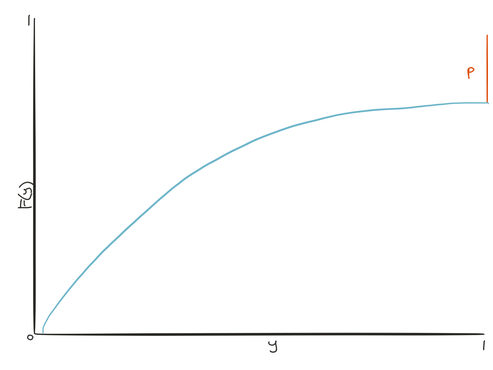

## Cliff's Summary

Exposure curve relation ships other factors

* ILFs
* XS Ratio $R(L)$

Bernegger exposure curve

* $G(d) = \dfrac{\mathrm{E}[X;dM]}{\mathrm{E}[X]} = \dfrac{\mathrm{E}[y;d]}{\mathrm{E}[y]}$
* $G(0) = 0$
* $G(1) = 1$
* $G'(d) \geq 0$
* $G''(d) \leq 0$
* Know the conditions so you can check if a curve is valid

From first principles

* $G(d) = \dfrac{\int_0^{d} 1 - F(y) \: dy}{\int_0^{1}1-F(y)\:dy} = \dfrac{\int_0^{dM} 1 - F(x) \: dx}{\int_0^{\infty}x\:f(x)} \:dx$

Mean, CDF, Pr(Total Loss)

* $\mathrm{E}[y] = \mu = \dfrac{1}{G'(0)}$

* $F(d) = 
\begin{cases}
  1 & d = 1 \\
  1 - \dfrac{G'(d)}{G'(0)} & 0 \leq d < 1\\
\end{cases}$

    * Know how to back out $F(d)$ with $G(d)$

* $p = 1 - F(1^-) = \dfrac{G'(1)}{G'(0)}$
    * $0 \leq p \leq \mu \leq 1$
    
***

MBBEFD

* $G(x) = \dfrac{ln(a+b^x)-ln(a+1)}{ln(a+b) - ln(a+1)}$

    * Know which one is a and b if they fille it with numbers

* $F(x) =
  \begin{cases}
    1 & x = 1 \\
    1 - \dfrac{(a+1)b^x}{a+b^x} & 0 \leq x < 1 \\
  \end{cases}$

* $p = 1 - F(1^-) = \dfrac{(a+1)b}{a+b}$

Conditions

* Sub in $a = \dfrac{(g-1)b}{1-gb}$ to $G(x)$
    * $g \geq 1$
    * $b \geq 0$

Different cases of MBBEFD parameters

* Probably don't have to memorize, just know some of the special cases
* For the $bg=1$ case, $b=p$

***

Unlimited distributions and the conditions

* $G(\infty) = 1$
* $G'(\infty) = 0$
    * No total losses

$\mu$ is the same but doesn't have to be $\leq 1$

$p$ not Pr(Total Loss) any more, just loss exceeding reference value

$p = \dfrac{G'(1)}{G'(0)}$

$0 \leq p \leq 1$

***

Exposure rating with MBBEFD

* Gross Prem $\times$ ELR $\times$ Exposure factor for layer
* Know how to get the $\mu$ and $p$ with different differential

[Curve Fitting]($MBBEFD-curve-fit) of MBBEFD

***

[Swiss Re](#swiss-re) curve

## Types of Exam Questions
Questions a bit thin

Curve properties, $p$, derive curve, parameters

* 2011 Q9 a $\star$ (MBBEFD exposure factor with $G(d)$ $G'(d)$ given)
* 2011 Q9 b $\star$ (MBBEFD $p$ with $G(d)$ $G'(d)$ given)
* 2012 Q8 a $\star$ (Check conditions of $G(d)$ given)
* 2012 Q8 c $\star$ (Meaning of $b$ for the special case)
* 2013 Q20 $\star$ (Derive $G(d)$ from first principle)
* 2013 Q22 $\star$ (Defective, but need back solve numbers)
* Practice 2 $\star$ (Properties of a given curve)
* Practice 3 $\star$ (Describe the process of fitting)
* Practice 4 $\star$ (The thing about dividing between ceding and reinsurer)

Plug and play with curve

* 2012 Q8 b (Given MBBEFD speical case)
* 2013 Q20 b
* Practice 1

UNLIMITED EXPOSURE CURVE GIVEN b, g PARAMETERS

* $p$ can be a reference, not just max
* Memorize the MBBEFD curve

LIMITED EXPOSURE CURVE GIVEN $\mu$, p PARAMETERS

* Come back later for this calculation

APPROXIMATE THE SWISS RE EXPOSURE CURVES

* Skipped for now

CDF AND EXPECTED LOSSES

* Need to memorize the formulas

## Questions

* Not super sure about the thing about dividing between ceding and reinsurer

## Basics and recap from Clark on Exposure Curves

Exposure curve:
Dist^n^ of $\dfrac{\text{Expected limited losses @ various limits}}{\text{Expected unlimited losses}}$ on various limit

Exposure curve @ given limit = 1 - XS ratio @ given limit

This is same as the ratio of pure risk premium 2013 Q22

Built on data outside of risk's own experience

* NCCI for WC
* ISO for AL and GL
* ISO or Salzmann Tables for Property

Exposure curve are different by risk size

* All risk $\in$ given size are assumed to be homogeneous
* Risk size: insured value (sum insured), maximum possible loss, estimated maximum loss

Data behind the curves has to be at the same granularity as what you are pricing (e.g. per location or per policy)

## Exposure Curves: Clark

**Exposure Curve** Def^n^

$\begin{array}{ll}
  G(d) &= \dfrac{\text{Expected loss cap @ d% of IV}}{\text{Expected unlimited loss}} \\
  &= \dfrac{\int_0^{dIV} 1 - F(x) \: dx}{\int_0^{\infty}x\:f(x)} \\
  &= \dfrac{\int_0^{dIV}x \: f(x) dx + dIV\int_{dIV}^{\infty}f(x)dx}{\mathrm{E}[X]} \\
  &= \dfrac{\mathrm{E}[X;dIV]}{\mathrm{E}[X]} \\
\end{array}$

***

**ILF** for limit $K$ and basic limit $B$

$\dfrac{G(\frac{K}{IV})}{G(\frac{B}{IV})}$

**XS Ratio** at $d$

$1 - G(d)$

Portion of **expected ground-up loss** in **XS layer**

$G(\frac{\text{Retention }+\text{Limit}}{IV}) - G(\frac{\text{Retention}}{IV})$

$G(100\%)$ can be $< 100\%$ while $0 \% \leq G(d) \leq 100\%$

* From additional coverage
* Exposures curve can be built on losses from multiple coverage but $IV$ from a single coverage

## Exposure Curves: Bernegger

Uses *maximum possible loss* instead of $IV$

$\begin{array}{ll}
  G(d) &= \dfrac{\text{Expected loss cap @ d% of M}}{\text{Expected unlimited loss}} \\
  &= \dfrac{\int_0^{dM} 1 - F(x) \: dx}{\int_0^{\infty}x\:f(x)} \:dx \\
  &= \dfrac{\int_0^{dM}x \: f(x) dx + dM\int_{dM}^{\infty}f(x)dx}{\mathrm{E}[X]} \\
  &= \dfrac{\mathrm{E}[X;dM]}{\mathrm{E}[X]} \\
\end{array}$

Normalize as % of MPL with $y = \frac{X}{M}$

$\begin{array}{ll}
  G(d) &= \dfrac{\int_0^{d} 1 - F(y) \: dy}{\int_0^{1}1-F(y)\:dy} \\
  &= \dfrac{\mathrm{E}[y;d]}{\mathrm{E}[y]} \\
\end{array}$

***

4 Properties/conditions of a valid $G(d)$:

1. $G(0)=0$

2. $G(1)=1$

    * $M$ based on the same coverages in the losses so $X \leq M$ $\Rightarrow$ $y\leq1$
    
    * Only true when losses $\leq$ maximum risk size based on what ever def^n^

3. $G'(d) = \dfrac{1 - F(d)}{\mathrm{E}[y]} \geq 0$

    * Since $F(d) \geq 0$
    
    * $G(d)$ is increasing on [0,1]

4. $G''(d) = \dfrac{-f(d)}{\mathrm{E}[y]} \leq 0$

    * Since $f(d) \geq 0$
    
    * $G(d)$ is concave on [0,1]
    
### Mean, CDF, Total Loss Probability

**Mean**

$\mathrm{E}[y] = \mu = \dfrac{1}{G'(0)}$

* $\mu$ is the expected severity $\div$ MPL

* Plug in $F(0)$

***

**CDF**

$F(d) = 
\begin{cases}
  1 & d = 1 \\
  1 - \dfrac{G'(d)}{G'(0)} & 0 \leq d < 1\\
\end{cases}$

* $F(d) = 1 - G'(d)\mathrm{E}[y]$ 
    
    * By def^n^ of $G'(d)$
    * Uses def^n^ of $\mu$

***

**Pr(Total Loss)**

$p = 1 - F(1^-) = \dfrac{G'(1)}{G'(0)}$

$0 \leq p \leq \mu \leq 1$

* Based on condition for $G'(0)$ and $G'(1)$

## MBBEFD Exposure Curves

Use to approximate the Swiss Re exposure curve

$G(x) = \dfrac{ln(a+b^x)-ln(a+1)}{ln(a+b) - ln(a+1)}$

$G'(x) = \dfrac{b^xln(b)}{(a+b^x)\left[ln(a+b) - ln(a+1)\right]}$

**CDF**  
Memorize Formula

$F(x) =
  \begin{cases}
    1 & x = 1 \\
    1 - \dfrac{(a+1)b^x}{a+b^x} & 0 \leq x < 1 \\
  \end{cases}$
  
**Pr(Total Loss)**  
Memorize Formula

$p = 1 - F(1^-) = \dfrac{(a+1)b}{a+b}$

### Conditions for MBBEFD Parameters

MBBEFD curves only valid for certain $a$ and $b$

Sub in $a = \dfrac{(g-1)b}{1-gb}$ to $G(x)$

1. $g \geq 1$

    * $g = \dfrac{1}{p} = \dfrac{a+b}{(a+1)b}$
    
    * $F(1^-) = 1 - p$ $\Rightarrow$ $0 \leq p \leq 1$
    
2. $b \geq 0$

    * Recall $G'(x)$ def^n^
    
    * $G'(x) \geq 0$
 
### Different Cases of MBBEFD Parameters  
Will be given
 
 $G_{b,g}(x) = 
  \begin{cases}
    x & g = 1 \text{ or } b = 0 \\
    \dfrac{ln(1+(g-1)x)}{ln(g)} & b = 1 \text{ and } g > 1 \\
    \dfrac{1-b^x}{1-b} &bg = 1 \text{ and } g > 1 \\
    \dfrac{ln \left( \dfrac{(g-1)b + (1-gb)b^x}{1-b} \right)}{ln(gb)} & b > 0 \text{ and } b \neq 1 \text{ and } bg \neq 1 \text{ and } g > 1\\
  \end{cases}$
  
### Unlimited Distributions

Exposure curves can be defined such that you can have unlimited losses

Similar as Clarks's $G(d) = \dfrac{\int_0^{dIV}1-F(x)dx}{\int_0^{\infty}x \: f(x)dx}$

$\because$ $X \in [0, \infty]$ $\therefore$ no finite $M$ $\Rightarrow$ Other other reference value such as $IV$

***

**Conditions**

$G(0) = 0$

$G(\infty) = 1$

$G'(d) \geq 0$

* $G(d)$ is increasing on $[0,\infty]$

$G''(d) \leq 0$

* $G(d)$ is concave on $[0,\infty]$

$G'(\infty) = 0$

* No total losses

**Mean**

$\mu = \mathrm{E}[X] = \dfrac{1}{G'(0)}$

$\mu$ doesn't have to be $\leq 1$

**Pr(loss exceeding the reference value)**

Not Pr(Total Loss) any more

$p = \dfrac{G'(1)}{G'(0)}$

$0 \leq p \leq 1$

## Exposure Rating

Steps to divide the total premiums of each risk size group between the ceding company and the reinsurer

1. Apply **ELR** to **gross premiums** to estimate overall risk premium ($\mathrm{E}[Loss]$) into *retained* and *ceded* portions

    * For each risk size group

2. Use **loss dist^n^ function** (exposure curve) to divide the risk premiums ($\mathrm{E}[Loss]$) into *retained* and *ceded* portions

### Exposure Rating with MBBEFD

1. Get $G(x)$ based on parameters given
2. Get $\mu$ with $G'(0)$
3. Get $p$ with $G'(1)$ and $G'(0)$
4. Get **Expected ceded risk premium**:  
Gross Premium $\times$ ELR $\times$ Exposure Factor in Ceded Layer

Step 4 is pretty similar to what was in Clark's

### Curve Fitting

Curve fitting of MBBEFD with know values of parameters

* $p$ and $\mu$; or
* $\mu$ and $\sigma$

$\exists$ only 1 MBBEFD for each unique combination of the 2 parameters $\Rightarrow$ get $g$ and $b$ with them

***

Given $p$ and $\mu$:

Calculate $g=\frac{1}{p}$

Get $b$ based on $\mu$

* Iterative unless $\mu$ is a special case

***

Given $\mu$ and $\sigma$:

Conditions required to find MBBEFD:

1. $\mu^2 \leq \mathrm{E}[y^2] \leq \mu$
2. $p \leq \mathrm{E}[y^2]$

Procedure to get $g$ and $b$

1. Initial estimate $p_0 = \mathrm{E}[y^2] = \mu^2 + \sigma^2$
2. Use $p_0$ and $\mu$ to get $g_0$ and $b_0$
3. Re calc $p_0 = \mathrm{E}_0[y^2]$ (Or just use the curve and do the $1-F(1^-)$ formula)
4. Repeat 2 and 3 till $\mathrm{E}_0[y^2]$ is close enough to $\mathrm{E}[y^2]$

***

Likely either be asking you to describe the procedure, or given formulas to use and a simple case of $\mu$

## Swiss Re Curves

Use MBBEFD to $\approx$ Swiss Re exposure curves $Y_i$ where $i \in \{1,2,3,4\}$

1. $\forall \: i$ estimate $b_i$ and $g_i$
2. Plot $b_i$ and $g_i$ $\Rightarrow$ Noticed they are on smooth curve in the plane
3. MBBEFD curves as a function of a single parameter $c$
    * $G_c(x) = G_{b_c, g_c}(x)$
    * $b_c = e^{3.1 - 0.15(1+c)c}$
    * $g_c = e^{(0.78+0.12c)c}$

$c \in \{1.5, 2.0, 3.0, 4.0\}$ matches $\{Y_1,Y_2,Y_3,Y_4\}$

$c = 5.0$ also coincides well with a Lloyd’s curve used for rating industrial risks

When $c = 0 \Rightarrow g(0) = 1$ $\therefore$ $p = \frac{1}{g} = 1$, so the curve corresponds to a dist^n^ of total losses